

<h3>🎉🎉🎉 ElectronEgg v4 has been released! 🎉🎉🎉</h3>

 

<h3><strong>An easy to get started, cross platform, enterprise level desktop software development framework</strong></h3>

 

<!-- ## 🌏 [English](https://www.yuque.com/u34495/ee-doc) | [中文](https://www.kaka996.com/) -->

## 📋 Introduction

> The framework has been widely applied to the clients in various fields such as bookkeeping, government affairs, enterprises, healthcare, schools, stock trading, ERP, entertainment, and video. Please feel free to use it!

## 👦 Who can use it?

The project already has 5 communication groups, covering developers proficient in `frontend`, `Java`, `Go`, `Python`, `PHP`, etc.

Whether you're a frontend developer, backend developer, operations engineer, game developer, or focused on clientside development, you can get started quickly.

## 🐶 showcase

- [**Click to view**](#project-case)

## 📺 feature
- 🍩 **Why use...？** Desktop software (in the areas of office work and personal tools) will remain one of the demands on the PC side in the next decade or so, and it can improve work efficiency.
- 🍉 **simple：** support js、ts 
- 🍑 **vision：** All developers can learn to develop desktop software.
- 🍰 **gitee：** https://gitee.com/dromara/electron-egg **5300+**
- 🍨 **github：** https://github.com/dromara/electron-egg **2000+**
- 🍰 **gitcode：** https://gitcode.com/dromara/electron-egg 
- 🏆 The Most Valuable Open - source Projects on Gitee
    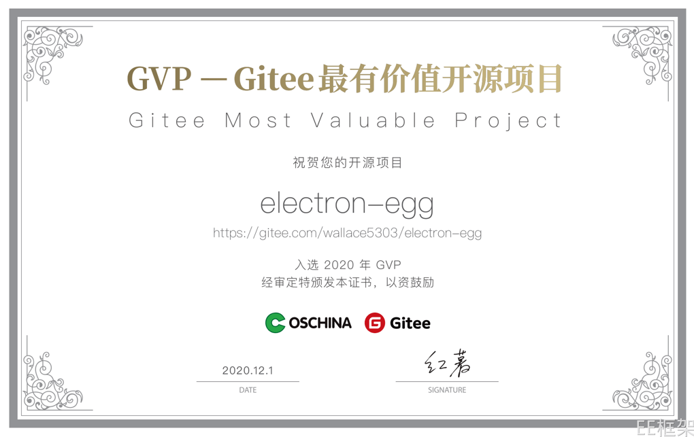    

## 📚 document
- Quick experience：[Tutorial](https://www.kaka996.com/)
    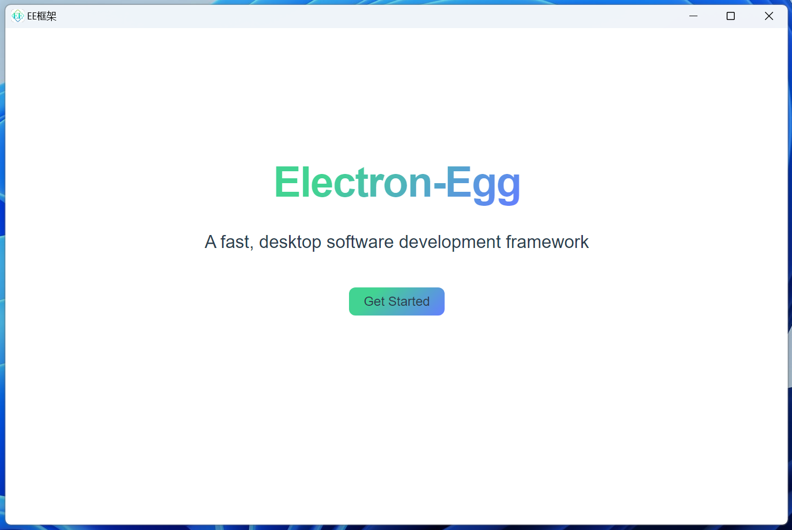 

## 📦 characteristic
1. 🍄 Cross platform: One set of code can be packaged into Windows, Mac, Linux versions, as well as domestic versions like UOS, Deepin, and Kylin.
2. 🌹 Architecture: Single - business process / modular / multi - task (process, thread, rendering process), which simplifies the development of large - scale projects.
3. 🌱 Simple and efficient: Supports JavaScript (js) and TypeScript (ts).
4. 🌴 Independent frontend: Theoretically supports any frontend technology, such as Vue, React, HTML, etc.
5. 🍁 Engineering oriented: Desktop software can be developed using the development concepts of frontend and backend.
6. 🌷 High performance: Event driven, non blocking I/O.
7. 🌰 Rich in functions: Configuration, communication, plugins, database, upgrade, packaging, tools... everything is available.
8. 💐 Secure: Supports bytecode encryption, compression, and obfuscation encryption.
9. 🌻 Function demos: Common functions of desktop software, with the framework integrating or providing demos. 

## ✈️ use case

### 1. 🚀 conventional desktop software
- 🚖 windows

    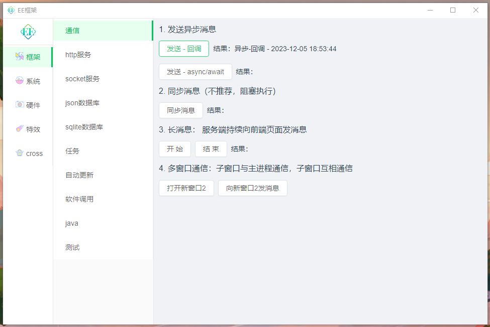

- 🚍 macOS    
    

- 🚔 linux - UOS、Deepin
    

- 🚔 linux - ubuntu
    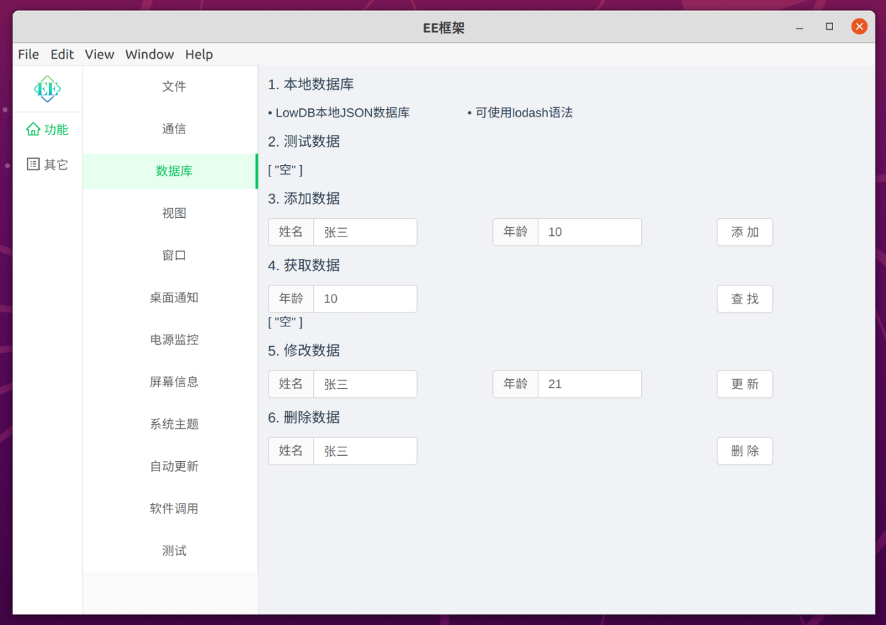

### 🚐 2. vue、react、angular、web, convert into desktop software
- 🚙 vue-ant-design（local）

    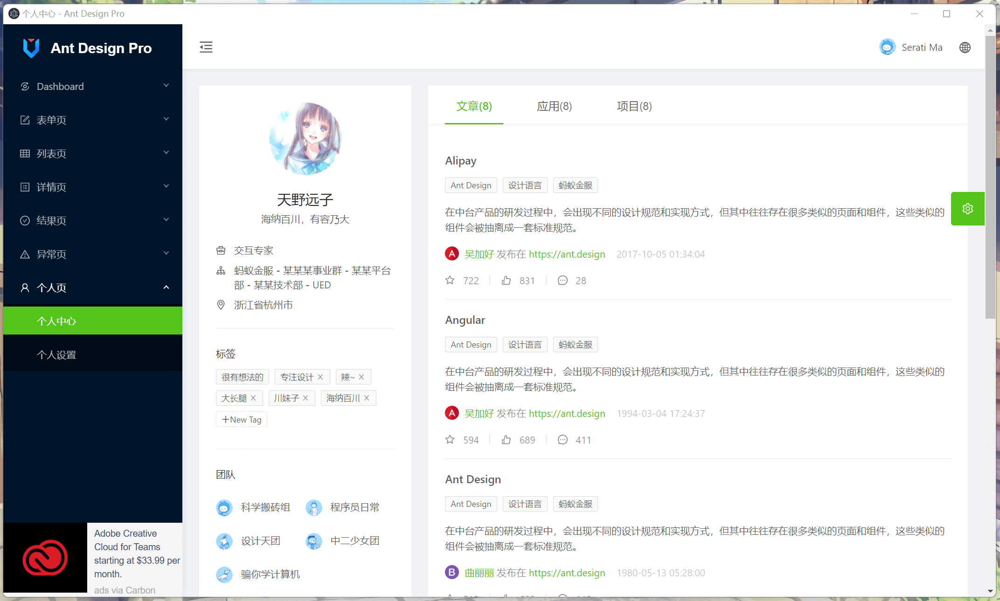

- 🚙 zendao（web url）

    

### 🚂 3. game（development related to H5 technologies）
- 🚊 Ninja 100 Floors

    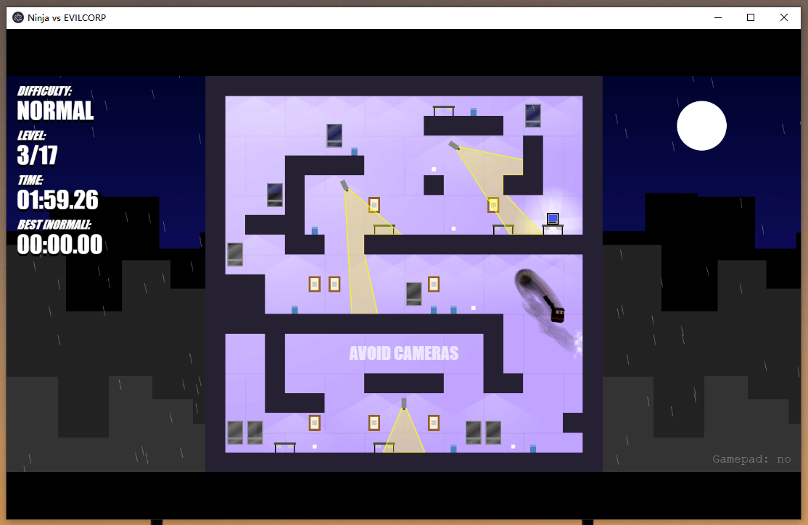

## 📒 start using

- ✒️ [Installation document](https://www.kaka996.com/pages/e64ff6/)
    
## project-case
- 🐟 The framework has been applied to the clients in various fields, including healthcare, education, government affairs, stock trading, ERP, entertainment, video, and enterprises.

### 🐸 knowledge note

- [gaiyan](https://gaiyan.net?from=electron-egg) 
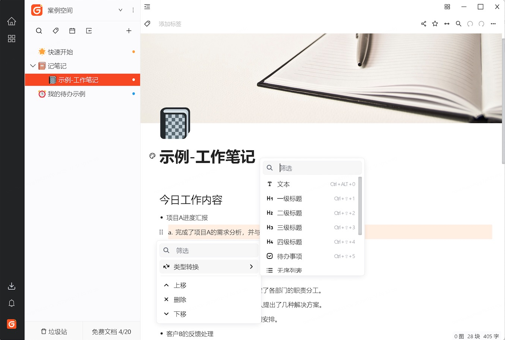
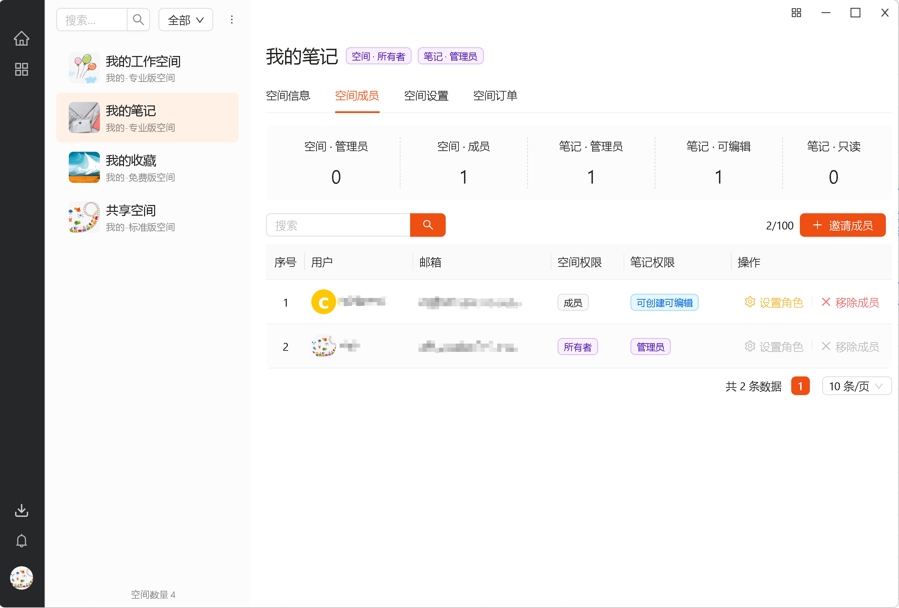

### 🐸 remote control

- RQ Center

### 🐸 cloud drive

- FM Cloud

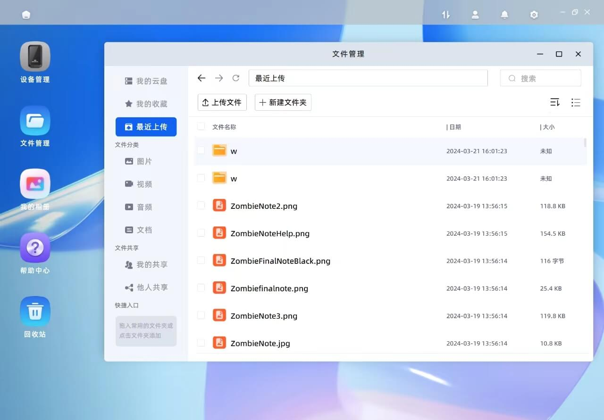

### 🐸 IM

- Cede IM
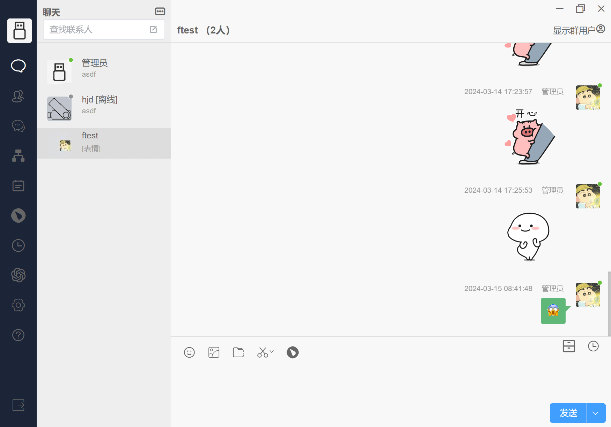

### 🐸 wallpaper

- warpar

### 🐸 League of Legends Helper

- Serendlplty
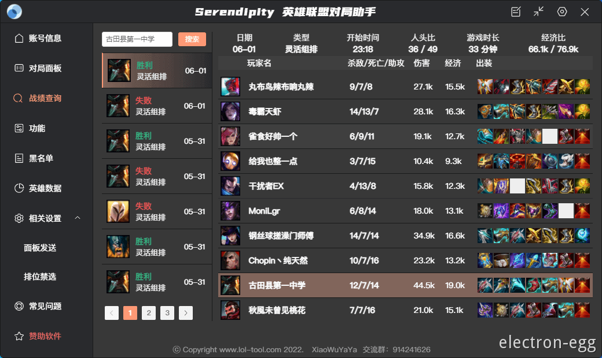

### 🐸 more

- [More cases](https://www.kaka996.com/pages/eadf46/)

## 💬 communication
1. [discuss](https://www.kaka996.com/pages/c2720e/)

## 📌 about pr
Please go to the[GitHub project](https://github.com/dromara/electron-egg)to submit a PR（to avoid the PR being overwritten after the code is synchronized). Thank you!

Website address: https://github.com/dromara/electron-egg

## 📔 Framework core package: ee-core
ee-core：[https://github.com/wallace5303/ee-core](https://github.com/wallace5303/ee-core)

## 📚 Dromara member projects

