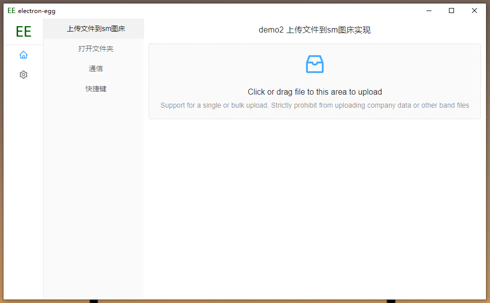
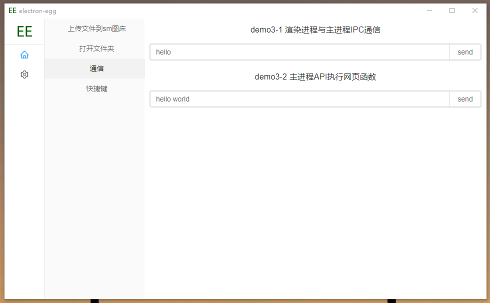

# electron-egg 
[](https://gitee.com/wallace5303/electron-egg/stargazers)

一个简单、快速、功能丰富的跨平台桌面软件开发框架。

- 🏆 码云最有价值开源项目


## 文档
- [教程文档](https://www.yuque.com/u34495/mivcfg/xnhmms)
- 文档进行了重新编写，更加直观，一定要看！！！

## 特性
1. 跨平台：一套代码，可以打包成windows版、Mac版、Linux版或者以web网站运行
2. 简单高效：支持vue、react、ejs等，数据服务请求外部api即可
3. 工程化：可以用服务端的开发思维，来编写桌面软件
4. 高性能：可启动多个工作进程
5. 功能丰富：服务端的技术场景都可以使用，如：路由、中间件、控制器、服务、定时任务、队列、插件等
6. 功能demo：桌面软件常见功能，后续逐步集成并完善或提供demo
7. 自动更新
8. 更多功能请看文档

## 默认UI

- demo使用vue编写，经典三栏样式，可自定义（使用你自己的前端页面）




## 开始使用

1. 下载
    ```
    # gitee
    git clone https://gitee.com/wallace5303/electron-egg.git
    # github
    git clone https://github.com/wallace5303/electron-egg.git
    ```

2. 安装
    ```
    # 提升安装速度，使用国内镜像；注：勿使用cnpm命令，可能出现安装不完整
    npm config set registry https://registry.npm.taobao.org
    # 进入目录 ./electron-egg/
    npm install
    ```
    
3. 常用命令
    ```
    # 开发者模式
        # 1：【进入前端目录】，启动vue
        cd frontend && npm install && npm run serve
        
        # 2：【根目录】，启动后端服务
        cd ../ && npm run dev

    # 预发布模式（环境变量为：prod）
    npm run start

    # 打包-windows版本
    npm run build-w (32位)
    npm run build-w-64 (64位)

    # 打包-mac版本
    npm run build-m
    npm run build-m-arm64 (苹果M1芯片架构)

    # 打包-linux版本
    npm run build-l

    # web运行-开发模式
    npm run web-dev

    # web运行-生产者模式-启动
    npm run web-start

    # web运行-生产者模式-停止
    npm run web-stop
    ```

## 项目案例

1. [小明云存储](https://gitee.com/wallace5303/xm-pic)


2. 可联系我（qq：530353222），展示你的项目。

## 交流
1. qq群：735532437
2. 把一些常用或者重复的功能，做成桌面小工具，给自己或者别人用，确实省了不少时间^_^ 

## 功能列表
1. 软件自动更新
2. 数据本地存储
3. 以web版运行
4. 默认UI
5. egg与electron通信
6. 开发模式实时渲染页面
7. 更多功能请看文档

## 关于pr
请前往[GitHub项目](https://github.com/wallace5303/electron-egg)提pr（避免代码同步后，pr被覆盖掉），感谢！

地址：https://github.com/wallace5303/electron-egg

## 感谢star


