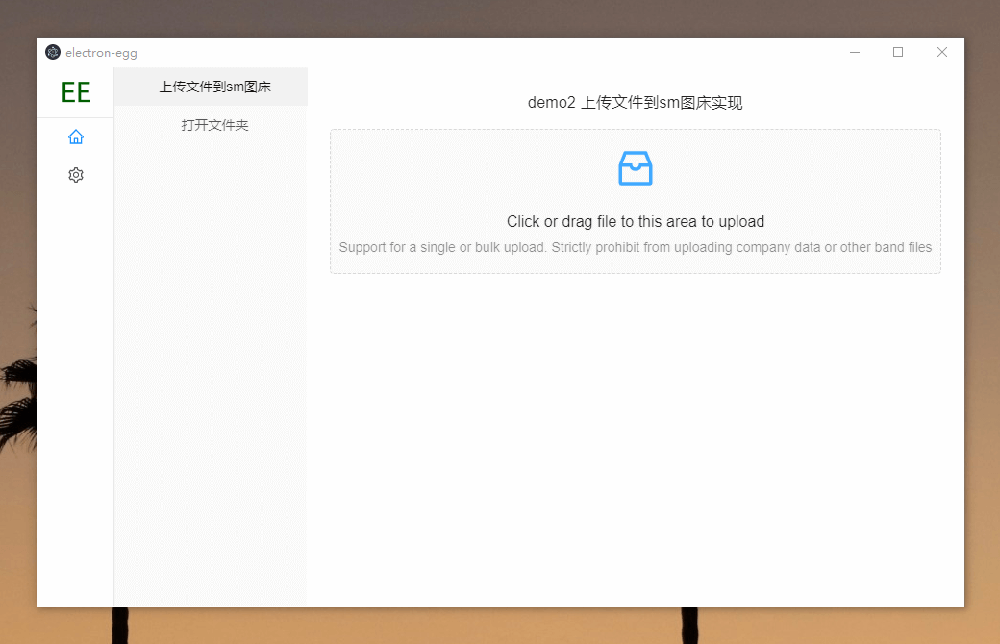
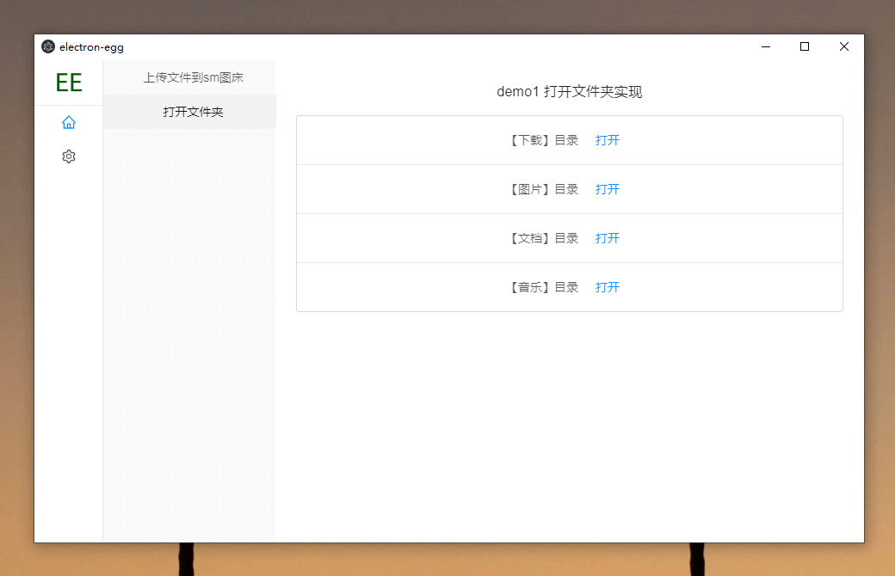

# electron-egg 
一个简单、快速、功能丰富的跨平台桌面软件开发框架。

查看：[教程文档](https://www.yuque.com/u34495/mivcfg/xnhmms)

🏆 码云最有价值开源项目

## 特性
1. 直接打包成windows版、Mac版、Linux版或者以web网站运行。
2. 可以用服务端的开发思维，来编写桌面软件。
3. 也可以用前端来开发，数据服务请求外部api即可。
4. 服务端的技术场景几乎都可以使用，如：路由、中间件、控制器、服务、定时任务、队列、插件等。
5. 桌面软件常见功能，后续逐步集成并完善或提供demo。
6. 软件自动更新。

## 默认UI

- 使用vue编写，经典三栏样式，可自定义




## 开始使用

1. 下载
    ```
    # gitee
    git clone https://gitee.com/wallace5303/electron-egg.git
    # github
    git clone https://github.com/wallace5303/electron-egg.git
    ```

2. 安装
    ```
    # 提升安装速度，使用国内镜像；注：勿使用cnpm命令，可能出现安装不完整
    npm config set registry https://registry.npm.taobao.org
    # 进入目录 ./electron-egg/
    npm install
    ```
    
3. 常用命令
    ```
    # 开发者模式
        # 1：【进入前端目录】，启动前端服务
        cd electron-egg/frontend && npm run serve
        # 2：【根目录】，启动后端服务
        npm run dev

    # 生产者模式
    npm run start

    # 打包-windows版本
    npm run build-w

    # 打包-mac版本
    npm run build-m

    # 打包-linux版本
    npm run build-l

    # web运行-开发模式
    npm run web-dev

    # web运行-生产者模式-启动
    npm run web-start

    # web运行-生产者模式-停止
    npm run web-stop
    ```

## 项目案例

1. [小明云存储](https://gitee.com/wallace5303/xm-pic)


## 交流
1. qq群：735532437
2. 把一些常用或者重复的功能，做成桌面小工具，给自己或者别人用，确实省了不少时间^_^ 

## 进行中功能

1. 软件自动更新（已完成）
2. 数据本地存储（已完成）
3. mac版功能兼容（已完成）
4. 以web版运行（已完成）
5. 默认UI（已完成）
6. egg与electron通信（已完成）
7. 打开文件功能demo（已完成）
8. 上传文件到sm图床demo（已完成）
9. 开发模式实时渲染页面（已完成）

## 关于pr
请前往[GitHub项目](https://github.com/wallace5303/electron-egg)提pr（避免代码同步后，pr被覆盖掉），感谢！

地址：https://github.com/wallace5303/electron-egg

## 欢迎star


