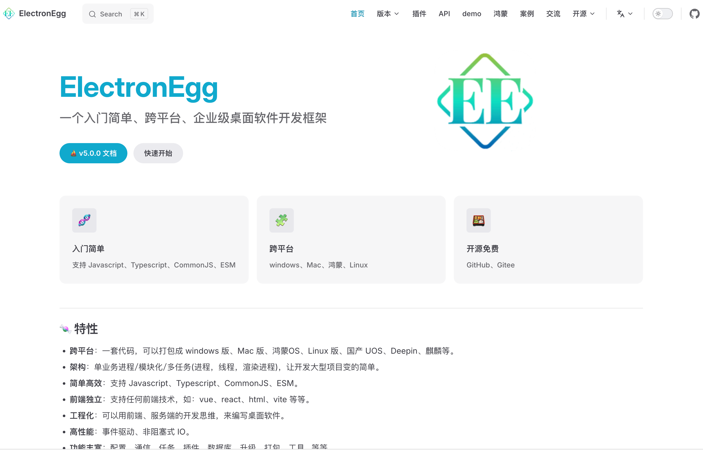
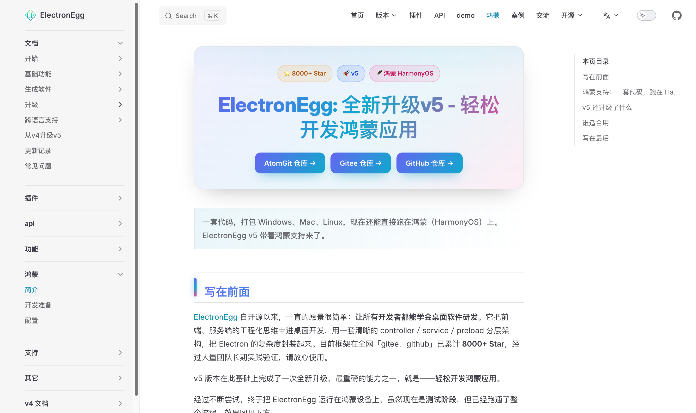
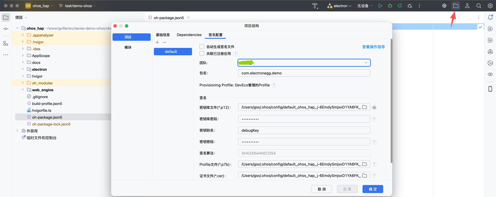
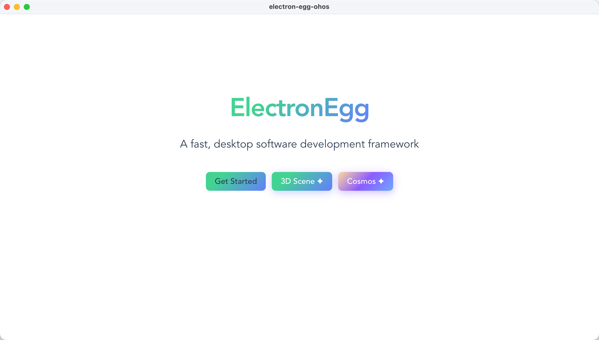
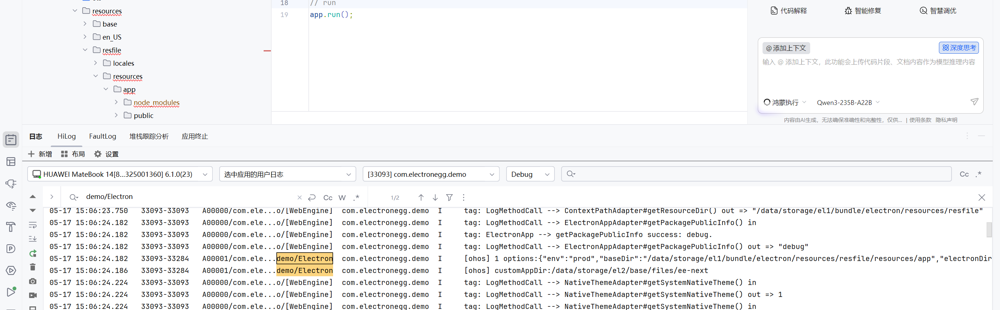

<!-- TODO: 发布时补充 Schema.org BlogPosting 结构化数据，至少包含 headline、author、datePublished、mainEntityOfPage。 -->

# 鸿蒙PC软件开发框架：ElectronEgg，一套代码，从桌面到鸿蒙

> **欢迎加入开源鸿蒙PC社区：** [https://harmonypc.csdn.net/](https://harmonypc.csdn.net/)
>
> **欢迎在PC社区平台申请新建项目：** [https://atomgit.com/OpenHarmonyPCDeveloper](https://atomgit.com/OpenHarmonyPCDeveloper)

## 摘要

ElectronEgg 是一个基于 Electron 的企业级桌面应用框架，累计 8000+ Star，经过大量团队长期实践验证。v5 最大的变化之一，是同一套代码除了打包 Windows、Mac、Linux，还能直接跑在鸿蒙上。本文把鸿蒙支持能力、环境搭建、资源构建与配置这条链路完整走一遍。

## 一、ElectronEgg 简介

ElectronEgg 自开源以来，愿景很简单：**让所有开发者都能学会桌面软件研发**。它把前端、服务端的工程化思维带进桌面开发，用一套清晰的 controller / service / preload 分层架构，把 Electron 的复杂度封装起来。



v5 在这个基础上做了一次整体升级，其中我们花力气最多的一件事，就是让 ElectronEgg 能跑在鸿蒙设备上。目前还是**测试阶段**，但整条流程已经跑通了。

### 1.1 鸿蒙支持：一套代码，跑在 HarmonyOS 上

过去把 Electron 应用搬到鸿蒙上，几乎等于重写一遍。v5 的做法是把构建产物放进 HarmonyOS HAP，交给 HAP 工程的 web 引擎加载——现有的 ElectronEgg 业务代码几乎不用动，就能以鸿蒙应用的形式跑起来。

原本在 Windows / Mac 上运行的那套应用，在鸿蒙端的安装和各项功能都已经验证过了。



### 1.2 框架功能

除了鸿蒙支持，v5 还做了这些：

**工程与构建**

- **TypeScript 全面重构**：所有 API 都有完整类型定义，ee-bin 也补齐了类型体系
- **双模块格式输出**：CJS 和 ESM 都支持
- **主进程打包**：主进程代码可以像前端一样 bundle；配套的构建注册表插件复现了运行时的属性名映射逻辑，打包不了的零散文件（比如 jobs）单独转译
- **构建配置增强**：新增大量精细控制项（minify、drop、external、copy 等）
- **资源原子化移动**：避免中途失败丢数据

**运行时**

- **Node.js 版本提升**：最低 Node.js >= 20.19.0
- **Pino 日志体系**：日志能力整体重做
- **Bundle 注册表机制**：启动更快
- **异步控制器加载**：支持 ESM 动态导入，避免同步/异步并发竞争；并发请求之间明确保证无状态污染
- **配置加载 ESM 兼容**：自动解包 `__esModule`，支持函数/类导出
- **EventBus 事件隔离**：生命周期事件不再互相干扰
- **Cross 跨进程改进**：Go / Python 子进程的拉起与日志处理更顺手

**安全**

- **加密系统升级**：混淆加密内置到构建链，一条命令搞定（详见第 06 篇的实测）

### 1.3 谁适合用

- 想用前端技术栈（Vue / React / HTML）做桌面软件的开发者
- 需要把内部工具、管理后台、办公软件交付为桌面应用团队
- 要同时覆盖 Windows、Mac、Linux，**以及鸿蒙**的产品
- 希望降低 Electron 上手成本、想要一套清晰架构的团队

无论你是前端、服务端、运维还是客户端开发者，都能很快入门。

### 1.4 开源仓库

- 框架仓库（AtomGit）：[https://atomgit.com/dromara/electron-egg](https://atomgit.com/dromara/electron-egg)
- 鸿蒙 PC 适配仓（AtomGit PC 社区）：[https://atomgit.com/OpenHarmonyPCDeveloper/ohos_electron-egg](https://atomgit.com/OpenHarmonyPCDeveloper/ohos_electron-egg)
---

## 二、开发准备

> 当前鸿蒙支持处于实验阶段，请持续关注更新。

### 2.1 开发资料

- [鸿蒙应用知识地图](https://developer.huawei.com/consumer/cn/app/knowledge-map/)（必看）
- [鸿蒙系统开发导读](https://developer.huawei.com/consumer/cn/doc/harmonyos-guides/application-dev-guide)（非必看）
- [Electron 鸿蒙化指导文档](https://gitcode.com/CPF-Electron/Electron)（非必看）
- [鸿蒙三方库](https://ohpm.openharmony.cn/#/cn/home)（了解）
- [鸿蒙 PC 开发者社区](https://harmonypc.csdn.net/)

### 2.2 环境准备

- 准备一台 **macOS M 芯片电脑**，方便本地模拟器调试。如果是 Windows 或 macOS Intel 芯片电脑，需要鸿蒙真机设备调试。因为鸿蒙 Electron 是构建好的 arm64 架构软件，非 M 芯片电脑无法运行 arm 架构模拟器。
- 下载 [DevEco Studio](https://developer.huawei.com/consumer/cn/download/deveco-studio)
- 下载 [鸿蒙 Electron](https://devcloud.cn-north-4.huaweicloud.com/codehub/project/b19f5ea8ffd4492ea8c06ca2ebf3f858/codehub/2821214/home?ref=electron37-release)

### 2.3 DevEco 设置资源目录（macOS 可忽略）

可选：把系统组件、SDK、模拟器等，下载到非 C 盘，避免占用 C 盘空间：

1. ark-ui 目录修改：`D:\dev_soft\harmony\ArkUI-X\Sdk`
2. codeGenie / 知识库 / 文档：`D:/dev_soft/harmony/Doc`
3. OpenHarmonySdk：`D:\dev_soft\harmony\OhSdk`
4. 设备管理器：`D:/dev_soft/harmony/emulator`

### 2.4 获取一个示例项目

1. 下载示例项目

```bash
# atomgit （推荐）

# 示例项目（鸿蒙 PC 适配仓）
git clone https://atomgit.com/OpenHarmonyPCDeveloper/ohos_electron-egg.git
```

2. 下载官方框架，主要是为了获取 ohos_hap/electron 资源

```bash
# 框架项目
git clone https://atomgit.com/dromara/electron-egg.git

# 检出 demo-ohos 分支并切换
git checkout -b demo-ohos remotes/origin/ohos/demo-37.2.2
```

3. 把 `electron-egg/ohos_hap/electron/libs` 整个目录复制（或替换）到 `ohos_electron-egg/ohos_hap/electron/libs`。

   这里放的是构建好的引擎运行时库，体积比较大，没有跟着示例项目一起托管，建议你放进自己的仓库里。

4. 工程目录结构

```text
ohos_electron-egg
├── electron/          # 主进程源码（controller / service / preload）
├── frontend/          # Vue 3 前端
├── go/                # Go 后端（可选）
├── cmd/               # bin.js 与 builder*.json 构建配置
├── public/            # 构建产物与静态资源
└── ohos_hap/          # 鸿蒙 HAP 工程
    ├── AppScope/      # 应用级配置与图标资源
    ├── electron/      # 鸿蒙 entry HAP（Ability、ArkUI 页面）
    └── web_engine/    # 核心 HAR 引擎层，承载前端资源
```

### 2.5 构建资源

把 electron-egg-ohos 项目构建产物，同步到 `ohos_hap` 工程的资源目录中。

> 注意：`cmd/builder-xxx.json` 中的 `asar` 属性需要是 `false`。

1. 构建 ElectronEgg 产物

```bash
# v5 版本默认生成 arm64 架构软件
npm run build-m
```

2. 同步资源到 ohos_hap 资源目录

```bash
npm run ohos
```

3. （可选）不打包，直接复制资源到 ohos_hap 资源目录，用于代码修改后的快速测试

```bash
npm run ohos-test
```

---

## 三、使用 DevEco Studio 运行项目

### 3.1 打开项目

- 启动 DevEco Studio
- 选择 File -> Open
- 打开 `./ohos_hap` 目录

### 3.2 配置签名

如果是首次运行，需要配置应用签名：自动生成调试签名或配置发布签名。



### 3.3 连接鸿蒙真机设备

使用 USB Type-C 数据线连接开发电脑和鸿蒙设备。

在设备上启用开发者模式和 USB 调试模式：

- **激活开发者模式**：进入「设置」> 搜索或找到「软件版本」，连续快速点击 7 次，弹出确认框后点击"确定"；部分版本需重启设备生效。
- **进入开发者选项**：重启后返回「设置」>「系统」>「开发者选项」（若未显示请确认已重启且处于机主模式）。
- **开启 USB 调试**：在开发者选项列表中找到"USB 调试"，点击开关并确认弹窗授权；HarmonyOS 5+ 可能需同步开启"仅充电模式下允许 ADB 调试"（若存在该选项）。
- **连接验证**：使用原装 USB 线连接电脑，手机端弹出"允许 USB 调试"对话框时勾选"始终允许"并确认；通知栏 USB 用途建议选择"文件传输/MTP"。

在 DevEco Studio 中确认设备已连接（顶部工具栏会显示设备名称）。

### 3.4 编译和运行

点击「运行」按钮，系统会自动进行以下操作：

- 编译 HAP 包
- 重新签名
- 安装到设备
- 启动应用

过一会，就可以在鸿蒙设备上看到应用了。



---

## 四、调试

### 4.1 渲染进程调试

调用 `openDevTool()` API 来打开开发者工具。

### 4.2 主进程调试

#### 控制台日志

由于 IDE 打印的日志较多，你可以在控制台搜索过滤。其中 `... [ohos] xxx ...` 是代码里 `console` 打印的日志。



#### 文件日志

真机设备上，日志目录：

```text
/storage/Users/currentUser/appdata/el2/base/com.electronegg.ohos/files/应用名/data
/storage/Users/currentUser/appdata/el2/base/com.electronegg.ohos/files/应用名/logs
```

---

## 五、鸿蒙资源配置

### 5.1 配置方法

上一节用的现成命令，背后就是这段配置。资源提取由 `ee-bin` 的 `ohos` 命令完成，规则沿用 electron-builder 的 `extraResources` FileSet 规范（`from` / `to` / `filter`）。在 `bin.js` 的 `ohos` 字段下按用途分组声明，每个条目是一个 FileSet：

```javascript
// cmd/bin.js
module.exports = {
  // ...其它 ee-bin 配置
  ohos: {
    // 生产：从打包后的 .app 里取
    resources: [
      {
        from: './out/mac-arm64/ee.app/Contents/Resources/app',
        to: './ohos_hap/web_engine/src/main/resources/resfile/resources/app',
        filter: ["**/*", "!README.md", "!README.zh-CN.md"]
      },
      {
        // extraResources 用 OHOS 交叉编译产物；mac .app 里的 goapp 是 Mach-O，
        // 在 OHOS 上 spawn 会报 ENOEXEC
        from: './build/extraResources-ohos',
        to: './ohos_hap/web_engine/src/main/resources/resfile/resources/extraResources',
        filter: ["**/*"]
      }
    ]
  }
}
```

### 5.2 配置字段说明

| 字段       | 类型         | 说明                                                                       |
| ---------- | ------------ | -------------------------------------------------------------------------- |
| `from`   | `string`   | 源路径（相对项目根目录），即要拷贝的构建产物                               |
| `to`     | `string`   | 目标路径（相对项目根目录），位于 HAP 资源目录内                            |
| `filter` | `string[]` | glob 匹配规则。`**/*` 匹配所有；`!pattern` 表示排除。默认 `['**/*']` |

### 5.3 使用命令

`package.json` 里的两个脚本分别对应上面两组配置：

```bash
npm run ohos        # = ee-bin ohos --cmds=resources，构建并同步资源
npm run ohos-test   # = ee-bin ohos --cmds=test，不打包，直接复制 public/
```

`--cmds` 接受逗号分隔的 `ohos` 下的 key 列表；省略则处理 `ohos` 下所有数组类型的配置项。

---

## 六、迁移能力分档：T0 / T1 / T2

「能不能跑在鸿蒙上」这个问题的答案，分三档看才准确。下面按 T0 / T1 / T2 给出 ElectronEgg 当前的支持程度，验收口径都落在具体动作上，不做模糊表述。

| 阶段 | 目标 | 验收内容 |
| --- | --- | --- |
| **T0：可启动** | HAP 能安装并打开首页 | `npm run build-m` 产出 arm64 产物；`npm run ohos` 同步进 HAP 工程；DevEco Studio 编译签名后安装、启动 EntryAbility，主界面正常显示、无白屏 |
| **T1：核心业务可用** | 前端资源与主进程能力可用 | Vue 前端资源随 HAP 加载；controller / service 路由正常；IPC 调用有返回；窗口创建、日志落盘正常 |
| **T2：可发布** | 覆盖产品的实际使用边界 | 多窗口与多实例、托盘、系统通知、网络权限声明、代码加密、自动升级按目标设备与业务场景逐项回归 |

三档的关系是递进的：T0 不通过，后面都是空谈；T1 决定框架能力有没有真的用上；T2 则是把「能跑」推到「能交付」。

有两点需要说清楚：

- **T0、T1 已经在鸿蒙模拟器与真机上跑通**，本文第三章的操作流程就是走这两档。
- **T2 不是一次性完成的清单**，而取决于业务实际用到了哪些桌面能力——用到托盘就验托盘，用到通知就验通知，每项都要在目标设备上重新确认。桌面端能跑不等于 HAP 自动具备同样权限，这一点在第三篇《功能适配鸿蒙PC》里有展开。

项目的迁移能力与分档结论同样写在仓库的 `README.OpenHarmony_CN.md` 里，随版本更新。

## 七、总结

ElectronEgg v5 的鸿蒙支持，让前端开发者不用再去啃一套全新的鸿蒙原生开发体系，用熟悉的技术栈（Vue / React / HTML + Electron）就能做出鸿蒙 PC 应用。整条链路其实就四步：装好 DevEco Studio 和鸿蒙 Electron，`npm run build-m` 出 arm64 产物，`npm run ohos` 同步进 HAP 工程，最后用 DevEco Studio 打开 `ohos_hap`、连真机跑起来。

桌面软件（办公类、个人工具）未来十几年仍然是 PC 端的刚需。框架已经在记账、政务、企业、医疗、学校、股票交易、ERP、娱乐、视频等领域的客户端上跑了很多年，可以放心用。

如果这篇对你有帮助，欢迎 Star，也欢迎来社区一起交流。

## 参考与延伸

- 开源鸿蒙 PC 社区：[https://harmonypc.csdn.net/](https://harmonypc.csdn.net/)
- PC 社区项目平台（AtomGit）：[https://atomgit.com/OpenHarmonyPCDeveloper](https://atomgit.com/OpenHarmonyPCDeveloper)
- ElectronEgg 框架仓库（AtomGit）：[https://atomgit.com/dromara/electron-egg](https://atomgit.com/dromara/electron-egg)
- ElectronEgg 鸿蒙 PC 适配仓（AtomGit PC 社区）：[https://atomgit.com/OpenHarmonyPCDeveloper/ohos_electron-egg](https://atomgit.com/OpenHarmonyPCDeveloper/ohos_electron-egg)
- DevEco Studio 下载：[https://developer.huawei.com/consumer/cn/download/deveco-studio](https://developer.huawei.com/consumer/cn/download/deveco-studio)
- OpenHarmony 官方文档：[https://docs.openharmony.cn/](https://docs.openharmony.cn/)
- 华为开发者文档：[https://developer.huawei.com/consumer/cn/doc/](https://developer.huawei.com/consumer/cn/doc/)
