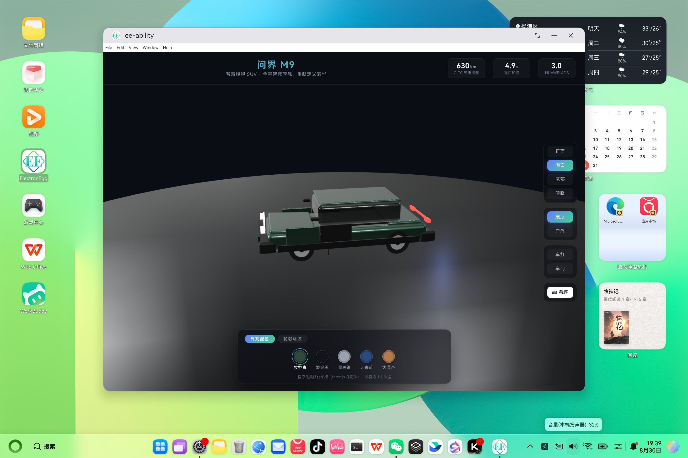
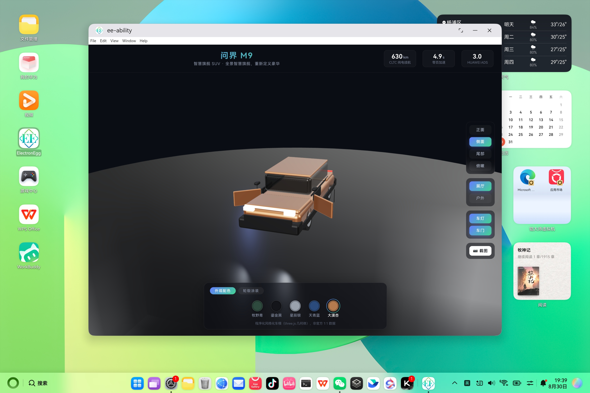

<!-- TODO: 发布时补充 Schema.org 结构化数据（BlogPosting），标注 headline / author / datePublished / mainEntity -->

# 【鸿蒙PC开发】使用AI编程工具Claude Code开发完整应用实践

> **欢迎加入开源鸿蒙PC社区：** [https://harmonypc.csdn.net/](https://harmonypc.csdn.net/)
>
> **欢迎在PC社区平台申请新建项目：** [https://atomgit.com/OpenHarmonyPCDeveloper](https://atomgit.com/OpenHarmonyPCDeveloper)

## 摘要

本文记录了用 Claude Code 开发鸿蒙 PC 应用的完整过程，覆盖环境准备、应用开发、运行时诊断、真机调试和打包发布。示例项目是一个 **3D 看车应用**：three.js 程序化搭出全尺寸 SUV 车模，支持车漆 / 轮毂换装、展厅 / 户外双场景、预设视角飞行、车灯车门动画和截图，构建产物打包进 HAP，由鸿蒙 PC 的 ArkWeb WebView 加载。过程中踩了两个坑：three.js r185 的 API 变更引发运行时 TypeError，HAP 部署时报设备连接故障（ErrorCode:00404039）。环境准备部分则用 `arkts-runtime-fix` Agent Skill 的一次真实安装，演示了装第三方技能前怎么核对来源、审查脚本风险、处理已有安装冲突。

## 一、Claude Code 简介

Claude Code 是 Anthropic 推出的 AI 编程工具，可直接在终端里以对话方式参与编码：读懂工程上下文、生成与修改代码、执行命令、按任务加载 Agent Skill。对鸿蒙 PC 开发而言，它既能辅助 ArkTS / ArkUI 编码，也能辅助 Vue + Electron 这类「前端资源跑在鸿蒙 WebView 里」的应用开发——本文 3.1～3.4 节演示的就是后一条路径。

### 1.1 它能做什么

在本文的 3D 看车项目中，Claude Code 实际完成了这些工作：

- **代码生成与补全**：根据一句话需求生成完整工程骨架与业务代码（Vue 页面、three.js 车模、Electron 主进程控制器）
- **架构设计**：把一段文字需求拆成分层结构（页面壳 + three.js 模块 + IPC 控制器 + 内嵌配置）
- **鸿蒙 ArkTS / ArkUI 语法纠错**：对 ArkTS 工程提供编译与类型错误修复建议（见 2.3 的 `arkts-error-fixes`）
- **鸿蒙系统能力（@ohos.* / @kit.*）API 建议**：给出符合当前 SDK 的接口、权限与替代方案
- **运行时崩溃（jscrash / hilog）辅助诊断**：通过 `arkts-runtime-fix` Agent Skill 提取异常类型、源码位置与调用栈（见 2.3）
- **鸿蒙 PC 运行适配**：识别 WebView 无 Electron API 的环境差异，落地前端自包含降级方案（见 3.3）
- **部署问题定位**：HAP 推送失败时，用 hdc 设备侧证据收敛根因，而不是凭报错文案猜（见 4.3）

### 1.2 与传统开发方式对比

开发鸿蒙 PC 应用有两条路径：一条是传统手写，从零学 ArkTS 语法与 ArkUI 组件体系，在 `@ohos.*` / `@kit.*` 文档里逐条查接口，崩了再翻 `jscrash` / `hilog` 日志手工定位；另一条是借助 Claude Code 这类工具，用自然语言描述需求生成代码，并把排障方法固化成可复用的 Agent Skill。两者的差异不只在打字速度，更在学习成本、排错方式和经验沉淀上。

| 维度 | 传统手写开发 | Claude Code AI 辅助 |
| --- | --- | --- |
| 上手门槛 | 需先掌握 ArkTS 语法、ArkUI 组件体系与工程结构，新手通常要数周才能独立写出可运行的界面 | 用自然语言描述界面与逻辑即可生成骨架代码，新手当天即可跑通可运行的 Demo |
| ArkTS 语法熟悉成本 | 需系统阅读官方语法规范，靠编译器报错逐步纠正，容易卡在类型限制（禁止 `any`、严格空安全）与声明式 UI 写法上 | 生成代码默认贴合 ArkTS 规范；编译报错可直接交给 Claude Code 解释并修复，熟悉成本明显下降 |
| 鸿蒙 API 查找效率 | 在 `@ohos.*` / `@kit.*` 文档、社区帖子与示例工程之间反复切换，还需自行判断接口是否已过时 | 直接提问即可得到符合当前 SDK 的 API 建议、用法与权限说明，还能获得替代方案 |
| 崩溃定位速度 | 面对 `jscrash` / `hilog` 的海量日志手工逐行分析，调用栈与源码对不上时尤其耗时 | 通过 `arkts-runtime-fix` 等 Agent Skill 自动提取异常类型、源码位置与调用栈，必要时再用 `hdc` 拉取设备日志，快速收敛根因 |
| 排错经验与知识的沉淀 | 结论散落在个人记忆与聊天记录中，难以复用和共享 | 把稳定的排障方法固化到 Agent Skill，一次审查、处处复用，新成员也能按同一套流程排障 |
| 结果可靠性 | 代码完全可控，质量取决于个人经验与审查习惯 | 生成速度快，但需人工 review，边界条件与权限、安全细节必须由人确认，不能盲信 |

#### 边界与原则

对比不是为了说明「AI 能替代开发」，而是强调「AI 辅助能缩短到第一个可运行版本的距离」。生成的代码仍可能引用过时的 API、遗漏权限声明，或在边界条件下出错，所以本文贯穿两条原则：**先审查后执行**——安装操作、脚本与设备访问都要核对来源再运行；**逐段 review、最小化修改**——不整段盲贴，只采纳理解并验证过的改动。两条原则在 2.3 与 3.4 节都有具体演示。

## 二、开发环境准备

鸿蒙 PC 开发环境分两部分：DevEco Studio + 鸿蒙 SDK（负责 HAP 编译、签名、部署到模拟器 / 真机），以及 Claude Code 与 Agent Skill（负责代码生成与运行时诊断）。

### 2.1 软件与硬件要求

本文使用的环境：

| 项 | 要求 | 本次使用 |
| --- | --- | --- |
| 开发机操作系统 | macOS / Windows / Linux | macOS（M 芯片） |
| DevEco Studio | 随鸿蒙 SDK 一起安装 | 6.1 |
| 鸿蒙 SDK | 与 DevEco Studio 配套安装 | OpenHarmony SDK 23 |
| 鸿蒙 PC 设备 | 真机（USB 调试）或模拟器 | 本机模拟器「MateBook Pro 14」 |
| Node.js | ≥ 20.19.0（ElectronEgg 要求） | v22 |
| 包管理器 | npm / pnpm | npm |
| Claude Code | 命令行工具 + 已登录账号 | 最新版 |

> 说明：鸿蒙 Electron 产物是构建好的 **arm64** 架构软件。macOS M 芯片电脑可直接用本地模拟器调试；Windows / macOS Intel 电脑建议改用鸿蒙真机。

### 2.2 安装 Claude Code

一条 npm 命令即可：

```bash
# macOS / Linux / Windows 通用
npm install -g @anthropic-ai/claude-code
```

> 更详细的安装与配置见 [Claude Code 官方文档](https://code.claude.com/docs)。

### 2.3 安装并审查 Agent Skill

Agent Skill 的作用，是把一套稳定的排障方法、参考资料和辅助脚本交给 AI 按需调用。本文用到四个，发布者都是 CarSmallGuo，审查固定在 `deveco-code` 的 `0.1.0-TD.4` 标签（提交 `567c83c8fa7299196864b2710566bdcc73f3c271`）：

| 技能 | 用途 | 固定版本目录内容 |
| --- | --- | --- |
| `arkts-runtime-fix` | `jscrash`、未捕获异常、调用栈、`faultlogger`、`hilog` 等运行时崩溃诊断 | `SKILL.md`、中英文说明、`evals/evals.json`、可直接执行的 `.mjs` 脚本与 8 个 `.ts` 源文件 |
| `arkts-error-fixes` | 编译错误与类型不匹配修复 | `README.md`、`SKILL.md`、32 个 ArkTS 示例和 31 篇参考资料，共 65 个文件 |
| `arkts-grammar-standards` | 编写或修改 `.ets` 前核对 ArkTS 语法、限制及与 TypeScript 的差异 | `SKILL.md` 与 4 个 `references/` 文件，共 5 个文件 |
| `arkui-knowledge` | ArkUI 组件、布局、状态、渲染、导航、交互与 UI 质量检查 | `SKILL.md` 与 4 个 `references/` 文件，共 5 个文件 |

技能介绍见 [SkillsMP](https://skillsmp.com/creators/carsmallguo/deveco-code/packages-opencode-resources-skills-arkts-runtime-fix)，固定版本源码见 [GitHub](https://github.com/CarSmallGuo/deveco-code/tree/0.1.0-TD.4/packages/opencode/resources/skills/arkts-runtime-fix)（以 `arkts-runtime-fix` 为例，其余三个同路径换名）。

#### 2.3.1 安装前先审查来源和完整目录

不要只下载一个 `SKILL.md`——技能行为还可能由 `scripts/`、`reference/` 等伴随目录决定，漏了文件，说明就和实际能力对不上。把技能固定到明确的标签或提交，完整读一遍 `SKILL.md` 及其引用的文件：

```bash
git clone --depth 1 --branch 0.1.0-TD.4 \
  https://github.com/CarSmallGuo/deveco-code.git \
  /tmp/deveco-code-0.1.0-TD.4

find /tmp/deveco-code-0.1.0-TD.4/packages/opencode/resources/skills/arkts-runtime-fix \
  -type f -print | sort
```

`arkts-runtime-fix` 的脚本里没有删除数据、提权、静默上传或安装时访问设备的行为，但运行时有几处边界值得记下来：

| 行为 | 风险与使用建议 |
| --- | --- |
| 调用 DevEco `hdc` | 只有明确执行脚本时才会访问已连接设备；运行前确认目标设备 |
| 读取 `faultlogger` 与 `hilog` | 日志可能包含应用路径、Bundle 名称、调用栈和运行时数据，对外分享前应脱敏 |
| 拉取故障日志到本机 | 文件会写入调用者指定的输出目录，应使用专用目录并检查剩余空间 |
| 执行 `.ts` 源文件 | `shared/hdc.ts` 依赖原仓库内部模块；脱离仓库时使用自包含的 `.mjs` 脚本 |

另外三个技能干净得多：没有 `scripts/`、二进制文件或带可执行权限的文件，内容全是 Markdown、JSON 和用于说明的 `.ets` 示例，`rm -rf`、`sudo`、`eval` 这类高风险命令的文本扫描也没命中——安装它们只是复制本地知识资料，不会自动执行示例或连接设备。可以保留的风险意识是：参考资料可能随 DevEco SDK 与 ArkUI API 演进而过时，`arkts-error-fixes` 给的修改建议必须在当前 SDK 里重新编译、并在目标设备上验证过才算数。

#### 2.3.2 安装方式与已有安装冲突

Claude Code 通过 `~/.claude/skills/`（用户级）目录发现技能，所谓安装就是把完整目录放进去——目录内含带 `name` / `description` frontmatter 的 `SKILL.md`，以及它引用的 `scripts/`、`reference/` 等伴随文件。发布方用 Git 标签发布，所以先把固定版本检出到临时目录（见 2.3.1）。

放完还要确认发现路径，不能凭「复制完了」就认为装好了。技能目录可能是符号链接，指向系统级的 DevEco 技能目录：

```text
~/.local/share/deveco/skills/arkts-runtime-fix   # 唯一内容源
~/.claude/skills/arkts-runtime-fix               # 指向上方目录的符号链接
```

这种情况下直接复制完整目录，可能因目标是符号链接而失败，也可能覆盖或降级已有内容。正确做法是逐项比对文件树和内容差异，只补缺失的部分，始终维持单一全局内容源。

另外三个技能没有这类冲突，直接从固定标签源码复制完整目录即可，注意保留相对结构，别只拷单个 `SKILL.md`。全新环境可整目录复制；目标已存在时先确认它是普通目录还是符号链接，再比较差异——不要直接覆盖，也不要把系统级技能复制进单个项目，弄出好几份失去同步的副本。

### 2.4 创建并配置项目

ElectronEgg 采用「一套代码，桌面 + 鸿蒙」的方式：业务代码照常用 Vue + Electron 编写，构建产物通过 `ee-bin ohos` 同步到鸿蒙 HAP 工程（`ohos_hap/`），由 HAP 的 ArkWeb WebView 加载。所以「创建项目」分三步。

**第一步：获取 ElectronEgg 示例工程并安装依赖**

```bash
git clone https://atomgit.com/wallace5303/ee-ability ee-ability
cd ee-ability
npm install                # 安装 ee-core / ee-bin 等框架依赖
npm run dev                # 桌面模式开发（frontend + electron）
```

**第二步：确认鸿蒙 HAP 工程结构**

`ohos_hap/` 是独立可编译的 DevEco 工程，`web_engine` 模块负责承载前端：

```text
ohos_hap/
├── AppScope/app.json5          # bundleName = com.electronegg.ohos（应用唯一标识）
└── web_engine/
    └── src/main/resources/resfile/resources/app/
        ├── electron/           # 打包后的主进程（main.js、preload/bridge.js）
        ├── dist/               # 打包后的前端资源
        └── public/             # 静态资源（html、images、预编译资源等）
```

`app.json5` 里的 `bundleName` 是应用唯一标识，后续安装、日志路径、排错都会用到。

**第三步：把构建产物同步到 HAP 工程**

```bash
npm run build-frontend          # 构建前端（Vite 产物 → frontend/dist）
npm run ohos-test               # 构建主进程 + 把 public 复制到 ohos_hap 资源目录
```

`ohos-test` 实际执行 `npm run build-electron && ee-bin ohos --cmds=test`：前者用 esbuild 打包主进程（产出 `public/electron/main.js`），后者把根 `public/` 拷到 `ohos_hap/web_engine/src/main/resources/resfile/resources/app/public`。之后用 DevEco Studio 打开 `ohos_hap` 即可编译部署（见第四章）。

## 三、用 AI 编写完整应用：从 0 到 1

本节以「3D 看车」应用为例，演示用 Claude Code 从一段自然语言需求到可运行应用的过程。项目参照 [hima.auto 的 3D 看车页](https://hima.auto/3d-view/)：three.js 程序化生成全尺寸 SUV 车模，前端负责交互，Electron 主进程提供配置与截图保存，构建产物跑在鸿蒙 PC 上。

### 3.1 需求与界面设计

需求最初只有一句话：

> 参照 https://hima.auto/3d-view/ 这个 3D 页面，用 three.js 生成一个类似的全尺寸 SUV 3D 看车程序，需要用到 frontend 和 electron 主进程。

Claude Code 没有直接开写，先确认了三个取舍——车模来源（three.js 程序化建模）、功能范围（标准版交互）、运行平台（构建产物跑在鸿蒙 PC 上），再把结论拆成模块划分：

- **页面壳**（`frontend/src/views/example/car/Index.vue`）：画布 + 顶部信息栏 + 右侧操作栏 + 底部配色面板，深色高级感视觉，对齐目标站点的交互节奏
- **3D 查看器**（`three/CarViewer.js`）：renderer / scene / camera / OrbitControls / 动画循环 / 资源释放
- **程序化车模**（`three/buildCar.js`）：用基础几何体拼出风格化全尺寸旗舰 SUV
- **材质与环境**（`three/materials.js`、`three/environments.js`）：车漆 / 轮毂 / 玻璃材质工厂，展厅 / 户外双环境
- **相机飞行**（`three/cameraAnimator.js`）：零依赖的球坐标相机插值
- **内嵌配置**（`config.js`）：车漆、轮毂、视角、场景、文案——浏览器 / 鸿蒙模式的数据源
- **主进程控制器**（`electron/controller/car.ts`）：提供 `getConfig` / `saveScreenshot` 两个 IPC 接口

生成的第一版界面骨架遵循项目既定视觉约束：渐变主色（`#42d392 → #647eff`）、毛玻璃浮层（`backdrop-filter`）、圆角色卡与高光描边，观感与目标站点一致。

### 3.2 业务逻辑生成

核心逻辑分四块，均由 Claude Code 生成、再由人工 review：

**程序化车模**。用基础几何体拼装，不依赖外部模型文件：`RoundedBoxGeometry` 做车身、引擎盖、尾箱盖、车顶；`CylinderGeometry` 横置做轮胎与轮毂；乘员舱用半透明玻璃材质；前后贯穿灯带用自发光材质。所有部件带 `name`，便于运行时按名字定位材质、车门与车灯；整车包围盒（`Box3`）决定相机距离与视角归一化。

**车漆换色**。车漆是 `MeshPhysicalMaterial`（`metalness: 1`、`clearcoat: 1`），切换时在动画循环里对颜色 `lerp` 平滑过渡，质感参数即时更新：

```js
setPaint (id) {
  const paint = this.config.paints.find((p) => p.id === id)
  // ...
  this.paintTarget = new THREE.Color(paint.color)
}
```

**双场景切换**。展厅用顶部 SpotLight + 深色反光地坪 + ShadowMaterial 阴影；户外用 Sky 天空 + 太阳平行光 + 半球环境光。切换 = 灯光 / 地面 / 背景显隐 + 环境光强度过渡。

**IPC 控制器**。主进程 `car.ts` 暴露 `controller/car/getConfig` 与 `controller/car/saveScreenshot` 两个 channel，方法签名遵循 ElectronEgg 约定 `(params, event)`。截图保存到系统图片目录下的专用文件夹，重名自动加 `-1` 去重，异常不抛出、只返回错误信息。

### 3.3 鸿蒙运行能力接入

这是本项目最关键的适配：**构建后的前端要跑在鸿蒙 PC 上，而鸿蒙端没有 Electron 的 IPC / 文件系统能力**。ElectronEgg 的做法是业务代码照常依赖 Electron，构建产物交给 HAP 工程的 ArkWeb WebView 加载，因此前端必须做到「无 Electron 也能降级运行」。

做法是在一个工具函数里判定运行环境：

```js
// frontend/src/utils/ipcRenderer.js
const ipc = Renderer.ipcRenderer || undefined
const isEE = ipc ? true : false   // 存在 ipcRenderer 才是 Electron 环境
```

- **Electron 桌面端**（`isEE === true`）：走 `ipc.invoke('controller/car/getConfig')` 拉取配置，截图交给主进程落盘
- **鸿蒙 ArkWeb / 纯浏览器**（`isEE === false`）：用内嵌 `config.js` 作为数据源，截图降级为页面内预览 modal（`canvas.toDataURL()` → ``，可手动另存）

再配合两处工程配置，保证构建产物可直接以 `file://` / HAP resfile 相对路径加载：

- Vite 设置 `base: './'`：产物内的资源引用改为相对路径
- 路由使用 hash 模式（`createWebHashHistory`）：WebView 加载 `index.html` 后无需服务端路由支持

这套「同构配置 + 双模式截图」让一份代码同时跑在 Electron 桌面与鸿蒙 PC 上。

### 3.4 代码 review 与最小修改

AI 生成代码不等于正确代码。项目运行期暴露过一次典型问题，处理方式是「先拿证据、再做最小修复」：

**three.js r185 移除了 `Color.distanceTo`。** 点击「俯瞰」「户外」时报 `CarViewer.js:178 Uncaught TypeError: m.color.distanceTo is not a function`。核对安装的 three 版本（`^0.185.1`），确认该 API 在 r185 被移除。修复只动换色收敛判断，用手写欧氏距离替代：

```js
m.color.lerp(this.paintTarget, 0.15)
const dx = m.color.r - this.paintTarget.r
const dy = m.color.g - this.paintTarget.g
const dz = m.color.b - this.paintTarget.b
const dist = Math.sqrt(dx * dx + dy * dy + dz * dz)
if (dist < 0.003) { m.color.copy(this.paintTarget) }
```

教训与第 1.2 节的「边界与原则」一致：**先审查后执行**（不盲信生成代码与外部依赖）、**逐段 review、最小化修改**（只改收敛判断，不动整个换色流程）。

## 四、调试与真机运行

本章覆盖从部署到排障的完整链路：4.1 用 DevEco Studio + hdc 把应用跑起来，4.2 讲运行时崩溃怎么定位，4.3 是一次 HAP 部署报错的完整排障记录。

### 4.1 运行到鸿蒙 PC

在 DevEco Studio 中打开 `ohos_hap` 工程，首次运行配置签名后，把模拟器或真机接入开发机，点击「运行」即可自动完成编译 HAP、签名、安装与启动。本文项目跑在鸿蒙模拟器「MateBook Pro 14」上（arm64 架构，需 M 芯片 Mac）。

部署链路的核心工具是 `hdc`（HarmonyOS Device Connector）。DevEco Studio 打包时内置了 hdc，但**通常不在系统 PATH 中**，手动排障时先定位到它的可执行文件：

```bash
# DevEco Studio 内置 hdc 的常见路径
/Applications/DevEco-Studio.app/Contents/sdk/default/openharmony/toolchains/hdc
# 或 OpenHarmony SDK 独立安装目录
~/Library/OpenHarmony/Sdk/<version>/toolchains/hdc
```

建议把 hdc 加入 PATH 并确认设备在线：

```bash
export PATH="/Applications/DevEco-Studio.app/Contents/sdk/default/openharmony/toolchains:$PATH"
hdc list targets            # 查看已连接设备 / 模拟器
```

> 注意：模拟器会同时注册 TCP 与 USB 两个条目（例如 `127.0.0.1:5555` 与 `86E0226325001360`）。直接 `hdc shell` 会提示 `need connect-key? please confirm a device`，此时用 `hdc -t <target>` 显式指定目标设备。

### 4.2 运行时崩溃定位

遇到 ArkTS/JavaScript 运行时崩溃时，可以让 Claude Code 调用前文安装的 `arkts-runtime-fix`：先从 `jscrash` 日志里提取异常类型、源码位置和调用栈；证据不足时再用 `hdc` 检查 `faultlogger`、拉取故障日志或采集限定时间范围的 `hilog`。采集和改代码要分开做——先留住原始证据，按最小复现定位根因，修复后重新构建并在同一设备上验证。

### 4.3 HAP 部署故障定位（ErrorCode:00404039）

首次把 HAP 部署到模拟器时，DevEco Studio 在「HAP 推送」阶段报错：

```text
execute sendRemoteCommand exception
ErrorCode:00404039  ErrorDescription:在HAP推送操作期间创建临时目录失败
```

报错发生在 `hdc shell mkdir data/local/tmp/<hash>` 这一步，很容易先怀疑「设备空间满」或「权限不足」。但用 hdc 实测设备侧证据后，**两个都不是**：

| 检查项 | 结果 | 结论 |
| --- | --- | --- |
| `/data` 剩余空间 | 294G 可用（35% 使用） | 排除空间不足 |
| `/data/local/tmp` 权限 | `drwxrwx--x shell shell`，shell 可写 | 排除权限问题 |
| 重跑失败命令 `mkdir -p /data/local/tmp/zz_test` | MKDIR_OK | 设备侧功能正常 |

真正根因是**本地 hdc server 进入病态**：旧的 hdc 进程残留未退出，新起的 hdc 客户端连它都报 `Connect server failed`；DevEco Studio 虽保持连接，但底层设备会话已坏，于是 `hdc shell mkdir` 失败，被 DevEco 包装成 00404039。修复很简单：

```bash
hdc kill && hdc start      # 重启本地 hdc server
hdc list targets -v        # 设备重新在线
```

重启后 DevEco 自动重连，重新部署即成功。这条经验说明：**遇到部署失败先别急着归因设备，先检查 hdc 链路本身**——server 是否健康、目标设备是否在线、多个设备条目是否需 `-t` 指定。

### 4.4 运行截图

应用在鸿蒙 PC 模拟器「MateBook Pro 14」上运行的效果：





## 五、打包与发布

HAP 打包分两步：先由 ElectronEgg 侧构建并同步资源，再由 DevEco Studio 编译出 HAP。这里只讲本地打包与调试签名，正式上架的细节以华为官方文档为准。

### 5.1 打包 HAP

HAP 的编译由 DevEco Studio 完成，但资源要先由 ElectronEgg 侧准备好：

```bash
npm run build-m            # 构建并打包 mac-arm64 桌面产物
npm run ohos               # 把产物同步到 ohos_hap 资源目录（ee-bin ohos --cmds=resources）
```

快速迭代阶段可跳过完整打包，直接 `npm run ohos-test` 复制未打包资源，便于改完代码立刻在模拟器验证。随后在 DevEco Studio 打开 `ohos_hap`，选择目标设备，点击「Build > Build Hap(s)/APP(s)」或直接「运行」，产物即 HAP 安装包。

### 5.2 签名与发布

- **调试签名**：DevEco Studio 首次运行会自动生成调试签名，模拟器与已授权真机可直接安装。
- **发布签名**：上架前需在开发者后台申请发布证书与 Profile，并在工程中配置。
- **上架 AppGallery Connect**：上传 HAP、填写应用信息、提交审核，涉及权限声明与隐私政策等合规项。

> 本文聚焦开发与本地部署，正式上架流程（证书申请、AGC 配置、审核）以[华为开发者文档](https://developer.huawei.com/consumer/cn/doc/)为准。

## 六、踩坑与经验

下表汇总了技能安装与鸿蒙部署阶段最容易撞上的几个问题。

| 问题 | 原因 | 解决办法 |
| --- | --- | --- |
| 日志解析脚本可运行，但设备日志采集失败 | `hdc` 不可用、设备未连接或目标设备选择错误 | 先检查 `hdc` 和设备列表，再运行设备侧采集脚本 |
| 从其他 AI 工具生态迁移技能，Claude Code 未发现该技能 | 技能 `SKILL.md` 缺少 Claude Code 要求的 `name` / `description` frontmatter | 补齐 frontmatter 后重启会话或重新加载技能清单 |
| `hdc: command not found` | hdc 未加入系统 PATH（DevEco 内置 hdc 在应用安装目录内） | 定位 DevEco SDK 下的 hdc 并加入 PATH，或用全路径调用 |
| `hdc shell` 提示 `need connect-key? please confirm a device` | 模拟器同时注册 TCP 与 USB 两个设备条目，hdc 要求明确选择 | 用 `hdc -t <target>` 显式指定目标设备 |

技能安装阶段的几个坑（符号链接冲突、日志脱敏、覆盖降级）都写在 2.3 里了，这里不重复。

## 七、总结

从一句「参照 hima.auto 生成 3D 看车程序」，到同时在 Electron 桌面和鸿蒙 PC 上跑通，有几点感受比较实在。

一句话需求确实能被拆成页面、3D 模块、控制器、内嵌配置这样清晰的分层，生成代码也贴合项目已有的风格和约定。但**代码对不对，最终还是人说了算**——核心逻辑虽然一次成型，运行期照样会暴露问题（比如 r185 那次 API 变更），只能靠「先拿证据、再做最小修复」一点点收敛。

**最值得复用的是那套降级思路**：`isEE` 判定 + 内嵌配置 + 双模式截图，让同一份前端在 Electron 和 ArkWeb 下都能用。而**部署排障一定得靠证据链**——00404039 这种设备相关报错，先用 hdc 实测空间、权限、重跑命令，把设备侧排除掉，再定位到 hdc server 病态，比对着报错文案猜要快得多。

往后能继续做的：接更精细的高模模型和 PBR 贴图；把车漆 / 轮毂配置服务化、运行时拉取；截图从 `toDataURL` 升级成主进程原生截图；再探探鸿蒙端更多系统能力（窗口、分享、文件）和 Electron 侧的对应实现。Claude Code 适合当「把想法快速变成可运行原型」的加速器，工程化和正确性终究得自己兜着。

## 参考与延伸

- 开源鸿蒙 PC 社区：[https://harmonypc.csdn.net/](https://harmonypc.csdn.net/)
- PC 社区项目平台（AtomGit）：[https://atomgit.com/OpenHarmonyPCDeveloper](https://atomgit.com/OpenHarmonyPCDeveloper)
- `arkts-runtime-fix` 技能介绍：[SkillsMP](https://skillsmp.com/creators/carsmallguo/deveco-code/packages-opencode-resources-skills-arkts-runtime-fix)
- `arkts-runtime-fix` 固定版本源码：[GitHub](https://github.com/CarSmallGuo/deveco-code/tree/0.1.0-TD.4/packages/opencode/resources/skills/arkts-runtime-fix)
- `arkts-error-fixes` 技能介绍：[SkillsMP](https://skillsmp.com/creators/carsmallguo/deveco-code/packages-opencode-resources-skills-arkts-error-fixes)，固定版本源码：[GitHub](https://github.com/CarSmallGuo/deveco-code/tree/0.1.0-TD.4/packages/opencode/resources/skills/arkts-error-fixes)
- `arkts-grammar-standards` 技能介绍：[SkillsMP](https://skillsmp.com/creators/carsmallguo/deveco-code/packages-opencode-resources-skills-arkts-grammar-standards)，固定版本源码：[GitHub](https://github.com/CarSmallGuo/deveco-code/tree/0.1.0-TD.4/packages/opencode/resources/skills/arkts-grammar-standards)
- `arkui-knowledge` 技能介绍：[SkillsMP](https://skillsmp.com/creators/carsmallguo/deveco-code/packages-opencode-resources-skills-arkui-knowledge)，固定版本源码：[GitHub](https://github.com/CarSmallGuo/deveco-code/tree/0.1.0-TD.4/packages/opencode/resources/skills/arkui-knowledge)
- Claude Code 官方文档：[https://code.claude.com/docs](https://code.claude.com/docs)
- ElectronEgg 框架仓库：[AtomGit](https://atomgit.com/dromara/electron-egg) · 示例工程（ohos 分支）：[electron-egg-ohos](https://atomgit.com/wallace5303/electron-egg-ohos.git)
- 本文 demo（3D 看车应用）代码仓库：[AtomGit](https://atomgit.com/wallace5303/ee-ability)
- 参照的 3D 看车页：[hima.auto/3d-view](https://hima.auto/3d-view/)
