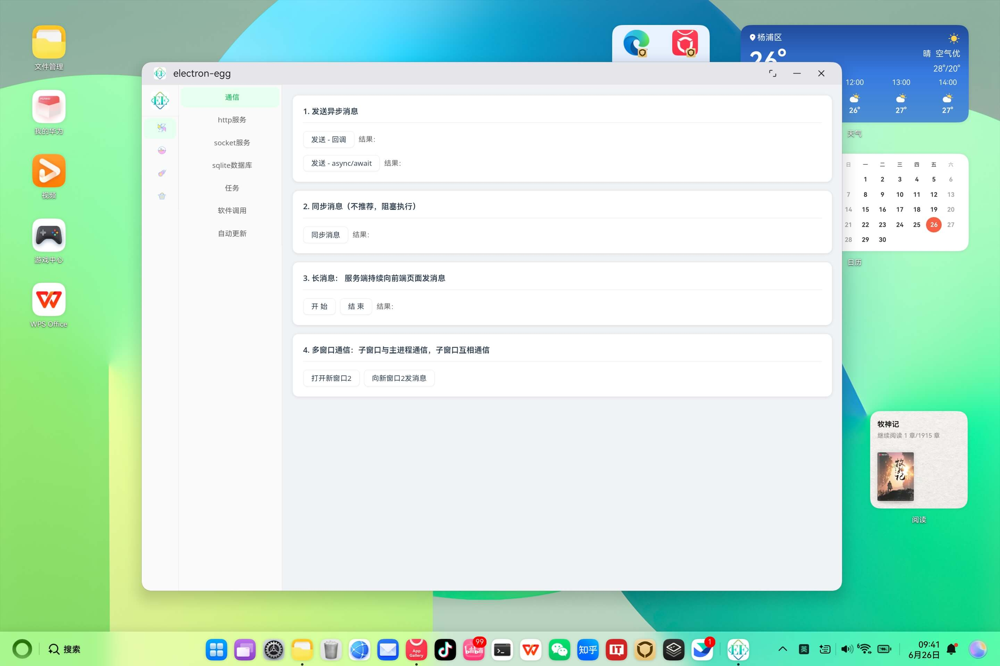
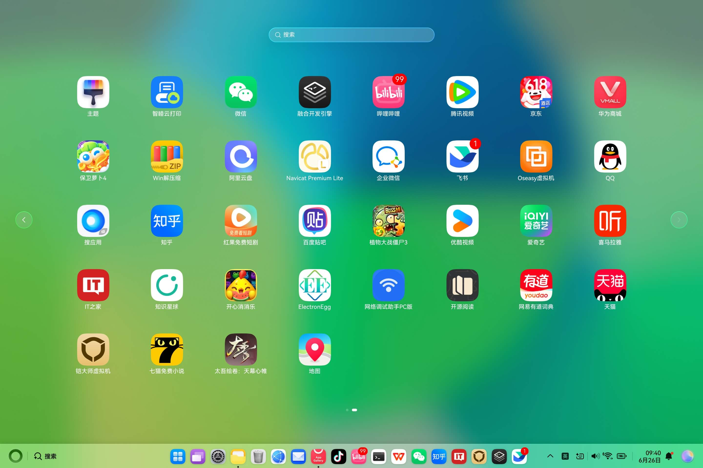
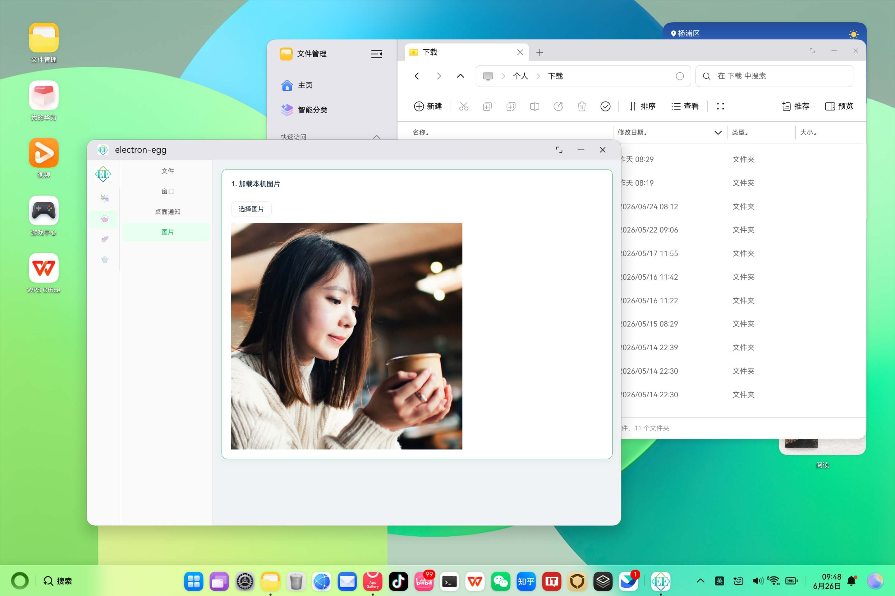
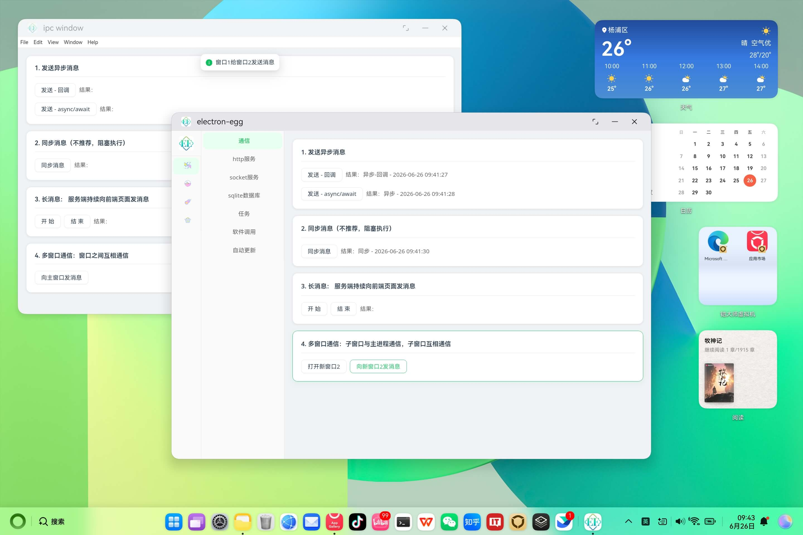
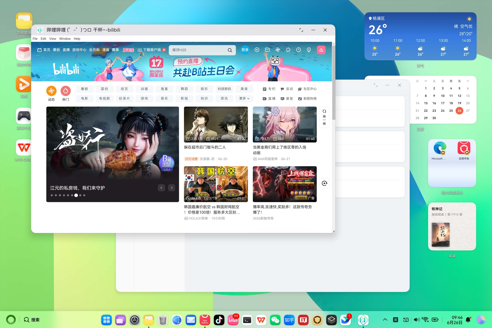
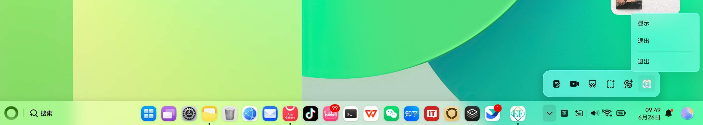

<!-- TODO: 发布时补充 Schema.org BlogPosting 结构化数据，至少包含 headline、author、datePublished、mainEntityOfPage。 -->

# 鸿蒙PC迁移：ElectronEgg框架功能适配鸿蒙PC

> **欢迎加入开源鸿蒙PC社区：** [https://harmonypc.csdn.net/](https://harmonypc.csdn.net/)
>
> **欢迎在PC社区平台申请新建项目：** [https://atomgit.com/OpenHarmonyPCDeveloper](https://atomgit.com/OpenHarmonyPCDeveloper)

## 摘要

ElectronEgg 是面向桌面软件的 Electron 框架。它将主进程、控制器、服务、前端与构建流程组织为一套工程化结构；而鸿蒙 PC 迁移的关键，不是将业务代码机械改写为 ArkTS，而是让既有 ElectronEgg 应用以 HAP 形式交付，并在鸿蒙侧提供 Ability、窗口容器和资源注入。本文以 `ee-demo-ohos` 为例，记录从桌面工程到鸿蒙 PC HAP 的适配路径，说明哪些能力可以复用、哪些边界必须单独处理，以及如何完成构建和设备验证。

项目源码托管在 AtomGit：[electron-egg](https://atomgit.com/dromara/electron-egg)。本文涉及的能力以当前示例工程和鸿蒙 PC 运行截图为准；平台支持仍在持续演进，生产项目应在目标 SDK、目标设备和目标业务场景上重新验收。

## 一、迁移目标：保留业务层，补齐鸿蒙运行层

传统 ElectronEgg 工程由根目录的 `electron/`、`frontend/` 和构建配置组成：前端负责界面，`electron/` 中的 controller、service、preload 承担业务与桌面能力。迁移到鸿蒙 PC 后，这一业务分层仍然保留；新增的 `ohos_hap/` 则负责把运行时封装为 HarmonyOS HAP。

这意味着迁移的主要工作可以拆为两部分：

1. **复用层**：Vue 前端、ElectronEgg 控制器、服务、配置与大部分 Node.js 业务逻辑继续在应用资源中运行。
2. **适配层**：使用 ArkUI-X 的 Ability 和 `WebWindow` 承载窗口；将构建结果注入 HAP 的 `resfile`；按鸿蒙应用模型完成打包与启动。

下图是 ElectronEgg 示例在鸿蒙 PC 上启动后的主界面。




## 二、工程分层：不要把两个 electron 目录混为一谈

这个迁移工程中存在两个名称相近但职责不同的目录。根目录 `electron/` 是 ElectronEgg 的 Node.js 主进程源码；`ohos_hap/electron/` 则是鸿蒙 entry HAP。前者放控制器、服务和 preload，后者只负责 Ability 生命周期、ArkUI 页面、权限和 HAP 打包入口。

`ohos_hap/web_engine/` 是核心 HAR 引擎层。它提供 `WebAbility`、`WebWindow` 和平台适配能力；entry HAP 尽量保持为薄壳，只在生命周期中调用基类能力。这样做的好处是：业务迭代仍在根目录完成，通用的鸿蒙窗口与引擎能力集中维护，避免把平台代码散落到业务控制器中。

在入口页面中，ArkTS 只需要加载引擎导出的 `WebWindow`，并保留窗口样式更新和按键事件等必要桥接：

```ts
@Entry(storage)
@Component
struct Index {
  build() {
    Row() {
      WebWindow()
    }
    .width('100%')
    .height('100%')
  }
}
```

这种结构把 ArkTS 页面限定为系统容器，而不是重复实现桌面前端。下图展示了应用在鸿蒙 PC 环境中的窗口化运行效果。

## 三、构建与资源注入：HAP 不能直接读取开发目录

应用能在桌面 Electron 中运行，并不代表 HAP 中已经拥有相同的资源。鸿蒙侧加载的是 HAP 内的 `web_engine/src/main/resources/resfile/`，因此必须先构建外层应用，再把产物注入其中。

日常调试可使用测试注入流程：

```bash
# 根目录执行；当前端有变化时先构建前端
npm run build-frontend
npm run ohos-test

# 进入 HAP 工程后构建并启动
cd ohos_hap
build_project --module electron@default
start_app --module electron --ability EntryAbility
```

其中 `npm run ohos-test` 会先构建 Electron 主进程，再把 `public/` 注入 `resources/app/public/`。需要特别注意：它**不会自动执行** `npm run build-frontend`，因此修改前端后漏掉第一条命令，HAP 里看到的仍可能是旧页面。

生产构建则先生成 macOS ARM64 的应用包，再通过 `npm run ohos` 从应用包提取 `resources/app/` 和 `extraResources/`。两种流程的共同原则是：修改根目录业务代码后必须重新构建和注入；不要手工编辑 HAP 内已生成的 `resources/app/`，否则下一次注入会覆盖修改。



## 四、功能适配实践：窗口通信与服务调用

ElectronEgg 的控制器、服务和通信路由仍然由主进程负责。框架运行阶段会依次加载控制器、Socket 服务、触发 Ready 生命周期，再加载 Electron 相关能力；因此遇到页面能打开但接口不可用的情况，应先检查打包后的主进程、配置注册表和注入资源，而不是直接改 Ability。

### 4.1 窗口与 IPC

示例保留了窗口服务和 IPC 调用：前端经 `ipcRenderer.invoke()` 请求业务接口，主进程再通过 ElectronEgg 的 controller/service 完成处理。鸿蒙侧的 `WebWindow` 和 Ability 负责承载窗口、处理窗口生命周期；多窗口场景要注意 Ability 可能运行在独立进程中，不能假设所有窗口共享同一个内存单例。

### 4.2 主进程启动与生命周期注册

`electron/main.ts` 是外层 ElectronEgg 应用的入口。它创建框架实例，将业务生命周期和预加载函数逐一注册，再由 `run()` 统一启动。迁移时应保留这种“入口只编排、具体逻辑分层实现”的结构，避免把窗口或业务逻辑直接堆进 Ability。

```ts
import { ElectronEgg } from 'ee-core';
import { Lifecycle } from './preload/lifecycle';
import { preload } from './preload';

const app = new ElectronEgg();
const life = new Lifecycle();

app.register('ready', life.ready);
app.register('electron-app-ready', life.electronAppReady);
app.register('window-ready', life.windowReady);
app.register('before-close', life.beforeClose);
app.register('preload', preload);

app.run();
```

预加载函数放置启动后需要尽早启用的桌面服务。当前示例先初始化窗口、托盘和安全服务；这些能力是否可用取决于鸿蒙侧引擎和权限声明，新增服务时应逐项在目标设备验证。

```ts
import { logger } from 'ee-core/log';
import { trayService } from '../service/os/tray';
import { securityService } from '../service/os/security';
import { windowService } from '../service/os/window';

export async function preload(): Promise<void> {
  logger.info('[preload] load');
  windowService.init();
  trayService.init();
  securityService.init();
}
```

`electron/preload/lifecycle.ts` 则负责 Electron 应用已经就绪后的窗口行为：二次启动时恢复主窗口；首次窗口准备完成后，按当前显示器工作区的比例计算尺寸并居中；若配置要求延迟显示，就等到 `ready-to-show` 再展示窗口以减少白屏感知。

```ts
async electronAppReady(): Promise<void> {
  electronApp.on('second-instance', () => {
    const win = getMainWindow();
    if (win.isMinimized()) win.restore();
    win.show();
    win.focus();
  });
}

async windowReady(): Promise<void> {
  const win = getMainWindow();
  const { width, height } = screen.getPrimaryDisplay().workAreaSize;
  const windowWidth = Math.floor(width * 0.7);
  const windowHeight = Math.floor(height * 0.8);
  win.setBounds({
    x: Math.floor((width - windowWidth) / 2),
    y: Math.floor((height - windowHeight) / 2),
    width: windowWidth,
    height: windowHeight,
  });

  if (getConfig().windowsOption.show === false) {
    win.once('ready-to-show', () => {
      win.show();
      win.focus();
    });
  }
}
```

### 4.3 控制器：把桌面能力收敛为可路由接口

控制器将前端请求映射为受控的主进程操作。`effect.ts` 包含文件选择与窗口尺寸切换：文件选择返回首个路径或 `null`；登录页和普通页面通过统一的“设置尺寸—允许缩放—居中—展示—聚焦”顺序切换窗口状态。登录窗口使用较小的默认尺寸，恢复普通窗口时回到业务页面所需的默认大小。



```ts
selectFile(): string | null {
  const filePaths = dialog.showOpenDialogSync({
    properties: ['openFile'],
  });
  return filePaths ? filePaths[0] : null;
}

loginWindow(args: { width?: number; height?: number }): void {
  const win = getMainWindow();
  win.setSize(args.width || 400, args.height || 300);
  win.setResizable(true);
  win.center();
  win.show();
  win.focus();
}

restoreWindow(args: { width?: number; height?: number }): void {
  const win = getMainWindow();
  win.setSize(args.width || 980, args.height || 650);
  win.setResizable(true);
  win.center();
  win.show();
  win.focus();
}
```

`framework.ts` 演示同一控制器可被不同通信通道调用。HTTP 接口接收 Koa 上下文，IPC 异步或同步调用均可返回带时间戳的结果，双向 IPC 交给服务层处理事件回传。HTTP 和 Socket 的目录请求会先校验参数，再取得 Electron 标准目录并交给系统打开；自动更新入口则委托更新服务检查和下载。这样前端不必直接接触主进程对象，也便于在迁移时集中检查每个接口的鸿蒙适配状态。



```ts
async checkHttpServer(): Promise<{ enable: boolean; server: string }> {
  const { enable, protocol, host, port } =
    (getConfig() as Config).httpServer;
  return { enable, server: protocol + host + ':' + port };
}

async ipcInvokeMsg(args: string): Promise<string> {
  return `${args} - ${dayjs().format('YYYY-MM-DD HH:mm:ss')}`;
}

async ipcSendSyncMsg(args: string): Promise<string> {
  return `${args} - ${dayjs().format('YYYY-MM-DD HH:mm:ss')}`;
}

ipcSendMsg(
  args: { type: string; content: string },
  event: IpcMainEvent,
): string {
  return frameworkService.bothWayMessage(args.type, args.content, event);
}
```

`os.ts` 将系统交互集中到操作系统控制器：信息提示与确认框、目录和图片选择、打开目录、创建窗口、查询窗口内容标识、窗口间消息中继和系统通知都以参数明确的方法暴露。图片选择会读取文件并转换为 Base64 数据 URL，避免前端直接读取主进程文件系统。涉及文件、窗口和通知的能力必须结合 `module.json5` 中的最小权限声明测试；不能因为桌面端可用，就假定目标 HAP 自动具备相同权限。



```ts
selectFolder(): string | null {
  const filePaths = dialog.showOpenDialogSync({
    properties: ['openDirectory', 'createDirectory'],
  });
  return filePaths ? filePaths[0] : null;
}

selectPic(): string | null {
  const filePaths = dialog.showOpenDialogSync({
    title: 'select pic',
    properties: ['openFile'],
    filters: [{ name: 'Images', extensions: ['jpg', 'png', 'gif'] }],
  });
  if (!filePaths) return null;
  return `data:image/jpeg;base64,${fs.readFileSync(filePaths[0]).toString('base64')}`;
}

createWindow(args: {
  type: string; content: string; windowName: string; windowTitle: string;
}): number {
  return windowService.createWindow(args);
}

window1ToWindow2(args: { receiver: string; content: unknown }): void {
  windowService.communicate(args);
}

sendNotification(
  args: { title?: string; subtitle?: string; body?: string; silent?: boolean },
  event: IpcMainEvent,
): boolean | string {
  if (!Notification.isSupported()) return '当前系统不支持通知';
  const options: NotificationConstructorOptions = {};
  if (args.title) options.title = args.title;
  if (args.subtitle) options.subtitle = args.subtitle;
  if (args.body) options.body = args.body;
  if (args.silent !== undefined) options.silent = args.silent;
  windowService.createNotification(options, event);
  return true;
}
```

本节聚焦窗口、通信与系统交互相关实现。

## 五、迁移分级与验收建议

将迁移目标分级，能避免把“可启动”误判为“可交付”：

| 阶段 | 目标 | 最小验收内容 |
| --- | --- | --- |
| T0：可启动 | HAP 能安装并打开首页 | `build_project --module electron@default` 成功；EntryAbility 启动；主页面可见 |
| T1：核心业务可用 | 业务资源与接口可用 | 前端为最新注入版本；controller/service 调用正常 |
| T2：可发布 | 覆盖产品的实际使用边界 | 多窗口、多实例、窗口关闭恢复、网络权限、异常日志、升级与目标设备回归均通过 |

截图中的功能页面可以作为 T0/T1 的直观证据，但 T2 仍需要针对实际产品补充设备、网络、权限和异常场景测试。尤其是应用当前配置为多实例模式，主 Ability 与浏览器相关 Ability 也可能处在不同进程；新增全局状态、缓存或单例时必须明确它的进程和实例边界。



### 图标资源放置：从桌面工程同步到 HAP

桌面工程的原始 PNG 图标位于 `build/icons/icon.png`，当前尺寸为 512 × 512；同目录还保留了 `icon.ico`、`icon.icns` 以及多种尺寸的打包图标。迁移到鸿蒙 PC 时，不要将图标放入 `web_engine/src/main/resources/resfile/`：该目录用于 ElectronEgg 运行时与应用资源注入，应用图标应作为 HAP 的 AppScope 媒体资源参与编译。

将准备好的 PNG 图标分别复制到以下两个位置：

```text
build/icons/icon.png
  ├─> ohos_hap/AppScope/resources/base/media/app_icon.png
  └─> ohos_hap/AppScope/resources/base/media/startIcon.png
```

可在仓库根目录执行：

```bash
cp build/icons/icon.png ohos_hap/AppScope/resources/base/media/app_icon.png
cp build/icons/icon.png ohos_hap/AppScope/resources/base/media/startIcon.png
```

其中 `app_icon.png` 由 `ohos_hap/AppScope/app.json5` 的 `icon: "$media:app_icon"` 引用，并被 EntryAbility 等 Ability 的 `icon` 与部分 `startWindowIcon` 复用；`startIcon.png` 由 `ohos_hap/electron/src/main/module.json5` 中 EntryAbility 的 `startWindowIcon: "$media:startIcon"` 引用。若应用希望启动页和桌面图标呈现不同视觉，可为这两个文件分别替换图片；文件名不变时，无需改动 JSON5 配置。替换后重新构建 HAP，确认桌面图标和启动窗口均已更新。

## 六、常见问题与排查顺序

### 6.1 HAP 启动了，但 ElectronEgg 控制器或服务没有工作

先确认 `public/electron/main.js` 是否为最新构建，再检查 `resources/app/` 中是否包含 `package.json`、`public/` 与运行时依赖。控制器、HTTP 与 Socket 同时失效时，优先怀疑资源注入、配置注册表或 `ee-core` 加载这一类共享上游。需要更细日志时可在根目录使用：

```bash
DEBUG='ee-core:config:*' npm run dev-electron
```

### 6.2 HAP 构建或启动失败

依次检查 ArkUI-X SDK 与工程 SDK 是否匹配、签名配置是否有效、`module.json5` 的 Ability/权限/资源声明是否正确，以及 `electron/libs/arm64-v8a/` 和引擎运行时库是否齐全。签名口令、证书路径和本机 SDK 绝对路径属于机器私有信息，不应写进代码仓库或公开文章。

## 结语

ElectronEgg 的鸿蒙 PC 迁移价值在于复用已有桌面业务工程：前端、控制器和服务不必从零开始，而是通过 ArkUI-X 容器和 HAP 资源注入进入鸿蒙运行环境。真正需要投入验证的，是资源是否为最新版本，以及多窗口、多进程、多实例等桌面场景在目标设备上的行为。以 T0、T1、T2 分阶段推进，可以让迁移过程从“成功打开一个页面”逐步走向可维护、可发布的鸿蒙 PC 应用。
