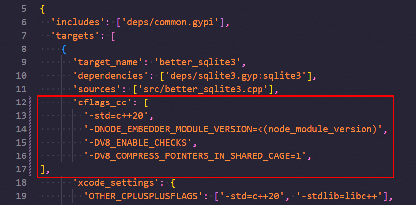
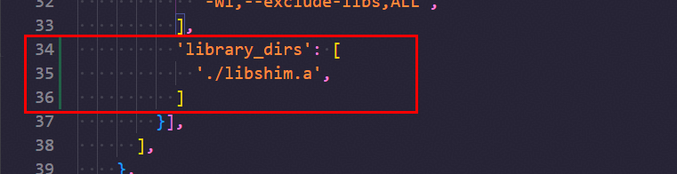
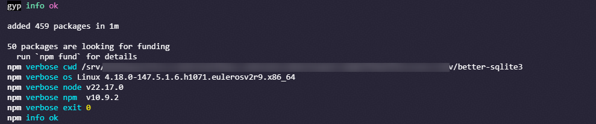
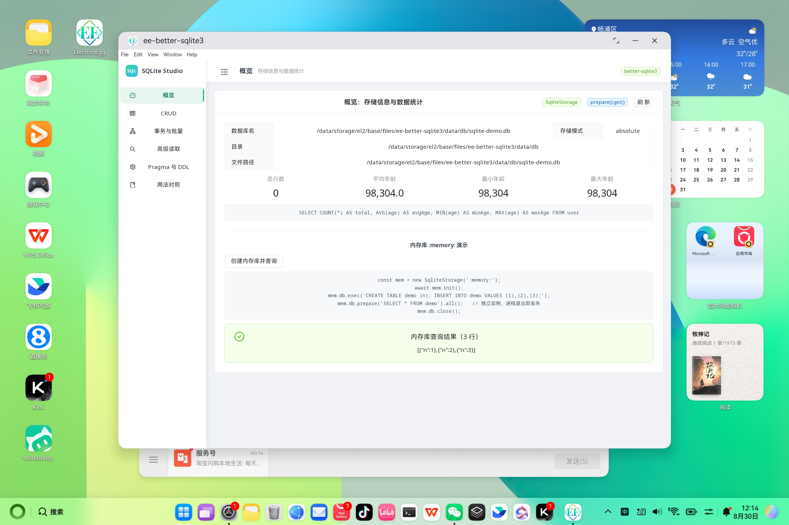
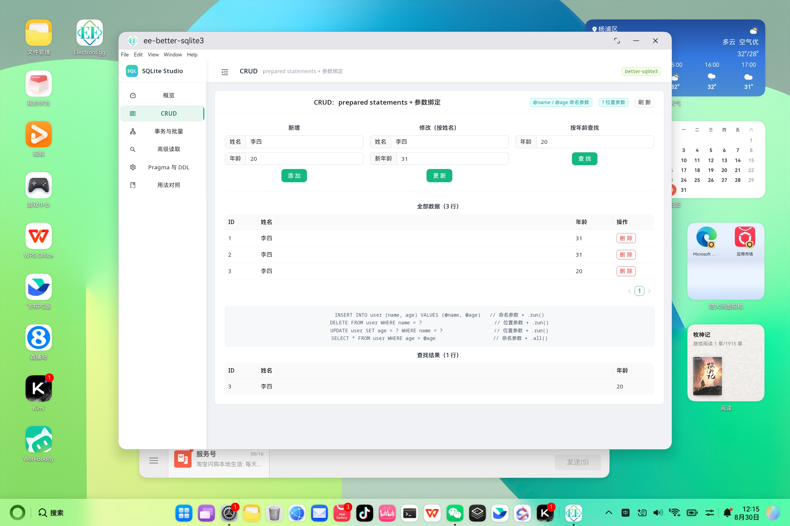
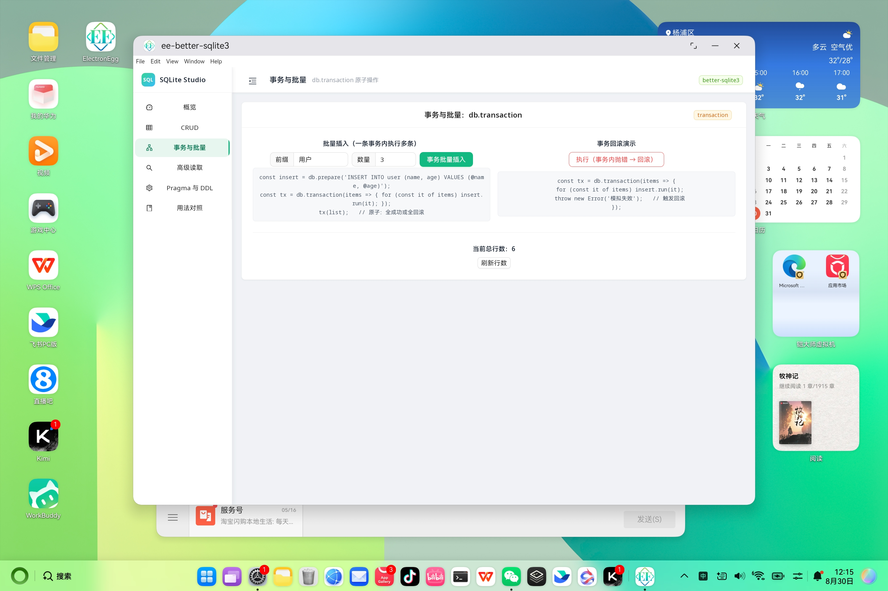

<!-- TODO: 发布时补充 Schema.org 结构化数据（BlogPosting），标注 headline / author / datePublished / mainEntity -->

# better-sqlite3 鸿蒙 PC 适配实践：交叉编译与 Electron 集成

> **欢迎加入开源鸿蒙PC社区：** [https://harmonypc.csdn.net/](https://harmonypc.csdn.net/)
>
> **欢迎在PC社区平台申请新建项目：** [https://atomgit.com/OpenHarmonyPCDeveloper](https://atomgit.com/OpenHarmonyPCDeveloper)

## 摘要

better-sqlite3 是 Node.js / Electron 生态里用得最多的 SQLite 绑定，同步 API 加预编译语句，本地读写比 `sqlite3` 快不少。代价是它是 C++ 原生模块（`.node`），必须针对目标平台单独编译，没法直接拿到鸿蒙 PC 上用。本文记录了把 better-sqlite3 12.x 交叉编译到 `aarch64-linux-ohos`、集成进 electron-egg（Electron 37）demo 工程的全过程：准备 Electron 头文件与工具链、改 `binding.gyp` 接入 `libshim.a`、校验符号、把 `better_sqlite3.node` 部署进 HAP，最后落成一个叫 **SQLite Studio** 的数据库桌面应用，在鸿蒙 PC 上把增删改查、事务、聚合、Pragma 全部跑通。

## 一、为什么要做 better-sqlite3 鸿蒙 PC 适配

### 1.1 better-sqlite3 简介

better-sqlite3 是一个把 SQLite 封装成 Node.js 原生模块的开源库（MIT 协议），与异步风格的 `sqlite3` 不同，它采用**同步 API**：所有数据库操作直接返回结果，无需回调或 Promise。配合**预编译语句**（`prepare().run()/get()/all()`），它在本地数据库读写场景下比 `sqlite3` 快数倍，因此大量 Electron 桌面应用选择它作为本地存储引擎。

日常用到的 API 就那几个：`new Database()` 开连接、`db.prepare(sql)` 拿可复用语句（支持 `@name` 命名参数和 `?` 位置参数）、`db.transaction(fn)` 包事务，再加上 `iterate()`、`pluck()`、`columns()` 几个高级读取方法和 `db.pragma()`。整个库零运行时依赖，C++ 写成，SQLite 源码直接编进绑定——5.3 节的演示表会把这些逐项过一遍。

### 1.2 鸿蒙 PC 适配的难点

原生模块的问题在于：`.node` 文件是**目标平台相关的二进制**，x64 / arm64 的 macOS、Windows、Linux 各不通用，更不能直接跨到鸿蒙 PC。把 better-sqlite3 移植到鸿蒙 PC，需要解决四个层面的差异：

| 差异点 | 说明 |
| --- | --- |
| 目标平台与工具链 | 鸿蒙 PC 使用 `aarch64-linux-ohos` 三元组，需要 OpenHarmony SDK 提供的 LLVM/clang 工具链交叉编译 |
| 系统 C 库 | 鸿蒙的 libc 基于 **musl**，编译时必须定义 `-D__MUSL__=1` |
| Electron 版本对应的 Node ABI | 本项目基于 Electron 37，对应模块版本（module_version）为 **138**，`.node` 必须匹配该 ABI，且需按 Electron 源码特性传入 V8 编译宏 |
| Electron 运行时符号 | Electron 运行时与官方 Node 在 V8 内部 API 上有差异，需要 `libshim.a` 补齐 `SlowGetAlignedPointerFromInternalField` 等符号 |

还有一个容易被忽略的点：Electron 官方发布的 Node 头文件和开源 Node 的不一样，直接拿来编译对不上 Electron 37 的运行时，所以环境准备阶段要用**整理好的 Electron 头文件**（2.2 节）。

## 二、编译环境准备

### 2.1 获取 better-sqlite3 源码

```bash
git clone https://github.com/WiseLibs/better-sqlite3.git
cd better-sqlite3
```

### 2.2 准备 Electron 头文件

将整理好的 Electron Node 头文件压缩包解压到自己的工作目录，例如 `~/work/better-sqlite3-headers-v138`。这份头文件是**针对 Electron 37 组装整理**的，与 electron 官方开源头文件存在差异，是后续 `--nodedir` 指定使用、让 node-gyp 跳过下载的关键。

### 2.3 编写编译脚本 build.sh

在源码根目录创建 `build.sh`，前半部分把交叉编译工具链写入环境变量，最后一步执行编译：

```bash
# 设置 npm 下载的镜像源（按自身网络环境设置，下面以淘宝源为例）
# npm config set registry https://registry.npm.taobao.org/

# 将编译时需要用到的编译工具链设置到环境变量
# 下列环境变量以 OpenHarmony SDK 源码为例，也可以使用 command-line-tools 中的 SDK
export CC="/home/chromium-electron-release/src/ohos_sdk/openharmony/native/llvm/bin/clang --target=aarch64-linux-ohos"
export CXX="/home/chromium-electron-release/src/ohos_sdk/openharmony/native/llvm/bin/clang++ --target=aarch64-linux-ohos"
export LD="/home/chromium-electron-release/src/ohos_sdk/openharmony/native/llvm/bin/lld --target=aarch64-linux-ohos"
export STRIP="/home/chromium-electron-release/src/ohos_sdk/openharmony/native/llvm/bin/llvm-strip"
export RANLIB="/home/chromium-electron-release/src/ohos_sdk/openharmony/native/llvm/bin/llvm-ranlib"
export OBJDUMP="/home/chromium-electron-release/src/ohos_sdk/openharmony/native/llvm/bin/llvm-objdump"
export OBJCOPY="/home/chromium-electron-release/src/ohos_sdk/openharmony/native/llvm/bin/llvm-objcopy"
export NM="/home/chromium-electron-release/src/ohos_sdk/openharmony/native/llvm/bin/llvm-nm"
export AR="/home/chromium-electron-release/src/ohos_sdk/openharmony/native/llvm/bin/llvm-ar"

# 保留 hilog 等额外路径
export CFLAGS="-fPIC -D__MUSL__=1 -DV8_ENABLE_CHECKS -I/tmp/bsq_hilog"
export CXXFLAGS="-fPIC -D__MUSL__=1 -DV8_ENABLE_CHECKS -I/tmp/bsq_hilog"
# 使用 --nodedir 让 node-gyp 跳过下载，直接用已准备好的头文件
# （其它三方库的编译也可用该方法）
npm install --verbose --build-from-source \
  --nodedir=~/work/better-sqlite3-headers-v138
```

其中 `-D__MUSL__=1` 对应鸿蒙的 musl libc，`-DV8_ENABLE_CHECKS` 匹配 Electron 的 V8 构建配置，`-I/tmp/bsq_hilog` 保留 hilog 等额外头文件路径。

编译机 Node 版本建议不低于 `v22.17.0`，撰稿时使用的版本如下：


## 三、修改 binding.gyp 并编译

### 3.1 修改 binding.gyp

**（1）在 `cflags_cc` 中添加以下编译宏**，把 Electron 37 的模块版本与 V8 特性传递进编译：

```
'-DNODE_EMBEDDER_MODULE_VERSION=<(node_module_version)',
'-DV8_ENABLE_CHECKS',
'-DV8_COMPRESS_POINTERS_IN_SHARED_CAGE=1',
```



**（2）添加 `library_dirs`**，用于链接 Electron 框架提供的 `libshim.a`：

```
'library_dirs': [
    './libshim.a',
],
```



### 3.2 将 libshim.a 放入源码根目录

把附件中的 `libshim.a` 放到 better-sqlite3 源码根目录。这个静态库由 Electron 框架提供，作用是补齐 Electron 37 运行时在 V8 内部符号上的差异（详见 3.3 符号校验）。

### 3.3 执行编译

把准备好的 `build.sh` 放到源码目录下，执行：

```bash
bash build.sh
```

出现如下图所示的信息即为编译成功，产物为 `build/Release/better_sqlite3.node`：



### 3.4 校验符号

编译完成后，用 `readelf` 检查 `better_sqlite3.node` 的符号表，确认 fast path 已剔除、慢路径符号由运行时提供：

```bash
readelf -Ws build/Release/better_sqlite3.node | grep ReadExternalFieldPointer
# 应该没有任何输出（fast path 已剔除）

readelf -Ws build/Release/better_sqlite3.node | grep SlowGetAlignedPointer
# 应该看到 SlowGetAlignedPointerFromInternalField，由运行时提供
```

这里的背景是：Electron 开启了 V8 指针压缩（pointer compression），某些 V8 内部字段访问在 Electron 37 下必须走 `SlowGetAlignedPointerFromInternalField` 慢路径，而不是 fast path 的 `ReadExternalFieldPointer`。如果编译出的 `.node` 还带 fast path 符号，运行时会因 ABI 不匹配而崩溃，所以要用 `libshim.a` 强制走运行时提供的慢路径。

## 四、部署到 Electron 鸿蒙工程

编译出的 `.node` 是「半成品」，要跑进 HAP 还需要把原生库与 JS 包按鸿蒙 Electron 工程的约定分别放置。以本次 demo 工程 `ee-better-sqlite3` 为例，最终目录结构如下：

```
ohos_hap/
├── electron/
│   └── libs/
│       └── arm64-v8a/
│           └── better_sqlite3.node      # ① 原生库
└── web_engine/
    └── src/main/resources/resfile/
        └── resources/app/
            ├── node_modules/            # ② better-sqlite3 编译时拉取的依赖
            │   └── better-sqlite3/
            │       ├── build/Release/better_sqlite3.node
            │       ├── lib/
            │       ├── package.json
            │       └── ...
            └── main.js
```

### 4.1 拷贝原生库

将 `better-sqlite3/build/Release/better_sqlite3.node` 复制到 `ohos_hap/electron/libs/arm64-v8a/` 下。这一步让 HAP 把原生库作为 arm64-v8a 的 so 级资源打包。

### 4.2 拷贝 node_modules

将 better-sqlite3 编译过程中拉取的整个 `node_modules`，放到 `ohos_hap/web_engine/src/main/resources/resfile/resources/app/` 下，作为应用运行时资源。

### 4.3 放置 better-sqlite3 包目录

在 `resources/app/node_modules/` 下新建 `better-sqlite3` 文件夹，放入 `package.json`、`build/Release/better_sqlite3.node`、`lib/` 等内容。这样主进程 `require('better-sqlite3')` 时，能按 Node 模块解析规则找到与 HAP 内原生库匹配的 `.node` 文件。

## 五、实战：ee-better-sqlite3 —— SQLite Studio

单纯「能加载」不算适配完成，本文用一个完整的数据库桌面应用 **SQLite Studio** 来验证适配质量。项目基于 [electron-egg](https://github.com/wallace5303/electron-egg)（ee-v5）框架，主进程 TypeScript，前端 Vue 3 + Ant Design Vue。

### 5.1 项目架构

```
ee-better-sqlite3/
├── electron/                     # 主进程源码
│   ├── main.ts                   # 入口
│   ├── config/                   # config.default.ts 等
│   ├── controller/
│   │   └── framework.ts          # 对外控制器（CRUD + 高级操作）
│   └── service/database/
│       ├── basedb.ts             # 数据目录与 SqliteStorage 封装
│       └── sqlitedb.ts           # better-sqlite3 全部演示方法
├── frontend/                     # Vue 3 + Ant Design Vue
│   └── src/views/framework/sqlitedb/
│       ├── Layout.vue            # 侧边栏 + 顶栏
│       └── pages/                # Overview / CRUD / Transaction / Reading / Pragma / Reference
├── ohos_hap/                     # 鸿蒙 PC 打包产物
└── package.json
```

### 5.2 主进程：SqliteStorage 懒加载

electron-egg 在 `ee-core/storage` 提供了 `SqliteStorage`，它对 better-sqlite3 做了**懒加载**：构造时只计算路径、不加载原生绑定，直到 `init()` 打开数据库时才 `require('better-sqlite3')`。这一点对鸿蒙 PC 尤为重要——不用的工程不会因为缺少 `.node` 而在启动时崩溃。`basedb.ts` 的封装如下：

```ts
import { SqliteStorage } from 'ee-core/storage';
import { getDataDir } from 'ee-core/ps';
import path from 'path';
import type Database from 'better-sqlite3';

class BasedbService {
  protected dbname: string;
  protected db!: Database.Database;
  protected storage!: SqliteStorage;

  async _init(): Promise<void> {
    // 定义数据文件：{dataDir}/db/{dbname}
    const dbFile = path.join(getDataDir(), "db", this.dbname);
    const sqliteOptions = { timeout: 6000, verbose: console.log };
    this.storage = new SqliteStorage(dbFile);
    await this.storage.init(sqliteOptions);
    this.db = this.storage.db;
  }
}
```

`sqlitedb.ts` 用幂等 SQL 建表，避免不同平台 `Statement#get()` 空结果语义差异：

```ts
async init(): Promise<void> {
  await this._init();
  const create_user_table_sql =
    `CREATE TABLE IF NOT EXISTS user
     (id INTEGER PRIMARY KEY AUTOINCREMENT,
      name CHAR(50) NOT NULL,
      age INT);`
  this.db.exec(create_user_table_sql);
}
```

### 5.3 服务层：覆盖 better-sqlite3 全部核心用法

`sqlitedb.ts` 把 better-sqlite3 的常用能力一一封装成方法，验证鸿蒙 PC 上各 API 的可用性：

| 页面 / 方法 | better-sqlite3 API | 说明 |
| --- | --- | --- |
| CRUD | `prepare().run()/.all()` | 命名参数 `@name` 与位置参数 `?` 的增删改查 |
| 事务与批量 | `db.transaction(fn)` | 事务内逐条 `insert.run()`，整体提交或回滚 |
| 高级读取 | `iterate() / pluck() / columns()` | 惰性游标、首列原语数组、列元信息 |
| Pragma 与 DDL | `db.pragma() / db.exec()` | 读写 `journal_mode`、查看表结构、创建索引 |
| 概览 | `prepare().get()` | 聚合统计（COUNT/AVG/MIN/MAX）与 `:memory:` 内存库 |

例如事务回滚演示，事务内抛错后行数应保持不变：

```ts
async transactionRollbackSqlite(): Promise<{ before: number; after: number; rolledBack: boolean }> {
  const countStmt = this.db.prepare(`SELECT COUNT(*) AS c FROM user`);
  const before = (countStmt.get() as { c: number }).c;
  const insert = this.db.prepare(`INSERT INTO user (name, age) VALUES (?, ?)`);
  const tx = this.db.transaction((items) => {
    for (const it of items) insert.run(it.name, it.age);
    throw new Error('模拟失败 —— 触发事务回滚');
  });
  try { tx([{ name: '回滚A', age: 1 }, { name: '回滚B', age: 2 }]); } catch (e) { /* 预期内 */ }
  const after = (countStmt.get() as { c: number }).c;
  return { before, after, rolledBack: before === after };
}
```

### 5.4 控制器与 IPC 通信

`controller/framework.ts` 暴露两个通道，前端通过 `ipc.invoke()` 调用：

- `controller/framework/sqlitedbOperation`：CRUD 与数据目录操作
- `controller/framework/sqliteAdvancedOperation`：事务 / 批量 / 聚合 / Pragma / iterate 等高级操作

前端统一封装在 `sqliteApi.js`，失败时弹 `message` 并返回 `null`，调用方判空即可：

```js
export async function invokeAdv(action, extra = {}) {
  if (!isEE) { message.error('请在 Electron 环境中运行（当前为浏览器）'); return null; }
  const res = await ipc.invoke(ipcApiRoute.framework.sqliteAdvancedOperation, { action, ...extra });
  if (res && res.code === -1) { message.error(res.msg || '操作失败'); return null; }
  return res;
}
```

### 5.5 前端页面

前端是一个六页面的 SPA（`Layout.vue` 侧边栏导航），每一页对应一类 better-sqlite3 用法，并在页面上直接展示对应 SQL：

1. **概览**：数据库名、存储模式、目录、文件路径，聚合统计与内存库演示
2. **CRUD**：新增 / 修改 / 按年龄查找 / 删除，实时表格
3. **事务与批量**：事务批量插入、事务内抛错回滚演示
4. **高级读取**：`iterate()` / `pluck()` / `columns()` 一键体验
5. **Pragma 与 DDL**：切换 `journal_mode`、查看 `user` 表结构、`db.exec()` 建索引
6. **用法对照**：better-sqlite3 API 速查表（`prepare` / `run` / `get` / `all` / `transaction` / `exec` / `pragma` 等）

### 5.6 运行效果（鸿蒙 PC）

在鸿蒙 PC 上构建 HAP 并安装运行后，SQLite Studio 的各个页面均可正常操作，数据库文件持久化到应用数据目录（`{dataDir}/db/sqlite-demo.db`）。以下为真机运行截图：








## 六、踩坑与经验

| 问题 | 原因 | 解决办法 |
| --- | --- | --- |
| 直接用 Electron 官方头文件编译后运行崩溃 | Electron 官方 Node 头文件与开源 Node 存在差异，V8 内部符号对不上 Electron 37 运行时 | 使用整理好的 Electron 头文件，并以 `--nodedir` 指定 |
| 报缺 `SlowGetAlignedPointerFromInternalField` 符号 | Electron 开启 V8 指针压缩，字段访问必须走运行时提供的慢路径 | 在 `binding.gyp` 加入 `library_dirs` 链接 `libshim.a`，并用 readelf 确认 fast path 已剔除 |
| 目标平台错误 / libc 不匹配 | 未指定 `aarch64-linux-ohos` 三元组，或未定义 `__MUSL__` | 按 2.3 配置 `CC/CXX/LD` 及 `CFLAGS/CXXFLAGS` |
| 主进程启动就报错，无法定位 | 模块加载期即 require 原生绑定，缺少 `.node` 时直接抛错 | 用 `ee-core/storage` 的 `SqliteStorage` 懒加载，打开数据库时才加载绑定 |
| 渲染进程无法调用原生方法 | 主进程与渲染进程隔离，`nodeIntegration` 未开启 | 在 `config.default.ts` 打开 `nodeIntegration: true`，前端经 IPC 通道调用 |
| 数据库文件目录不存在 | better-sqlite3 打开文件前目录未创建 | `SqliteStorage` 自动按 `{dataDir}/db` 创建目录 |

再补充三点经验：

1. **产物版本要固定**：`.node` 与 Electron 版本严格绑定（本文是 Electron 37 / module_version 138），升级 Electron 后必须重新编译，旧 `.node` 不能复用。
2. **原生模块是二进制，读不出对错**：只能靠 `readelf` 校验符号，再在真机上把 CRUD、事务、聚合、Pragma 这些路径逐一跑通，才敢说适配完成。

## 七、总结

把 better-sqlite3 适配到鸿蒙 PC，本质上就是接受「原生模块 = 平台相关二进制」这个前提：备好 Electron 37 对应的头文件和 `libshim.a`，用 OpenHarmony 的 clang 交叉编译到 `aarch64-linux-ohos`，再按 HAP 的资源约定把原生库和 JS 包放到位。剩下的事交给框架——`SqliteStorage` 的懒加载封装让同一套业务代码同时撑起桌面端和鸿蒙 PC 端。

后面还有得做：备份和加密扩展（比如 `better-sqlite3-multiple-ciphers`）都还没覆盖；这套编译脚本值得抽成可复用的 npm 脚本或 CI 流水线；项目 README 里也该按社区规范用 **T0 / T1 / T2** 标出当前迁移到哪一级，方便别人评估能复用多少。

## 参考与延伸

- better-sqlite3 源码：[https://github.com/WiseLibs/better-sqlite3](https://github.com/WiseLibs/better-sqlite3)
- electron-egg 框架：[https://github.com/wallace5303/electron-egg](https://github.com/wallace5303/electron-egg)
- 本 demo 代码仓库（AtomGit）：[https://atomgit.com/wallace5303/ee-better-sqlite3](https://atomgit.com/wallace5303/ee-better-sqlite3)
- OpenHarmony 官方文档：[https://docs.openharmony.cn/](https://docs.openharmony.cn/)
- 华为开发者文档：[https://developer.huawei.com/consumer/cn/doc/](https://developer.huawei.com/consumer/cn/doc/)
- 开源鸿蒙 PC 社区：[https://harmonypc.csdn.net/](https://harmonypc.csdn.net/)
