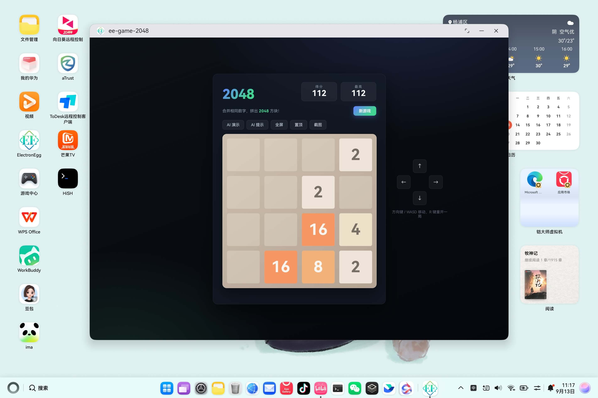
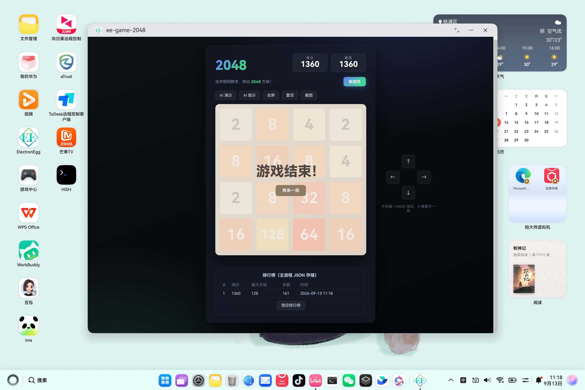
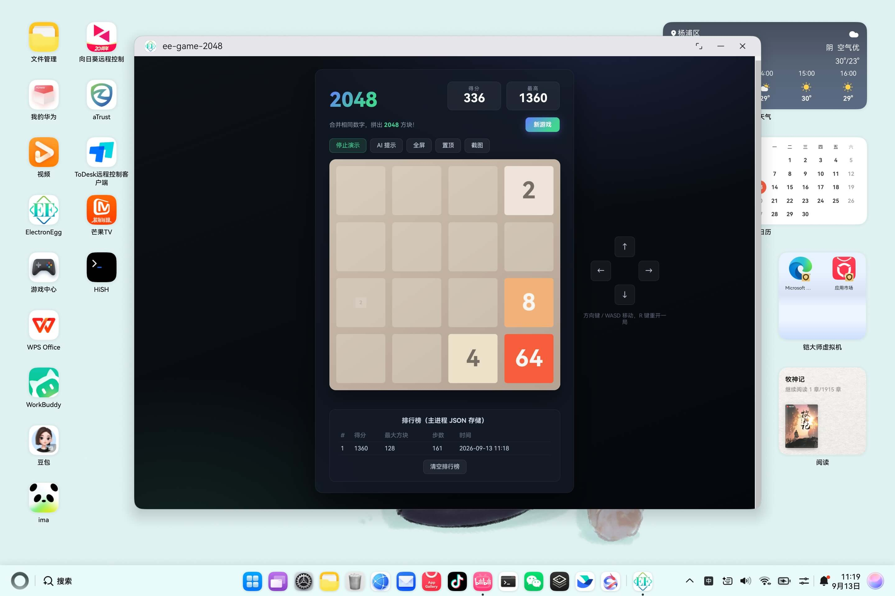
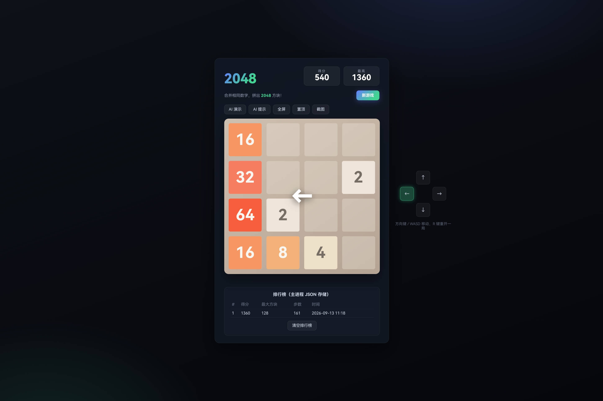

<!-- TODO: 发布时补充 Schema.org BlogPosting 结构化数据，至少包含 headline、author、datePublished、mainEntityOfPage。 -->

# 鸿蒙PC移植：2048 从网页小游戏到 AI 桌面应用

> **欢迎加入开源鸿蒙PC社区：** [https://harmonypc.csdn.net/](https://harmonypc.csdn.net/)
>
> **欢迎在PC社区平台申请新建项目：** [https://atomgit.com/OpenHarmonyPCDeveloper](https://atomgit.com/OpenHarmonyPCDeveloper)

## 摘要

经典开源 2048（gabrielecirulli/2048）再熟悉不过，一个 HTML 加几个 JS 模块就能在浏览器里玩。搬到鸿蒙 PC 有两条路，一是用 ArkTS 从头重写，二是交给 ElectronEgg 打包成 HAP，让鸿蒙 PC 的 ArkWeb WebView 直接加载前端资源。本文走第二条，而且没停在「能跑」就算完：expectimax AI 求解器挪进主进程 service，最高分与排行榜用 JSON 落盘到 `./data`，系统通知、窗口控制、主进程截图逐项接通。

项目源码托管在 AtomGit PC 社区：[ohos_ee-game-2048](https://atomgit.com/OpenHarmonyPCDeveloper/ohos_ee-game-2048)（仓库创建中）。

## 一、迁移目标：从「能跑」到「值得写」

选 2048 做鸿蒙 PC 移植对象有三个原因：它是 MIT 开源软件，代码完全可审查；它是纯前端项目，没有任何原生依赖，验证「前端资源跑在鸿蒙 WebView」这条路径它最短；它玩法经典，人人都看得懂，拿来演示能力很合适。

但「把 2048 跑上鸿蒙」只算完成最基础的一步。如果停在这里，应用和一张网页没什么区别，主进程是个空壳，框架能力一样没用上。所以这次移植顺手给游戏补了三类主进程能力：

| 能力               | 落点                                                                               | 说明                                                   |
| ------------------ | ---------------------------------------------------------------------------------- | ------------------------------------------------------ |
| AI 求解 / 自动演示 | `controller/game/aiMove` + `service/game/ai.ts`                                | expectimax 算法跑在 Node 主进程，前端经 IPC 取最优走法 |
| 战绩持久化         | `controller/game/getGameData / saveRecord` + `service/game/storage.ts`         | 最高分与排行榜写成 JSON，落盘到`./data`              |
| 系统能力           | `controller/game/sendNotify / toggleFullscreen / setAlwaysOnTop / captureScreen` | 达成 2048 弹系统通知、窗口全屏/置顶、主进程截图        |

这三类能力覆盖了 ElectronEgg 的控制器、服务、IPC 和 Electron 系统 API，也带出了后面几个真实的坑。整条迁移路径按 T0/T1/T2 分级推进：

| 阶段             | 目标                     | 最小验收内容                                                                                                          |
| ---------------- | ------------------------ | --------------------------------------------------------------------------------------------------------------------- |
| T0：可启动       | HAP 能安装并打开游戏首页 | `build_project --module electron@default` 成功；EntryAbility 启动；棋盘可见、可操作                                 |
| T1：核心业务可用 | 游戏与主进程能力可用     | 方向键/按钮/WASD 移动正常；AI 演示与 AI 提示返回合理走法；对局结束战绩写入`./data/game/game-data.json` 并刷新排行榜 |
| T2：可发布       | 覆盖实际使用边界         | 达成 2048 系统通知、窗口全屏/置顶、主进程截图在目标设备回归通过；多实例/多进程下排行榜数据读写正确                    |



## 二、前端移植：把网页 2048 改造成 ElectronEgg 应用

原版 2048 是典型的 MVC 结构：`game_manager.js` 管规则，`grid.js` / `tile.js` 管数据，`html_actuator.js` 管渲染，`keyboard_input_manager.js` 管输入。移植到 Vue 3 不用重写算法，把同一套逻辑搬进一个 `.vue` 组件就行：`Grid`、`Tile`、`GameManager` 三个类原样保留，只把 DOM 渲染换成 Vue 响应式。

移动与合并是游戏的核心逻辑，移植时方向常量一定要对齐。前端把方向约定为 `0=上 1=右 2=下 3=左`：

```js
const keyMap = {
  38: 0, 39: 1, 40: 2, 37: 3,   // 方向键：上 右 下 左
  87: 0, 68: 1, 83: 2, 65: 3,   // WASD
}
```

移动按方向取向量，再对每条「线」做滑动 + 合并：

```js
move (direction) {
  if (this.isGameTerminated()) return
  const vector = this.getVector(direction)   // 0: {x:0,y:-1} 上 …
  const traversals = this.buildTraversals(vector)
  let moved = false
  this.prepareTiles()
  traversals.x.forEach((x) => {
    traversals.y.forEach((y) => {
      const tile = this.grid.cellContent({ x, y })
      if (tile) {
        const positions = this.findFarthestPosition({ x, y }, vector)
        const next = this.grid.cellContent(positions.next)
        if (next && next.value === tile.value && !next.mergedFrom) {
          const merged = new Tile(positions.next, tile.value * 2)
          merged.mergedFrom = [tile, next]
          this.grid.insertTile(merged)
          this.grid.removeTile(tile)
          this.score += merged.value
          if (merged.value === 2048) this.won = true
        } else {
          this.moveTile(tile, positions.farthest)
        }
        if (!this.positionsEqual({ x, y }, tile)) moved = true
      }
    })
  })
  if (moved) {
    this.addRandomTile()
    if (!this.movesAvailable()) this.over = true
    this.actuate()
  }
}
```

状态恢复继续用 `localStorage`：最高分、棋盘、分数、胜负状态都序列化保存，刷新或重启后能回到上次的局面。这一层保持纯前端，等后面加主进程持久化时职责边界会很清晰：`localStorage` 管当前进度，主进程 JSON 管历史战绩。

前端就绪后，`npm run build-frontend` 把产物打进 `public/dist`，配合 Vite 的 `base: './'` 和 hash 路由，构建产物可以直接以相对路径被 ArkWeb 加载。

## 三、主进程能力：让游戏真正用上 ElectronEgg

纯前端的 2048 不需要主进程也能玩，但那样就没用上桌面框架。游戏的三类能力都搬进主进程，控制器统一通过 IPC 暴露给前端。

### 3.1 AI 求解器跑在主进程 service

把 expectimax AI 放进主进程而不是前端，有三个理由。一是算力，搜索会展开大量分支，放渲染进程容易让 UI 卡顿；二是复用，主进程的 service 不只能被 IPC 调，以后还能走 HTTP / Socket 通道；三是可测试，纯算法模块不依赖 Electron，可以直接在 Node 里跑单元验证。

`service/game/ai.ts` 是一个零依赖的纯算法模块，主进程控制器与前端内置副本（`utils/ai.js`）共用同一套逻辑。核心是 `getBestMove` + `expectimax`：

```ts
class GameAI {
  /** 计算当前棋盘的最优移动方向；无可行方向（游戏结束）时返回 null */
  getBestMove(grid: number[][]): number | null {
    let best: number | null = null;
    let bestScore = -Infinity;
    for (let d = 0; d < 4; d++) {
      const res = this.move(grid, d);
      if (res.moved) {
        const v = this.expectimax(res.grid, 4, false);
        if (v > bestScore) { bestScore = v; best = d; }
      }
    }
    return best;
  }

  /** expectimax：true = 玩家回合取最大，false = 随机回合取期望 */
  private expectimax(grid: number[][], depth: number, isMax: boolean): number {
    if (depth === 0) return this.evaluate(grid);
    if (isMax) {
      let best = -Infinity;
      for (let d = 0; d < 4; d++) {
        const res = this.move(grid, d);
        if (res.moved) {
          const v = this.expectimax(res.grid, depth - 1, false);
          if (v > best) best = v;
        }
      }
      return best === -Infinity ? this.evaluate(grid) : best;
    }
    // 对手回合：在空格处放 2（90%）或 4（10%），对抽样空格求期望
    // …（采样最多 3 个空格，控制搜索量）
  }
}
```

启发式评估综合四项指标：平滑度（相邻方块数值差越小越好）、单调性（每行/列尽量沿单一方向递增）、空格数（越多越灵活）、最大方块（越大越好）。用它模拟对局，AI 多数能合出 512 甚至 1024 方块，做自动演示绰绰有余；单步计算约 15ms，远低于前端的走子间隔。

控制器把 AI 暴露成 IPC 通道，前端把 4x4 棋盘序列化后传进来，拿到最优方向：

```ts
aiMove(args: { grid?: number[][] }): { direction: number | null } {
  const grid = args?.grid;
  if (!Array.isArray(grid) || grid.length < 4) return { direction: null };
  return { direction: ai.getBestMove(grid) };
}
```

### 3.2 战绩持久化：最高分 + 排行榜落盘 `./data`

游戏得分这类数据，放主进程存储最自然。这里刻意用简单的 JSON 文件，没上 SQLite：数据量小、结构简单，也不需要交叉编译任何原生模块，在鸿蒙 PC 上风险最低。

存储路径用 `ee-core/ps` 的 `getDataDir()`，它在不同环境自动映射到正确的落点：

| 运行环境         | 数据目录                                                       |
| ---------------- | -------------------------------------------------------------- |
| dev（开发）      | `{项目根}/data/game/game-data.json`，即本文所说的 `./data` |
| 生产（桌面）     | `{userHome}/.{appName}/data/game/game-data.json`             |
| openharmony 生产 | 应用沙箱自定义目录下的`data/game/game-data.json`             |

`service/game/storage.ts` 用一个内存缓存加文件写入，省掉每次读都开文件；文件损坏时退回默认数据，不让存储问题拖垮主进程启动：

```ts
class GameStorage {
  private dir: string;
  private file: string;
  private cache: GameData | null = null;

  constructor() {
    this.dir = path.join(getDataDir(), 'game');
    this.file = path.join(this.dir, 'game-data.json');
  }

  /** 读取全部数据；文件不存在或损坏时返回默认值并缓存 */
  getAll(): GameData {
    if (this.cache) return this.cache;
    try {
      if (fs.existsSync(this.file)) {
        const parsed = JSON.parse(fs.readFileSync(this.file, 'utf-8'));
        this.cache = { ...this.defaultData(), ...parsed };
      } else {
        this.cache = this.defaultData();
      }
    } catch (e) {
      this.cache = this.defaultData();
    }
    return this.cache;
  }

  /** 新增一条战绩并更新最高分，返回最新数据 */
  addRecord(record: GameRecord): GameData {
    const data = this.getAll();
    data.records.push(record);
    data.records.sort((a, b) => b.score - a.score);
    data.records = data.records.slice(0, 10);
    if (record.score > data.best) data.best = record.score;
    this.persist();
    return data;
  }
}
```

控制器提供 `getGameData` / `saveRecord` / `resetGameData` 三个通道。前端在游戏结束那一帧（`over` 由 false 变 true 时）把本局得分、最大方块、步数提交给主进程，排行榜即时刷新。真实落盘的效果如下：



### 3.3 系统能力：通知、窗口、截图

这三项直接调用 Electron 系统 API，也是在鸿蒙 PC 上最需要真机验证的边界。控制器里每一项都做了能力检测或异常兜底，避免平台不支持时直接抛错：

```ts
// 系统通知：平台不支持时返回明确提示
sendNotify(args: { title?: string; body?: string }): { ok: boolean; msg?: string } {
  if (!Notification.isSupported()) {
    return { ok: false, msg: '当前系统不支持通知' };
  }
  new Notification({ title: args?.title || '2048', body: args?.body || '' }).show();
  return { ok: true };
}

// 窗口控制：全屏 / 置顶
toggleFullscreen(): boolean {
  const win = getMainWindow();
  win.setFullScreen(!win.isFullScreen());
  return win.isFullScreen();
}

// 主进程截图：capturePage 截取当前窗口，保存为 PNG
async captureScreen(): Promise<{ ok: boolean; file?: string; msg?: string }> {
  const win = getMainWindow();
  try {
    const image = await win.webContents.capturePage();
    if (image.isEmpty()) return { ok: false, msg: '截图内容为空' };
    const dirPath = path.join(getDataDir(), 'screenshot');
    fs.mkdirSync(dirPath, { recursive: true });
    const file = path.join(dirPath, `2048-${Date.now()}.png`);
    fs.writeFileSync(file, image.toPNG());
    return { ok: true, file };
  } catch (e) {
    return { ok: false, msg: e instanceof Error ? e.message : '截图失败' };
  }
}
```

前端在达成 2048 时调用 `sendNotify`，全屏 / 置顶 / 截图三个按钮分别触发对应通道。`capturePage` 在鸿蒙 ArkWeb 下是否支持、通知是否真的弹出，都作为 T2 验收项在真机回归。

## 四、构建、注入与运行

游戏代码就绪后，按 ElectronEgg 的鸿蒙流程走三步：

```bash
npm run build-frontend      # 构建前端（Vite 产物 → public/dist）
npm run build-electron      # 构建主进程（esbuild bundle → public/electron/main.js）
npm run ohos-test           # 构建主进程 + 把 public/ 注入 ohos_hap 资源目录
```

`npm run ohos-test` 实际执行 `npm run build-electron && ee-bin ohos --cmds=test`，把根 `public/` 复制到 `ohos_hap/web_engine/src/main/resources/resfile/resources/app/public`。之后用 DevEco Studio 打开 `ohos_hap`：

```bash
build_project --module electron@default   # 编译 electron Entry HAP
start_app --module electron --ability EntryAbility
```

应用在鸿蒙 PC 模拟器（arm64，M 芯片 Mac）上的运行效果如下：





> 提醒：修改前端后必须重新执行 `npm run build-frontend`，否则 `ohos-test` 注入的还是旧页面；主进程改动后至少重新执行 `npm run ohos-test`。

## 五、踩坑与经验

| 问题                                     | 原因                                    | 解决办法                                                                                                                          |
| ---------------------------------------- | --------------------------------------- | --------------------------------------------------------------------------------------------------------------------------------- |
| AI 走法看起来「乱走」                    | 前端方向常量与 AI 向量不一致            | 统一约定`0=上 1=右 2=下 3=左`，前端 `keyMap` 与 AI `VECTORS` 一一对应；前端序列化棋盘用 `grid[x][y]`，AI 同样以列、行索引 |
| 数据该放哪                               | `localStorage` 与主进程 JSON 职责不清 | `localStorage` 管当前进度（棋盘/分数/最高分），主进程 JSON 管历史战绩（排行榜/统计）；对局结束时经 IPC 归档                     |
| `capturePage` 在鸿蒙上可能返回空或报错 | ArkWeb / 平台对窗口捕获支持有限         | 方法内做`image.isEmpty()` 检查与 try/catch，返回结构化错误；列入 T2 真机验收                                                    |
| 系统通知不弹                             | 平台不支持或未授权                      | 先`Notification.isSupported()` 判定，前端降级到 Web Notification                                                                |
| AI 单步太慢导致演示卡顿                  | 搜索深度过大                            | 期望节点只采样最多 3 个空格，深度 4，单步约 15ms；演示间隔 180ms 与方块动画 120ms 匹配                                            |
| 排行榜数据写不进去                       | 目录不存在或只读                        | `persist()` 里 `fs.mkdirSync(dir, { recursive: true })` 自动建目录；写入失败只记日志不抛错                                    |

再补充两点经验：

1. **主进程 service 不必依赖框架自动加载**。ee-v5 的 init 阶段 `loadDir` 只创建 data/logs 目录，`service/` 下的模块就是普通模块，由控制器直接 import，写起来和普通 TypeScript 没区别。
2. **降级副本必须和主进程保持同一份逻辑**。AI 有主进程 TS 版和前端 JS 版两份实现，改算法时两端都要动；算法再复杂下去，就该抽成共享包了。

## 六、总结

把 2048 搬上鸿蒙 PC，重点不在游戏本身，而在验证一条可复用的路径：纯前端网页 → ElectronEgg 桌面应用 → HAP 跑在鸿蒙 PC，中间把主进程真正用起来。AI 放进 `service/` 走 IPC、战绩落 JSON、系统能力逐项接通，换成扫雷、俄罗斯方块、数独，做法基本一样。

往下还有几件事可做：给排行榜加联机，用 ElectronEgg 的 Go 后端配 Socket / HTTP 通道做在线榜，顺便把三条通信通道演示一遍；把 AI 副本抽成共享 npm 包，消掉主进程与前端两份实现的漂移；按鸿蒙端的窗口、分享等系统能力继续补 T2 验收场景。

## 参考与延伸

- 经典 2048 原版（MIT）：[https://github.com/gabrielecirulli/2048](https://github.com/gabrielecirulli/2048)
- electron-egg 框架：[https://atomgit.com/dromara/electron-egg](https://atomgit.com/dromara/electron-egg)
- 本文 demo（2048 移植）代码仓库（AtomGit PC 社区，仓库创建中）：[https://atomgit.com/OpenHarmonyPCDeveloper/ohos_ee-game-2048](https://atomgit.com/OpenHarmonyPCDeveloper/ohos_ee-game-2048)
- OpenHarmony 官方文档：[https://docs.openharmony.cn/](https://docs.openharmony.cn/)
- 华为开发者文档：[https://developer.huawei.com/consumer/cn/doc/](https://developer.huawei.com/consumer/cn/doc/)
- 开源鸿蒙 PC 社区：[https://harmonypc.csdn.net/](https://harmonypc.csdn.net/)
