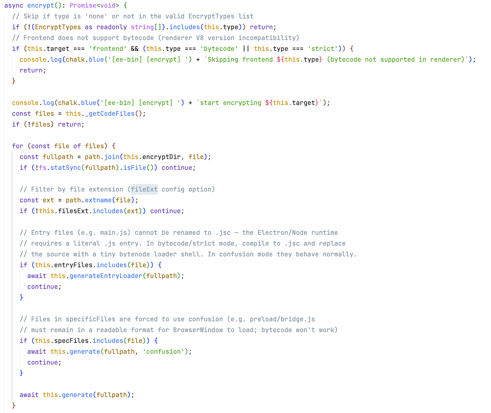
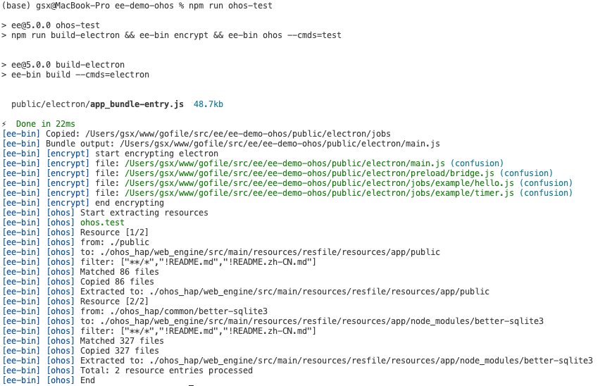

<!-- TODO: 发布时补充 Schema.org BlogPosting 结构化数据，至少包含 headline、author、datePublished、mainEntityOfPage。 -->

# 【鸿蒙PC开发】使用混淆加密代码，让你的项目更加安全

> **欢迎加入开源鸿蒙PC社区：** [https://harmonypc.csdn.net/](https://harmonypc.csdn.net/)
>
> **欢迎在PC社区平台申请新建项目：** [https://atomgit.com/OpenHarmonyPCDeveloper](https://atomgit.com/OpenHarmonyPCDeveloper)

## 摘要

Electron / OpenHarmony Electron 应用的代码以 JS 形式随包分发，打包工具默认只做「归档」不做「保护」，源码几乎等于裸奔。electron-egg（ee-v5）框架把代码加密做成了构建链内置能力：`cmd/bin.js` 配置 + `npm run encrypt` 一条命令，即可对主进程与前端产物做**压缩混淆加密**。本文将这套流程应用到本鸿蒙 PC demo 工程上，完整记录配置项解读、执行流程、javascript-obfuscator 高价值参数详解与三档强度实测（基础混淆 +34%，增强混淆约 3.5 倍）、HAP 注入与真机验证结果，并给出可直接抄走的配置与避坑清单——混淆加密对功能零侵入，是当前鸿蒙 PC 项目最务实的代码防护方案。

## 一、为什么桌面应用也需要代码加密

很多开发者以为 `.exe` / `.app` / HAP 里的代码是「编译好的、看不到的」——恰恰相反。Electron 系应用（包括鸿蒙 PC 上的 OpenHarmony Electron）分发的主体就是 JS：

- 用 `npx asar extract app.asar ./out` 一条命令即可解包，拿到**原始 JS**；
- asar 只是归档格式，**没有任何加密语义**；
- 即便经过 esbuild 打包（bundle），产物仍是可读 JS，工具类项目（如我们前几篇的 SQLite Studio、2048 的 AI 算法）的核心逻辑一览无余。

商业发布至少要做一层防护。electron-egg 把这件事做成了框架构建链的一部分：`npm run encrypt`（即 `npm run build-electron && ee-bin encrypt`），不需要自己接混淆工具。

## 二、混淆加密的原理与工具链

`ee-bin encrypt` 由 `ee-bin/src/tools/encrypt.ts` 实现，底层是 **javascript-obfuscator**（v5.x）。它把同一份 JS 改写成等价但难读的形态：

- 变量名全部替换为 `_0x49064b` 式十六进制标识符；
- 字符串常量收进一个特殊数组，取值走解码函数（`stringArray` / `stringArrayCallsTransform`）；
- 数字拆成算术表达式（`numbersToExpressions`）；
- 整个文件压成一行（`compact`）。

关键点：**混淆产出的仍然是标准 JS 源码**，由引擎照常解析执行——不改变模块边界、不改变加载方式，因此对桌面 Electron 和鸿蒙 ArkWeb / ohos Electron 运行时都天然兼容，这是它成为鸿蒙项目默认选择的根本原因。

工具链的行为特征：

| 特性       | 说明                                                        |
| ---------- | ----------------------------------------------------------- |
| 双 target  | `electron` 与 `frontend` 分别配置策略，一条命令依次处理 |
| 就地替换   | 扫描`files` 匹配到的产物，逐个混淆后写回原文件            |
| 过滤语法   | `files` 支持 `!` 前缀排除，如 `'!electron/xxx.json'`  |
| 扩展名限定 | 只处理`fileExt`（默认 `.js`）匹配的文件                 |

下图是 `ee-bin` 加密管线核心方法 `Encrypt.encrypt()` 的实现：扫描目标文件清单后逐个分流处理——入口文件、`specificFiles` 与普通文件各走各的分支，最终就地写回混淆结果。



## 三、实操：以本工程为例

### 3.1 配置

本 demo 的 `cmd/bin.js` 中 `encrypt` 段实际配置：

```javascript
encrypt: {
  frontend: {
    type: 'none',                          // 前端暂不加密（见第五章）
    files: ['./public/dist/**/*.(js|json)'],
    cleanFiles: ['./public/dist'],
    confusionOptions: { compact: true, stringArray: true, /* … */ target: 'browser' },
  },
  electron: {
    type: 'confusion',                     // 主进程：压缩混淆
    files: ['./public/electron/**/*.(js|json)'],
    cleanFiles: ['./public/electron'],
    specificFiles: [
      './public/electron/main.js',          // 包启动入口，保持 .js 文件名
      './public/electron/preload/bridge.js' // BrowserWindow preload 脚本
    ],
    confusionOptions: {
      compact: true,               // 压缩成一行
      stringArray: true,           // 字符串常量收进数组
      stringArrayEncoding: ['none'], // 数组编码：none | base64 | rc4，rc4 更强
      deadCodeInjection: false,    // 死代码注入，安全↑ 体积/性能代价大
      stringArrayCallsTransform: true,
      numbersToExpressions: true,  // 数字拆成算术表达式
      target: 'node',
    },
    silent: true,                  // 屏蔽 javascript-obfuscator 的广告横幅
  },
}
```

两个配置项值得展开：

- **`files`** 用 globby 扫描出文件清单后逐个就地加密写回，支持 `!` 过滤语法排除个别文件；
- **`specificFiles`** 显式列出的文件走单独处理分支——`main.js` 是包入口、`bridge.js` 是 preload 脚本，两者的文件名与格式约束最严格，单列出来便于后续调整策略时不误伤。

### 3.2 执行

```bash
npm run encrypt
# = npm run build-electron && ee-bin encrypt
```

`ee-bin encrypt` 会依次处理 `electron` 与 `frontend` 两个 target，按各自 `type` 决定是否加密、怎么加密。加密是**就地替换** `public/electron/` 下的产物，完成后目录内容：

```text
public/electron/
├── main.js                    # 混淆后的主进程 bundle
├── preload/bridge.js          # 混淆后的 preload
└── jobs/example/hello.js      # fork 用的后台任务，同样逐个混淆
    jobs/example/timer.js
```

混淆后的 `main.js` 开头（真实产物）：

```javascript
const _0x596237=_0x2e21;(function(_0x43f9b4,_0x3e2dd7){const _0x143c18=
{_0x47255f:0x19f,_0x113568:0x1ee,...} ...
```

已完全不具备人工阅读价值。



### 3.3 体积代价（实测）

对同一份代码执行混淆前后的字节数对比（`wc -c` 实测）：

| 文件                         |           混淆前 |           混淆后 | 变化                           |
| ---------------------------- | ---------------: | ---------------: | ------------------------------ |
| `main.js`（主进程 bundle） |           49,890 |           67,067 | +34%                           |
| `preload/bridge.js`        |              152 |            1,705 | ×11（小文件被包装开销占主导） |
| `jobs/example/hello.js`    |            1,152 |            3,309 | ×2.9                          |
| `jobs/example/timer.js`    |            2,619 |            5,865 | ×2.2                          |
| **合计**               | **53,813** | **77,946** | **约 +45%**              |

结论：当前配置（不开 `deadCodeInjection`）下体积膨胀约 45%，对安装包大小和启动速度都无感；如果把 `stringArrayEncoding` 提到 `rc4`、打开死代码注入，安全提升但体积和运行开销会继续上升，按项目风险等级取舍。

## 四、javascript-obfuscator 高价值参数详解

### 4.1 参数是直通官方配置的

`ee-bin` 的混淆实现只固定了三个默认值（`compact: true`、`stringArray: true`、`stringArrayThreshold: 1`），其余 `confusionOptions` **原样透传**给 javascript-obfuscator v5.x。也就是说，官方文档里的每一个选项都可以直接写进 `cmd/bin.js`，无需改框架。v5 还提供了 `optionsPreset: 'low-obfuscation' | 'medium-obfuscation' | 'high-obfuscation'` 一键预设，作为调强起点。

### 4.2 值得关注的参数

| 参数 | 作用 | 代价 | 建议 |
| --- | --- | --- | --- |
| `controlFlowFlattening` + `controlFlowFlatteningThreshold`(0.5~0.75) | 控制流扁平化：把顺序执行改写为 `while + switch` 状态机跳转，**对人工逆向单点效果最强** | 体积明显↑，执行有小幅开销 | 核心算法文件值得开，阈值不必拉满 |
| `stringArrayEncoding: ['rc4']` | 字符串数组再加密一层（可配 `base64`） | 解码依赖 eval 系能力：与 `target: 'browser-no-eval'` / 严格 CSP 页面不兼容 | 主进程（`target: 'node'`）放心用；前端在 ArkWeb 下先验证 CSP |
| `stringArrayWrappersType: 'function'` | 字符串取值函数再多套几层包装（配合 `stringArrayCallsTransform`） | 轻微 | 开着 |
| `splitStrings` + `splitStringsChunkLength: 10` | 长字符串拆成碎片拼接，接口名、提示文案等不再能整串搜索 | 轻微 | 开 |
| `renameGlobals` | 顶层全局名一并混淆（bundle 作用域内） | 无 | 开——防函数名泄露业务语义 |
| `selfDefending` | 产物防美化格式化，一经 beautify 即失效 | 与 `compact: false` 冲突（会毁掉代码） | 只在 `compact: true` 的发布产物上用 |
| `identifierNamesGenerator: 'dictionary'` / `'mangled'` | 标识符命名风格：默认 `hexadecimal` 满屏 `_0x` 很显眼，`dictionary` 用随机单词命名，更像「正常但难看」的代码 | 无 | 想降低「被针对」程度可换 |
| `seed: <数字>` | 固定随机种子，混淆输出**可复现**（同输入同产物，利于构建缓存与审查） | 无 | CI 里固定；「重跑 encrypt 修复偶发不可运行」的本质就是换 seed |
| `debugProtection` + `debugProtectionInterval` | 打开 DevTools 即陷入 debugger 循环卡死页面 | 自己也别想调试 | 前端 target 的攻击面防御，主进程不开 |
| `reservedNames` / `reservedStrings` | 白名单：指定正则命中的标识符/字符串保持原样不混淆 | 无 | 个别必须保持字面值的场景兜底用 |

两个**看似诱人、实际要慎用**的参数：

- `transformObjectKeys` / `renameProperties`：改对象属性名。Electron 的控制器返回值是跨 IPC 的普通对象，渲染进程按属性名取值——若前端（`public/dist`）没有同步混淆，**键名一错两端直接断联**。默认关闭是正确姿势。
- `sourceMap` 系列：obfuscator 本身能产出还原错误栈的 map，但 ee-bin 只取 `getObfuscatedCode()` 写回文件、**不落盘 sourcemap**，这些参数在 ee-bin 链路下不生效；确有需要就得自己接混淆步骤。

### 4.3 增强配置与实测代价

把上表的「开」项组装成增强配置：

```javascript
confusionOptions: {
  compact: true,
  stringArray: true,
  stringArrayEncoding: ['rc4'],
  stringArrayCallsTransform: true,
  stringArrayWrappersType: 'function',
  numbersToExpressions: true,
  splitStrings: true,
  splitStringsChunkLength: 12,
  renameGlobals: true,
  controlFlowFlattening: true,
  controlFlowFlatteningThreshold: 0.6,
  deadCodeInjection: true,
  deadCodeInjectionThreshold: 0.1,
  selfDefending: true,
  seed: 114514,
  target: 'node',
}
```

对同一份 49,890 字节的明文 `main.js` 做三档实测（固定 `seed` 保证可比）：

| 档位 | 产物大小 | 相对明文 |
| --- | ---: | --- |
| 明文 | 49,890 B | — |
| 基础混淆（本文第三章配置） | 66,927 B | +34% |
| 增强混淆（上面这套） | 173,508 B | **+248%（约 3.5 倍）** |

增强档体积约为基础档的 2.6 倍，大头来自控制流扁平化与死代码注入。务实结论：**日常发布用基础档，核心商业版本上增强档**，并在真机回归一次启动耗时与关键流程。

## 五、前端代码怎么办

前端（`public/dist`）的 target 同样支持 `confusion`（`target: 'browser'` 的混淆配置），但对本工程的鸿蒙形态有一层现实考量：前端资源最终由 ArkWeb 加载执行，Vite 构建产物本身已经过 minify，进一步混淆对「防抄」收益有限（前端代码反正要下发到客户端执行）。因此本工程 `frontend.type` 保持 `'none'`；确有要求时改成 `'confusion'` 即可，命令不变。

真正需要保护的算法放在**主进程 service** 里，恰好是 `electron.type = 'confusion'` 覆盖的范围——这也是「能力放主进程」除了性能之外的又一条理由。

## 六、部署到鸿蒙 PC 与真机验证

加密只动 `public/electron/`，鸿蒙链路不需要任何额外步骤——加密产物照常随资源注入：

```bash
npm run encrypt              # 构建主进程 + 混淆加密
npm run ohos-test            # 把 public/ 注入 ohos_hap 资源目录
# DevEco Studio: build_project --module electron@default → start_app
```

混淆产物在鸿蒙 PC 真机上的实际验证结果：应用启动正常，IPC 通道调用、控制器/service、jobs 子进程全部回归通过，行为与未混淆版本完全一致。

| 阶段             | 目标                            | 验收内容                                                 |
| ---------------- | ------------------------------- | -------------------------------------------------------- |
| T0：可启动       | 混淆产物注入 HAP 后能安装并启动 | 应用窗口正常出现，无白屏                                 |
| T1：核心业务可用 | 混淆不改变行为                  | IPC 通道调用、jobs 子进程、控制器/service 全部回归       |
| T2：可发布       | 发布形态完整性                  | 解包检查产物确已混淆；多环境（dev/打包后）路径与功能一致 |


## 七、踩坑与经验

| 问题                              | 原因                                             | 解决办法                                                                                                        |
| --------------------------------- | ------------------------------------------------ | --------------------------------------------------------------------------------------------------------------- |
| 混淆后偶发代码无法运行            | 混淆输出极端情况下触发关键字/编码冲突            | 官方文档建议：**重新执行 `npm run encrypt`** 即可（混淆带随机因子，重跑即换输出）；重要版本加密后先冒烟 |
| 体积意外翻倍                      | 打开了`deadCodeInjection`                      | 保持`false`；本文配置实测全量仅 +45%                                                                          |
| 误以为加密=安全，解包还能看到逻辑 | `asar` 只是归档                                | 混淆是底线防护；核心算法另加服务端校验                                                                          |
| 加密后调试困难                    | 产物不可读                                       | 调试期 type 回`none`；发布流水线里再开加密                                                                    |
| 小文件混淆后膨胀十倍              | 包装开销（字符串数组、解码函数）对小文件占比极高 | 正常现象；`bridge.js` 这类薄文件收益低，可放 `files` 过滤列表排除                                           |

三点补充经验：

1. **加密发生在构建之后、注入打包之前**，顺序固定为 `build-electron → encrypt → ohos/resources 注入 → HAP 构建`；先 `ohos-test` 再加密的话，注入进 HAP 的还是明文。
2. **`confusion` 对功能零侵入**：它不改变模块边界和加载方式，控制器注册、`child_process.fork` 的 jobs 文件、JSON 配置统统照常，回归成本很低。
3. **字符串编码按需升级**：`stringArrayEncoding: ['none']` 已不可读，敏感项目换 `['rc4']`，体积代价略高、运行时解码开销可忽略。

## 八、总结

- electron-egg 的代码加密是**构建链内置能力**：`cmd/bin.js` 配置 + `npm run encrypt` 一条命令，主进程与前端两个 target 独立策略；
- **压缩混淆是当前鸿蒙 PC 的务实选择**：产出仍是标准 JS，对运行时零要求；功能零侵入、体积 +45% 量级、配置十行，实测真机行为与明文版完全一致；
- 想上更强保护，先把**值得保护的东西放进主进程 service**，让它至少落在混淆覆盖范围内——比前端加密划算得多。

## 参考与延伸

- electron-egg 官方文档 · 代码加密：[https://github.com/wallace5303/docs/blob/main/docs/zh/00.docs/030.build-software/020.code-encryption.md](https://github.com/wallace5303/docs/blob/main/docs/zh/00.docs/030.build-software/020.code-encryption.md)
- javascript-obfuscator：[https://github.com/javascript-obfuscator/javascript-obfuscator](https://github.com/javascript-obfuscator/javascript-obfuscator)
- electron-egg 框架：[https://atomgit.com/dromara/electron-egg](https://atomgit.com/dromara/electron-egg)
- OpenHarmony 官方文档：[https://docs.openharmony.cn/](https://docs.openharmony.cn/)
- 华为开发者文档：[https://developer.huawei.com/consumer/cn/doc/](https://developer.huawei.com/consumer/cn/doc/)
- 开源鸿蒙 PC 社区：[https://harmonypc.csdn.net/](https://harmonypc.csdn.net/)


