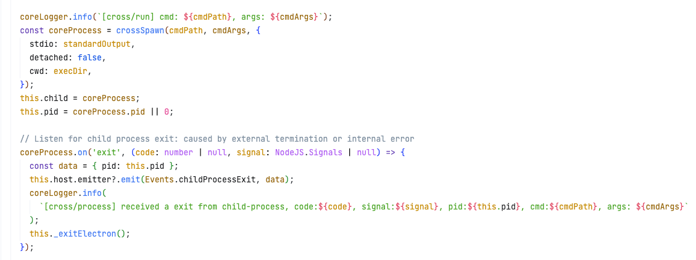
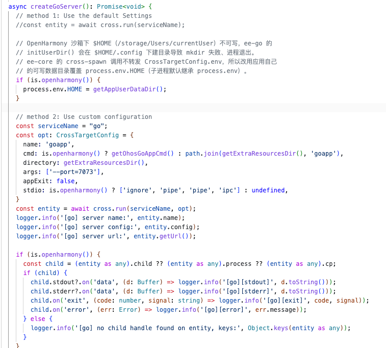
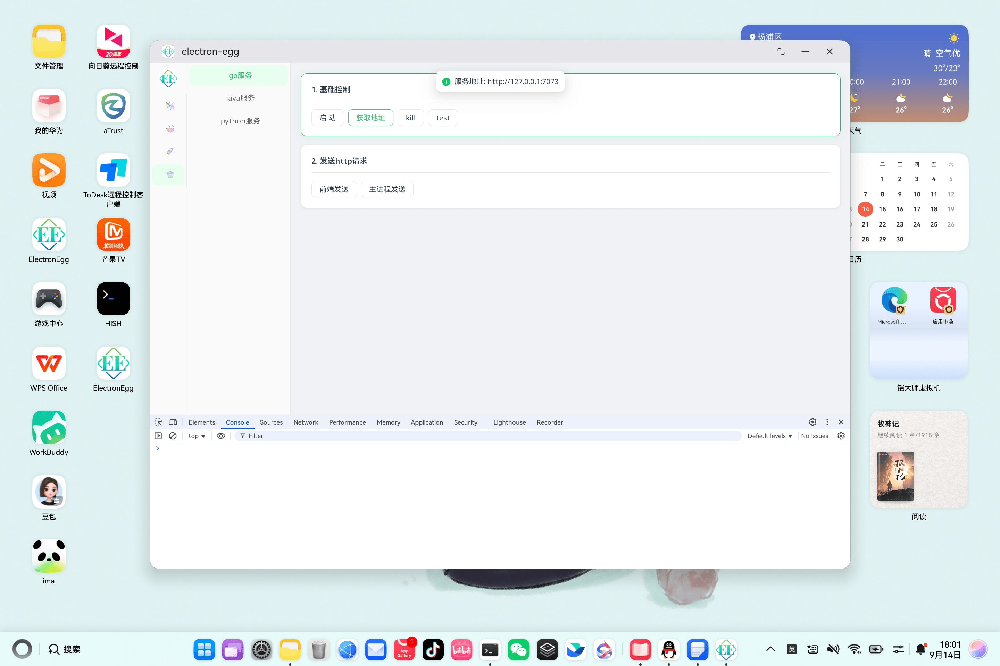

# 【鸿蒙PC开发】如何让electron拉起go服务并运行在鸿蒙PC上

> **欢迎加入开源鸿蒙PC社区：** [https://harmonypc.csdn.net/](https://harmonypc.csdn.net/)
>
> **欢迎在PC社区平台申请新建项目：** [https://atomgit.com/OpenHarmonyPCDeveloper](https://atomgit.com/OpenHarmonyPCDeveloper)

## 摘要

ElectronEgg（ee-v5）的主进程可以用 `cross` 模块拉起 Go 后端子进程，这一步在桌面上开箱即用。搬到鸿蒙 PC 后多出两个问题：未签名的二进制会被内核 XPM 拦截，得先用 HNP（HarmonyOS Native Package）打包、让系统在安装时签名放行；鸿蒙沙箱的目录权限模型和桌面不一样，`$HOME` 这类常见环境变量在沙箱里不可写，靠它建目录的 Go 程序会直接启动失败。下面按打包签名 → 环境适配 → 构建注入 → 验证的顺序，记录这套链路踩过的坑和最终解法。

项目源码托管在 AtomGit PC 社区：[ohos_electron-egg](https://atomgit.com/OpenHarmonyPCDeveloper/ohos_electron-egg)。

## 一、总体思路

在鸿蒙 PC 上让 Go 服务跑起来，需要打通三层：

| 层 | 问题 | 方案 |
| --- | --- | --- |
| 二进制执行 | 内核 XPM 拦截未签名二进制的 `exec` | 用 HNP 打包，安装时由系统签名放行 |
| 运行时环境 | 沙箱目录权限与桌面系统不同，`$HOME` 不可写 | 让 Go 程序的运行时目录检测优先读取可写的环境变量 |
| 构建与注入 | HAP 打包用的资源目录和主构建产物是两份拷贝 | 每次改动后跑资源同步命令，确保新代码真正进了 HAP |

## 二、二进制签名：HNP 打包

鸿蒙 PC 的内核 XPM 会拦截未签名二进制的 `exec`，`resfile` 目录下直接 spawn 出来的 Go 二进制会报 `EACCES`。解法是把交叉编译产物打成 HNP 包，安装时由系统释放到沙箱内并签名，运行路径固定为：

```
/data/app/<appName>.org/<appName>_<version>/bin/<appName>/<appName>
```

对应到本项目的构建命令：

```bash
npm run build-go-ohos      # cross-env GOOS=linux GOARCH=arm64 CGO_ENABLED=0 交叉编译
npm run build-hnp-ohos      # 打包成 .hnp，产物落在 ohos_hap/hnp/arm64-v8a/
```

`module.json5` 里声明这个 HNP 包，安装时系统才会去解包签名：

```json5
"hnpPackages": [
  {
    "package": "goapp.hnp",
    "type": "private"
  }
],
```

业务代码里，鸿蒙分支的可执行文件路径要指向系统释放后的签名路径，而不是 `resfile` 里的原始拷贝：

```typescript
function getOhosGoAppCmd(): string {
  const home = process.env.HNP_PRIVATE_HOME || '/data/app';
  return path.join(home, 'goapp.org', 'goapp_1.0', 'bin', 'goapp', 'goapp');
}

const opt: CrossTargetConfig = {
  name: 'goapp',
  cmd: is.openharmony() ? getOhosGoAppCmd() : path.join(getExtraResourcesDir(), 'goapp'),
  directory: getExtraResourcesDir(),
  args: ['--port=7073'],
  appExit: false,
}
```

下图是 `ee-core` 的 `cross` 模块创建子进程的实现：接到 `cross.run()` 调用后，底层用 `cross-spawn` 把签名释放好的二进制 exec 起来。



到这里 `cross.run()` 已经能把二进制真正 exec 起来，`EACCES` 不再出现。但签名只是让进程能启动，能不能活下来是另一回事。

## 三、运行时环境：沙箱目录权限适配

### 3.1 现象：进程秒退，`ps -ef` 显示僵尸态

如果 Go 程序依赖用户主目录（`$HOME`）建配置/数据目录，在鸿蒙沙箱下大概率会启动失败：

```bash
$ ps -ef | grep goapp
20020232  27178  26406  0 23:03:57 ?  00:00:00 [/data/app/goapp]
```

命令名带方括号，说明进程已经退出（defunct）。原因是鸿蒙 PC 应用沙箱里，从父进程继承的 `$HOME`（`/storage/Users/currentUser`）只读不可写，真正可写的只有 `ee-core` 的 `getAppUserDataDir()`（对应 `/data/storage/el2/base/files`）。Go 程序尝试在不可写目录下 `mkdir` 会直接失败退出。

### 3.2 排查工具：先找对日志文件，再打开 stdio

`ee-core` 有两套独立日志，业务代码的输出在 `ee.*.log`（应用层 logger），不在 `ee-core.*.log`（框架内部 logger）：

```bash
hdc file recv /data/app/el2/100/base/<bundleName>/files/ee/logs/ee.$(date +%Y-%m-%d).1.log /tmp/ee_app.log
grep "\[go\]" /tmp/ee_app.log
```

`cross.run()` 默认的 `stdio` 配置不会转发子进程的 stdout/stderr，需要临时打开：

```typescript
const opt: CrossTargetConfig = {
  // ...
  stdio: ['ignore', 'pipe', 'pipe', 'ipc'],
}
const entity = await cross.run(serviceName, opt);
const child = (entity as any).child;
child?.stdout?.on('data', (d: Buffer) => logger.info('[go][stdout]', d.toString()));
child?.stderr?.on('data', (d: Buffer) => logger.info('[go][stderr]', d.toString()));
child?.on('exit', (code: number, signal: string) => logger.info('[go][exit]', code, signal));
child?.on('error', (err: Error) => logger.info('[go][error]', err.message));
```

打开之后，能在 `ee.*.log` 里看到 Go 程序真实的报错，例如：

```
[go][stdout] Error: create user home conf folder [/storage/Users/currentUser/.config/ee] failed:
mkdir /storage/Users/currentUser/.config: operation not permitted
```

排查完这几行监听代码建议**注释而非删除**，方便下次同类问题复用。

### 3.3 方案：把可写目录喂给 Go 程序，但要注意两个转发陷阱

思路很直接——把子进程的 `HOME` 环境变量指向应用可写的数据目录。但这里有两个容易踩的坑：

**陷阱一：`CrossTargetConfig.env` 可能不会被框架转发。** 需要确认所使用的 `ee-core` 版本，其 `cross-spawn` 调用是否真的读取了 `env` 配置字段——如果没有，写在 `opt.env` 里的值会被静默忽略，子进程实际继承的是 Node 主进程自己的 `process.env`。稳妥的做法是直接修改 `process.env` 后再调用 `cross.run()`：

```typescript
if (is.openharmony()) {
  process.env.HOME = getAppUserDataDir();
}
const entity = await cross.run(serviceName, opt);
```

下图是本工程业务代码里 `cross.run()` 拉起 goapp 的实际调用现场：



**陷阱二：目标语言的运行时可能绕过环境变量检查。** 以 Go 为例，标准的"取用户主目录"实现通常先调用 `user.Current()`（系统级用户信息查询），只有它报错时才会去读 `HOME` 环境变量兜底：

```go
func GetUserHomeDir() (string, error) {
	user, err := user.Current()
	if nil == err {
		return user.HomeDir, nil   // 沙箱下这里可能成功，但返回值不可写
	}
	return homeUnix()               // 只有上面报错才会走到这里检查 HOME
}
```

鸿蒙沙箱下 `user.Current()` 往往是**成功**的，只是返回的目录不可写。也就是说，`HOME` 环境变量无论怎么设，都不会被这段逻辑采纳。判断方法很简单：设了 `HOME` 之后报错依然一字不差，基本就是这层原因。

如果目标程序是自己维护的框架源码，修复方式是把环境变量检查提到系统调用之前：

```go
func GetUserHomeDir() (string, error) {
	if !IsWindows() {
		if home := os.Getenv("HOME"); home != "" {
			return home, nil
		}
	}
	user, err := user.Current()
	if nil == err {
		return user.HomeDir, nil
	}
	// ... 其余兜底逻辑不变
}
```

### 3.4 改第三方依赖源码的安全流程：本地 `replace` 先联调

如果需要改的是一个独立仓库的第三方 Go 依赖，不要直接改版本号指向的缓存副本。用 Go modules 的 `replace` 指令把依赖临时指向本地开发checkout，改完本地源码直接编译验证：

```
# go.mod
replace github.com/<org>/<pkg> => /path/to/local/checkout
```

```bash
go build -o /tmp/test_bin .          # 本地编译验证
npm run build-go-ohos                # 交叉编译 OHOS 版本
npm run build-hnp-ohos                # 重新打 HNP 包
```

验证通过后，在依赖仓库里提交、打 tag、推送，再把 `go.mod` 的 `replace` 去掉、版本号改成新 tag：

```bash
# go.mod 里删掉 replace 行，版本号改成新版本
GOPROXY=https://goproxy.cn,direct go mod tidy   # 如果连不上境外代理，单次命令临时切镜像
```

这套"本地 replace 联调 → 发布真实版本 → 切回版本号依赖"的流程，不会在验证阶段污染 `go.sum`，也不会让其他协作者的构建依赖一个只存在于本机的路径。

## 四、构建与注入：确保改动真正进了 HAP

### 4.1 陷阱：两份 `main.js`

`npm run build-electron` 只会更新仓库根目录下的 `public/electron/main.js`，但 hvigor 打包 HAP 时用的是另一份拷贝：

```
ohos_hap/web_engine/src/main/resources/resfile/resources/app/public/electron/main.js
```

只有执行资源同步命令后，这份拷贝才会更新：

```bash
npm run build-electron
ee-bin ohos --cmds=test      # 或 --cmds=resources，把 public/ 同步进 resfile
```

漏掉这一步，表现和"修复没生效"完全一样——报错信息一字不差，但原因是根本没测到新代码。**改完业务代码后，先确认两处 `main.js` 内容或修改时间一致，再重新打包安装。**

### 4.2 按需拆分构建命令

如果项目同时维护含 Go 后端和不含 Go 后端的构建路径，建议把资源同步命令拆开，避免每次都强制触发一次 Go 交叉编译：

```json
"build-go-hnp-ohos": "npm run build-go-ohos && npm run build-hnp-ohos",
"ohos": "ee-bin ohos --cmds=resources",
"ohos-go": "npm run build-go-hnp-ohos && npm run ohos",
"ohos-test": "npm run build-electron && ee-bin ohos --cmds=test",
"ohos-test-go": "npm run build-electron && npm run build-go-hnp-ohos && ee-bin ohos --cmds=test"
```

不含 Go 后端、或 Go 侧没有改动时用 `ohos` / `ohos-test`；Go 侧有改动时用带 `-go` 后缀的命令。

### 4.3 打包与安装

```bash
export DEVECO_SDK_HOME=/Applications/DevEco-Studio.app/Contents/sdk
export JAVA_HOME=/Applications/DevEco-Studio.app/Contents/jbr/Contents/Home
export PATH="$JAVA_HOME/bin:$PATH"
node /Applications/DevEco-Studio.app/Contents/tools/hvigor/hvigor/bin/hvigor.js \
  --mode module -p product=default -p buildMode=debug -p module=electron@default \
  assembleHap --no-daemon

hdc install ohos_hap/electron/build/default/outputs/default/electron-default-signed.hap
```

排障阶段优先用 `buildMode=debug`，跳过 ArkTS 混淆，减少额外故障面。

## 五、验证

安装完成后，启动应用并检查进程与端口：

```bash
hdc shell "aa start -a EntryAbility -b <bundleName>"
hdc shell "ps -ef" | grep goapp
```

正常存活的子进程会显示完整命令行，而不是方括号包裹的僵尸态：

```
20020232  43456  43037  0 23:29:07 ?  00:00:00 goapp --port=7073
```

转发端口后用 `curl` 验证 HTTP 服务确实可用：

```bash
hdc fport tcp:17073 tcp:7073
curl http://127.0.0.1:17073/api/hello
{"code":0,"msg":"","data":"hello electron-egg"}
```

真机上的实际验证效果：




日志里也能看到 HTTP 服务正常加载、后台任务正常触发：

```
[go][stderr] INFO  ehttp/http.go:94  [ee-go] http server http://127.0.0.1:7073, pid:43456
[go][stderr] INFO  job/index.go:36   [task] hello
```

## 六、迁移能力分档：T0 / T1 / T2

Go 子进程这条链路能不能算「跑通」，同样分三档看。这三档正好对应前文三层：签名管「能不能起」、可写目录管「起了会不会活」、资源同步管「改的东西进没进包」。

| 阶段 | 目标 | 验收内容 |
| --- | --- | --- |
| **T0：可启动** | 签名放行的二进制能被 exec | HNP 包随 HAP 安装并释放到沙箱；`cross.run()` 不再报 `EACCES`；goapp 进程能被拉起 |
| **T1：核心业务可用** | 子进程常驻且服务可用 | `ps -ef` 显示完整命令行而非方括号僵尸态；HTTP 端口监听正常，`curl` 有返回；主进程可采集子进程 stdout / stderr 与退出码 |
| **T2：可发布** | 覆盖实际运行的边界情况 | 设备重启后自启、子进程异常退出后的重启策略、多实例下的端口冲突、release 包与 debug 包行为一致、目标设备回归 |

T0 与 T1 之间的落差最小、也最容易迷惑人：进程能起来不代表能活下来，而两者的表现都是「应用里没反应」。这也是为什么 3.2 节要先打开 `stdio` 把子进程的真实报错捞出来——没有日志，这两档根本分不开。

## 七、常见问题清单

同一批坑换个说法再列一遍没意义，这里只做成速查索引，具体做法看对应小节：

| 现象 | 先看哪里 |
| --- | --- |
| `ee-core.*.log` 里翻不到任何异常 | 业务子进程的日志在 `ee.*.log`，不在框架日志里（3.2） |
| 子进程的报错一个字都看不到 | `cross.run()` 默认不转发 stdio，临时开 `pipe` 并挂监听（3.2） |
| `opt.env` 配了却没生效 | 直接改 `process.env` 再调用 `cross.run()`（3.3） |
| 改了 `HOME` 还是报同一个错 | 目标运行时可能先走系统级用户查询，要改依赖源码的检查顺序（3.3、3.4） |
| 代码改了，装到设备上问题依旧 | 两份 `main.js`，先确认资源同步跑过（4.1） |
| `go mod tidy` 连不上 `proxy.golang.org` | 单次命令临时加 `GOPROXY=https://goproxy.cn,direct`（3.4） |

## 八、总结

三层缺一层都跑不起来：**HNP 签名**解决"能不能起"，**可写目录**解决"起了会不会活"，**资源同步**解决"改的东西到底进没进包"。麻烦的是这三者的故障现象高度相似，都是起不来或者起来就死，所以按这个顺序逐层确认，比盯着报错文案猜要快得多。

环境变量那一层最绕。`env` 字段可能压根没被框架转发，目标运行时又可能根本不读这个变量——两头任何一头没打通，现象一模一样。要改第三方依赖的源码时，先 `replace` 到本地联调，验证通过再发版本，别让 `go.sum` 和本机的临时路径扯上关系。

最后，HAP 资源同步是整条链路里最容易漏的一步。改完代码顺手确认一下两份产物是否一致，能省掉大量"改了但没生效"的排查时间。

## 参考与延伸

- electron-egg 框架：[https://atomgit.com/dromara/electron-egg](https://atomgit.com/dromara/electron-egg)
- 本文 demo 工程（AtomGit PC 社区）：[https://atomgit.com/OpenHarmonyPCDeveloper/ohos_electron-egg](https://atomgit.com/OpenHarmonyPCDeveloper/ohos_electron-egg)
- ee-go（Go 后端框架）：[https://github.com/wallace5303/ee-go](https://github.com/wallace5303/ee-go)
- OpenHarmony 官方文档：[https://docs.openharmony.cn/](https://docs.openharmony.cn/)
- 华为开发者文档：[https://developer.huawei.com/consumer/cn/doc/](https://developer.huawei.com/consumer/cn/doc/)
- 开源鸿蒙 PC 社区：[https://harmonypc.csdn.net/](https://harmonypc.csdn.net/)
