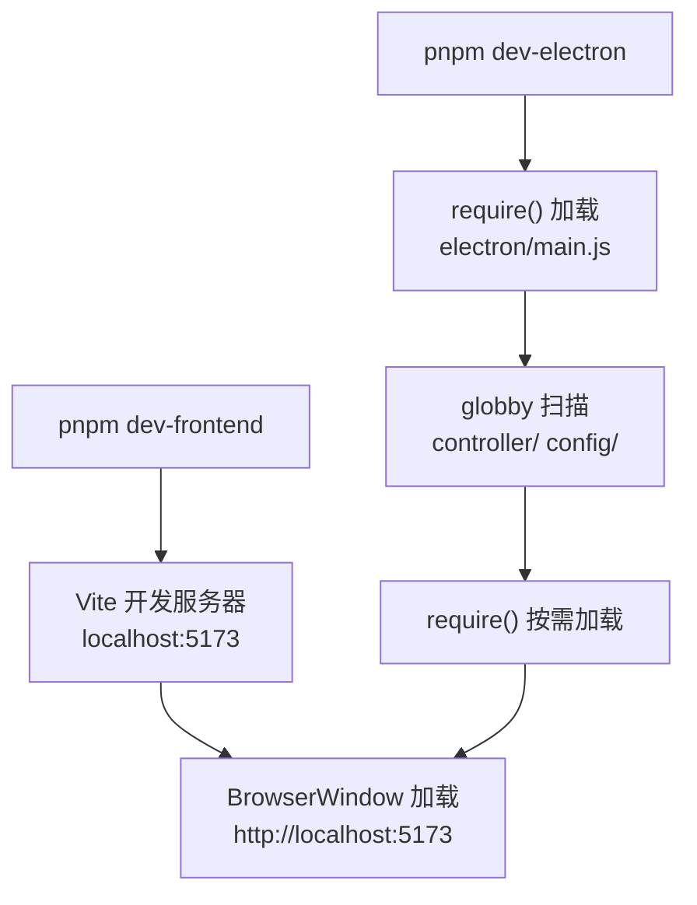
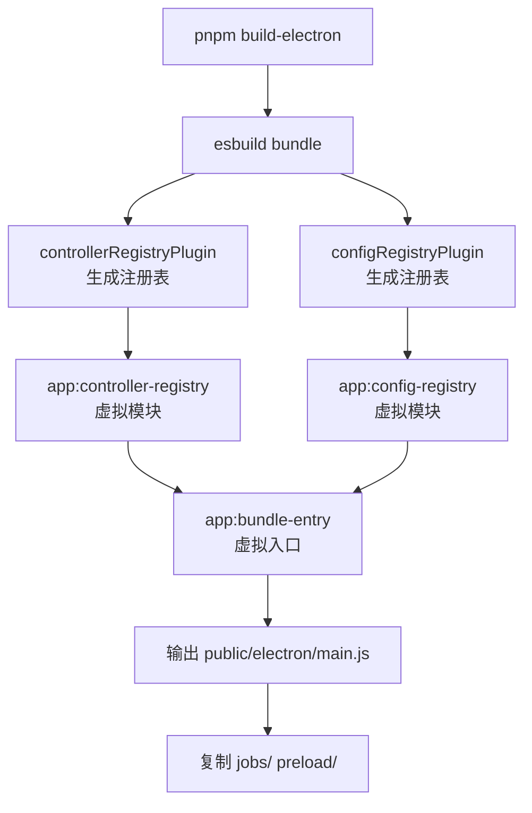

# 打包模式与开发模式

electron-egg 的核心架构区分两种运行模式：**开发模式**（dev）和**打包模式**（bundle）。开发模式面向日常开发调试，打包模式面向生产部署。两种模式在代码加载、配置获取和控制器注册等方面采用不同路径。

## 开发模式工作流程

开发模式下，代码直接从文件系统加载，不做打包处理：



开发模式的关键特征：

| 特性 | 开发模式 |
|------|---------|
| Electron 入口 | `require('electron/main.js')` — 直接引用源文件 |
| 控制器加载 | globby 扫描 + require() 文件系统加载 |
| 配置加载 | require() 加载 config.default.js / config.local.js |
| 前端资源 | Vite 开发服务器实时提供 |
| 热更新 | 前端 Vite HMR，后端需手动重启 |
| Source Map | 默认 inline sourcemap |
| 通信服务 | IpcServer / HttpServer / SocketIO 全部可用 |

```js
// 开发模式启动命令
// package.json scripts
"dev-electron": "cross-env EE_ENV=dev electron .",
```

<Note>
开发模式下 `EE_ENV=dev`，ConfigLoader 会选择加载 `config.local.js` 而非 `config.prod.js`。
</Note>

## 打包模式工作流程

打包模式通过 esbuild 将所有业务代码（控制器、服务、配置）合并到单个 `main.js`，但保留必须独立运行的文件：



打包模式的关键特征：

| 特性 | 打包模式 |
|------|---------|
| Electron 入口 | `public/electron/main.js` — esbuild 打包产物 |
| 控制器加载 | `globalThis.__EE_CONTROLLER_REGISTRY__` 注册表 |
| 配置加载 | `globalThis.__EE_CONFIG_REGISTRY__` 注册表 |
| 前端资源 | 预构建的 `dist/frontend` 静态文件 |
| 热更新 | 不支持（生产模式） |
| Source Map | 默认关闭，可配置 inline/external |
| 通信服务 | 与开发模式完全一致 |

## esbuild 插件内部机制

ee-bin 通过三个 esbuild 插件虚拟模块实现打包注入：

### 1. app:controller-registry

扫描 `electron/controller/` 目录，生成包含惰性 getter 的注册表模块：

```js
// controllerRegistryPlugin 生成的虚拟模块代码
globalThis.__EE_CONTROLLER_REGISTRY__ = {
  get 'user'() {
    return { module: require('./controller/user.js') };
  },
  get 'user/profile'() {
    return { module: require('./controller/user/profile.js') };
  },
};
```

<Note>
`controllerRegistryPlugin` 实际上使用 esbuild 的 `onResolve` 和 `onLoad` 钩子拦截 `ee-core:controller-registry` 这个虚拟 import 路径，返回动态生成的代码作为模块内容。
</Note>

### 2. app:config-registry

扫描 `electron/config/` 目录，生成配置注册表：

```js
// configRegistryPlugin 生成的虚拟模块代码
globalThis.__EE_CONFIG_REGISTRY__ = {
  get 'config.default'() {
    return require('./config/config.default.js');
  },
  get 'config.local'() {
    return require('./config/config.local.js');
  },
};
```

### 3. app:bundle-entry

打包入口虚拟模块，按顺序加载注册表和真实入口：

```js
// bundleEntryPlugin 生成的虚拟模块代码

// 1. 先加载配置注册表
require('app:config-registry');

// 2. 再加载控制器注册表
require('ee-core:controller-registry');

// 3. 最后加载真实入口
require('./main.js');
```

<Warning>
加载顺序至关重要：配置注册表必须在控制器注册表之前加载，因为控制器的初始化可能依赖配置值。而两者都必须在真实 `main.js` 之前加载，否则框架启动时找不到注册表数据。
</Warning>

### Banner 注入

打包产物开头注入环境标识：

```js
// esbuild banner
const banner = `
  process.env.EE_BUNDLED = "true";
`;
```

框架运行时通过 `process.env.EE_BUNDLED === "true"` 判断是否处于打包模式。

## 惰性 getter 设计原理

注册表使用惰性 getter（`get` 访问器）而非直接赋值，原因如下：

### 解决初始化顺序问题

如果使用直接赋值：

```js
// 直接赋值方式（有问题的方案）
globalThis.__EE_CONTROLLER_REGISTRY__ = {
  user: require('./controller/user.js'),      // 立即执行 require
  admin: require('./controller/admin.js'),     // 立即执行 require
};
```

所有控制器在注册阶段就被 `require()`，如果控制器之间存在依赖关系（如 `admin.js` 依赖 `user.js` 的某个导出），可能在 `user.js` 尚未完成注册时就被 `admin.js` 引用。

### 惰性 getter 方案

```js
// 惰性 getter 方案（实际采用的方案）
globalThis.__EE_CONTROLLER_REGISTRY__ = {
  get user() {
    return { module: require('./controller/user.js') };  // 首次访问时才 require
  },
  get admin() {
    return { module: require('./controller/admin.js') }; // 首次访问时才 require
  },
};
```

所有控制器先在注册表中"占位"，实际 `require()` 推迟到 ControllerLoader 需要加载时才执行。此时所有注册已完成，不存在顺序问题。

## 构建产物结构

打包后 `public/electron/` 目录结构：

```
public/electron/
├── main.js              # 打包后的主进程入口
│                        # 包含：配置注册表 + 控制器注册表 + 业务代码
├── jobs/                # 子进程任务（原样复制）
│   ├── example.js       # child_process.fork() 需要独立文件
│   └── timer.js
└── preload/             # 预加载脚本（原样复制）
    └── bridge.js        # BrowserWindow preload 需要独立文件
```

<Note>
`jobs/` 和 `preload/` 不能被打包到 `main.js` 中，因为 Electron 的 `child_process.fork()` 和 `BrowserWindow.preload` 都需要独立文件路径。esbuild 将它们标记为外部模块，构建后通过文件复制保留。
</Note>

## 框架外部依赖

esbuild 打包时以下包被排除，不合并到 `main.js` 中：

| 包名 | 排除原因 |
|------|---------|
| `ee-core` | 运行时框架，`child_process.fork()` 需要真实文件路径 |
| `ee-bin` | 构建工具，不属于应用运行时 |
| `electron` | Electron 主进程模块，由 Electron 提供 |
| `better-sqlite3` | Native 模块，不能被 esbuild 打包 |
| `proxy-agent` | Native 相关依赖 |
| `pino-roll` | 日志滚动插件，依赖 native |
| `pino-pretty` | 日志格式化，开发环境专用 |

<Warning>
如果你在业务代码中引入了其他 native 模块，需要在 `cmd/bin.js` 的 `build.electron.external` 中添加排除项，否则 esbuild 打包会失败。
</Warning>

## package.json main 字段切换

开发模式与打包模式使用不同的 `main` 字段：

<CodeGroup>
  <Code title="开发模式" language="json">
    ```json
    // package.json — 开发模式
    {
      "main": "electron/main.js"
    }
    ```
  </Code>

  <Code title="打包模式" language="json">
    ```json
    // package.json — 打包模式（自动切换）
    {
      "main": "public/electron/main.js"
    }
    ```
  </Code>
</CodeGroup>

`ee-bin` 在构建完成后自动修改 `package.json` 的 `main` 字段，将入口从源文件切换到打包产物。开发模式下用户需手动还原为 `electron/main.js`。

## 打包配置详解

`cmd/bin.js` 中 `build.electron` 部分控制 esbuild 行为：

```js
// cmd/bin.js — build.electron 配置
module.exports = {
  build: {
    electron: {
      bundleType: 'bundle',   // 'bundle' 打包模式 | 'copy' 复制模式
      external: [],           // 用户自定义外部依赖
      sourcemap: false,       // false=自动(dev:inline, prod:off) | 'inline' | 'external'
      minify: false,          // 生产压缩
      drop: undefined,        // ['console', 'debugger'] 生产移除
      keepNames: false,       // 压缩时保留函数/类名
      legalComments: undefined, // 'inline' | 'eof' | 'none'
      define: undefined,      // 编译时常量替换
      copy: undefined,        // 额外复制文件 ['assets', 'data/db.json']
      format: undefined,      // 'cjs'(推荐) | 'esm'
    },
  },
};
```

<Note>
`format` 默认为 `cjs`，这是 Electron 主进程推荐的格式。如果选择 `esm`，需要确保所有业务代码（控制器、服务、配置）都是 ESM 兼容的。
</Note>