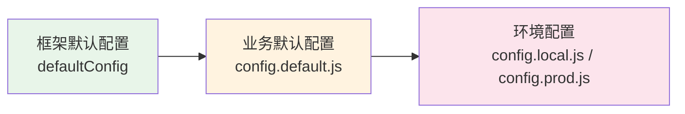

# 配置管线

electron-egg 采用**三层配置合并**机制，确保框架默认值、业务默认值和环境特定值有序叠加。配置管线同时支持开发模式（文件系统加载）和打包模式（注册表加载）两种路径。

## 三层合并顺序

配置按以下顺序合并，后者覆盖前者：



### 第一层：框架默认配置

来自 `ee-core/src/config/default_config.ts`，提供所有配置项的默认值和结构定义：

```js
// ee-core/src/config/default_config.ts（简化示例）
const defaultConfig = {
  appMode: 'local',
  mainServer: {
    host: 'localhost',
    port: 7070,
    protocol: 'http',
  },
  logger: {
    level: 'info',
    appLogger: {
      filename: 'app.log',
      roll: true,
    },
  },
  socketServer: {
    enable: false,
    path: '/socket.io',
  },
  windows: [],
  jobs: {
    directory: 'jobs',
  },
};
```

<Note>
框架默认配置包含所有配置项的结构定义和合理默认值，业务配置只需覆盖需要修改的项。
</Note>

### 第二层：业务默认配置

来自项目根目录 `electron/config/config.default.js`，覆盖框架默认值以满足业务需求：

```js
// electron/config/config.default.js
module.exports = (appInfo) => {
  const config = {};

  // 开发服务器配置
  config.mainServer = {
    host: '127.0.0.1',
    port: 7070,
    protocol: 'http',
    // 开发模式下前端资源路径
    devPath: 'http://localhost:5173',
    // 生产模式下前端资源路径
    prodPath: './dist/frontend',
  };

  // 日志配置
  config.logger = {
    level: 'INFO',
    appLogger: {
      filename: path.join(appInfo.appDir, 'logs', 'app.log'),
    },
  };

  // 窗口配置
  config.windows = [
    {
      title: 'electron-egg',
      width: 960,
      height: 640,
      show: true,
    },
  ];

  return config;
};
```

### 第三层：环境配置

根据运行环境选择 `config.local.js`（开发）或 `config.prod.js`（生产）：

```js
// electron/config/config.local.js
module.exports = (appInfo) => {
  const config = {};

  config.logger = {
    level: 'DEBUG',  // 开发环境使用 DEBUG 级别
  };

  config.mainServer = {
    port: 7071,      // 开发环境使用不同端口避免冲突
  };

  return config;
};
```

```js
// electron/config/config.prod.js
module.exports = (appInfo) => {
  const config = {};

  config.logger = {
    level: 'WARN',   // 生产环境减少日志输出
  };

  config.mainServer = {
    port: 7070,
    prodPath: './dist/frontend',
  };

  return config;
};
```

## 配置函数导出模式

配置文件可以导出一个**函数**，接收 `appInfo` 对象作为参数。`appInfo` 包含项目路径信息：

```js
module.exports = (appInfo) => {
  const config = {};

  // 使用 appInfo 中的路径构建绝对路径
  config.logger = {
    appLogger: {
      filename: path.join(appInfo.appDir, 'logs', 'app.log'),
      errorFilename: path.join(appInfo.appDir, 'logs', 'error.log'),
    },
  };

  return config;
};
```

`appInfo` 对象结构：

```js
const appInfo = {
  appDir: '/path/to/project',     // 项目根目录
  homeDir: os.homedir(),          // 用户主目录
  electronDir: '/path/to/electron', // electron 目录
  env: 'development' | 'production', // 运行环境
  name: 'electron-egg',          // 应用名称
};
```

<Note>
如果配置文件导出的是普通对象而非函数，ConfigLoader 会直接使用该对象，不传入 `appInfo`。推荐使用函数导出模式以获取路径信息。
</Note>

## 开发模式 vs 打包模式

<Tabs>
  <Tab title="开发模式">
    开发模式下，ConfigLoader 从文件系统逐个加载配置文件：

    ```js
    // ConfigLoader._loadConfig() — 开发模式
    _loadConfig() {
      // 1. 加载框架默认配置（内置）
      const defaultConfig = getDefaultConfig();

      // 2. 从文件系统加载 config.default.js
      const businessConfig = loadFile(configDir, 'config.default.js');

      // 3. 根据环境加载 config.local.js 或 config.prod.js
      const envConfig = loadFile(configDir, envConfigFile);

      // 4. 三层合并
      return deepMerge(defaultConfig, businessConfig, envConfig);
    }
    ```

    `loadFile()` 使用 `require()` 直接加载文件系统中的 JS 模块。
  </Tab>

  <Tab title="打包模式">
    打包模式下，配置文件已被 esbuild 注册到 `globalThis.__EE_CONFIG_REGISTRY__`：

    ```js
    // ConfigLoader._loadConfig() — 打包模式
    _loadConfig() {
      // 1. 加载框架默认配置（内置）
      const defaultConfig = getDefaultConfig();

      // 2. 从注册表加载 config.default.js
      const registry = globalThis.__EE_CONFIG_REGISTRY__;
      const businessConfig = registry['config.default']();
      // 如果是函数导出，传入 appInfo 调用
      if (typeof businessConfig === 'function') {
        businessConfig = businessConfig(appInfo);
      }

      // 3. 从注册表加载环境配置
      const envConfig = registry['config.local']?.() || registry['config.prod']?.();
      if (typeof envConfig === 'function') {
        envConfig = envConfig(appInfo);
      }

      // 4. 三层合并
      return deepMerge(defaultConfig, businessConfig, envConfig);
    }
    ```

    注册表中的每个配置项都是**惰性 getter**，只有在被访问时才会执行 `require()`：

    ```js
    globalThis.__EE_CONFIG_REGISTRY__ = {
      get 'config.default'() { return require('./config/config.default.js'); },
      get 'config.local'() { return require('./config/config.local.js'); },
    };
    ```
  </Tab>
</Tabs>

## ConfigLoader API

ConfigLoader 是 ee-core 中负责配置加载的核心类：

### 核心方法

```js
class ConfigLoader {
  /**
   * 加载并合并所有配置
   * @returns {Object} 合并后的完整配置对象
   */
  load() {
    return this._loadConfig();
  }

  /**
   * 内部配置加载实现
   * 自动检测打包/开发模式并选择对应加载路径
   */
  _loadConfig() {
    const isBundled = globalThis.__EE_CONFIG_REGISTRY__ != null;
    if (isBundled) {
      return this._bundleWithRegistry();
    }
    return this._loadFromFileSystem();
  }

  /**
   * 从注册表加载配置（打包模式）
   */
  _bundleWithRegistry() {
    const registry = globalThis.__EE_CONFIG_REGISTRY__;
    // ... 从注册表获取并调用配置
  }

  /**
   * 从文件系统加载配置（开发模式）
   */
  _loadFromFileSystem() {
    // ... 使用 loadFile() 逐个加载
  }
}
```

### 配置访问

合并后的配置存储在 `app.config`，可通过以下方式访问：

```js
// 在控制器或服务中访问配置
class UserController extends Controller {
  async index() {
    const port = this.app.config.mainServer.port;
    const logLevel = this.app.config.logger.level;

    return {
      serverPort: port,
      logLevel: logLevel,
    };
  }
}
```

<Warning>
配置一旦合并完成就不再变更。不要在运行时修改 `app.config` 的属性，这会导致不可预期的行为。
</Warning>