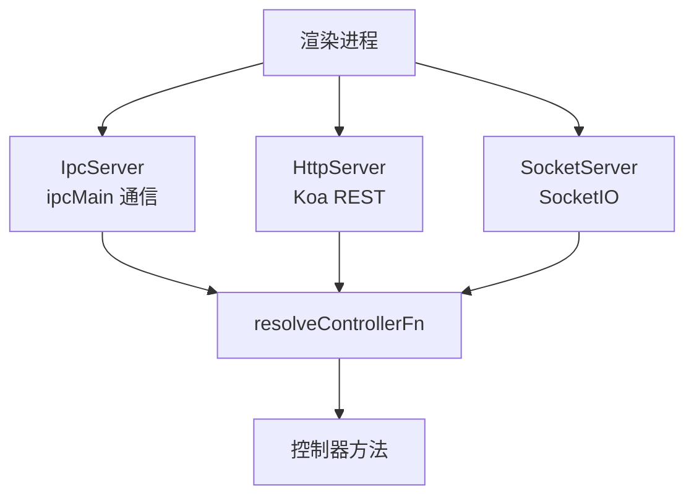

# IPC 通信

electron-egg 提供三种通信服务，覆盖 Electron 主进程与渲染进程之间的所有交互场景。所有服务最终通过 `resolveControllerFn()` 将请求路由到控制器方法。

## 三种通信服务概览



| 服务 | 实现 | 通信模型 | 适用场景 |
|------|------|---------|---------|
| IpcServer | `ipcMain.on` + `ipcMain.handle` | 请求-响应 / 事件推送 | 系统级调用、窗口控制 |
| HttpServer | Koa + koa-router | REST API | 大量数据传输、跨进程调用 |
| SocketServer | SocketIO | 双向实时通信 | 实时推送、进度更新、聊天 |

## IpcServer — IPC 通信

IpcServer 基于 Electron 原生 IPC 机制，提供同步和异步两种调用模型：

### 异步调用（ipcMain.handle）

渲染进程通过 `ipcRenderer.invoke()` 发起请求，主进程通过 `ipcMain.handle()` 响应：

```js
// 主进程 — IpcServer 注册
ipcMain.handle('controller/user/login', async (event, args) => {
  return await resolveControllerFn('user', 'login', args);
});

// 渲染进程 — 发起调用
const result = await ipcRenderer.invoke('controller/user/login', {
  username: 'admin',
  password: '123456',
});
```

<Note>
`ipcMain.handle` 返回 Promise，渲染进程通过 `await` 获取结果。这是推荐的 IPC 调用方式，不会阻塞渲染进程。
</Note>

### 同步调用（ipcMain.on）

渲染进程通过 `ipcRenderer.sendSync()` 发起同步请求，主进程通过 `ipcMain.on()` 处理并设置 `event.returnValue`：

```js
// 主进程 — IpcServer 注册
ipcMain.on('controller/user/getInfo', (event, args) => {
  const result = resolveControllerFn('user', 'getInfo', args);
  event.returnValue = result; // 必须设置返回值
});

// 渲染进程 — 同步调用
const result = ipcRenderer.sendSync('controller/user/getInfo', {});
```

<Warning>
同步调用会阻塞渲染进程直到主进程返回结果。仅在必须同步获取数据的场景使用（如窗口创建前获取配置），日常交互请使用异步 `invoke`。
</Warning>

### 事件推送（ipcMain.on → event.reply）

主进程主动向渲染进程推送消息：

```js
// 主进程 — 推送通知
mainWindow.webContents.send('controller/notification/push', {
  type: 'warning',
  message: '磁盘空间不足',
});

// 渲染进程 — 监听推送
ipcRenderer.on('controller/notification/push', (event, data) => {
  showNotification(data);
});
```

## HttpServer — HTTP REST 服务

HttpServer 基于 Koa + koa-router，提供标准 REST API 接口：

### 路由机制

所有 HTTP 请求按通道命名规则路由到控制器方法：

```js
// HttpServer 路由注册
router.post('/controller/user/login', async (ctx) => {
  const args = ctx.request.body;
  ctx.body = await resolveControllerFn('user', 'login', args);
});

router.get('/controller/user/getInfo', async (ctx) => {
  const args = ctx.query;
  ctx.body = await resolveControllerFn('user', 'getInfo', args);
});
```

### 渲染进程调用

渲染进程通过标准 HTTP 客户端（fetch / axios）访问：

```js
// 渲染进程 — HTTP 调用
const response = await fetch('http://localhost:7070/controller/user/login', {
  method: 'POST',
  headers: { 'Content-Type': 'application/json' },
  body: JSON.stringify({ username: 'admin', password: '123456' }),
});

const result = await response.json();
```

<Note>
HttpServer 默认监听 `config.mainServer.port`（7070）。渲染进程可通过 `http://localhost:{port}` 访问。如果启用 SocketServer，两者共享同一端口。
</Note>

### 配置

```js
// config.default.js — HttpServer 配置
config.mainServer = {
  host: '127.0.0.1',
  port: 7070,
  protocol: 'http',
  enableHttpServer: true, // 启用 HTTP 服务
};
```

## SocketServer — SocketIO 实时通信

SocketServer 基于 SocketIO，提供双向实时通信能力：

### 连接与通信

```js
// 主进程 — SocketServer 配置与启动
config.socketServer = {
  enable: true,
  path: '/socket.io',
  cors: {
    origin: '*',
  },
};

// 主进程 — SocketServer 路由
io.on('connection', (socket) => {
  // 监听客户端请求
  socket.on('controller/user/login', async (args) => {
    const result = await resolveControllerFn('user', 'login', args);
    socket.emit('controller/user/login', result);
  });

  // 主动推送
  socket.emit('controller/notification/progress', {
    percent: 50,
    status: 'processing',
  });
});
```

### 渲染进程连接

```js
// 渲染进程 — SocketIO 客户端
import io from 'socket.io-client';

const socket = io('http://localhost:7070', {
  path: '/socket.io',
});

// 发送请求
socket.emit('controller/user/login', { username: 'admin', password: '123456' });

// 接收响应
socket.on('controller/user/login', (result) => {
  console.log('登录结果:', result);
});

// 监听推送
socket.on('controller/notification/progress', (data) => {
  updateProgressBar(data.percent);
});
```

## 通道命名规范

所有三种通信服务遵循统一的通道命名规范：

```
controller/{name}/{method}
```

| 部分 | 含义 | 示例 |
|------|------|------|
| `controller` | 固定前缀 | `controller` |
| `{name}` | 控制器注册名称 | `user`、`user/profile` |
| `{method}` | 控制器方法名 | `login`、`getInfo` |

完整示例：

```
controller/user/login          → UserController.login()
controller/user/profile/detail → UserProfileController.detail()
controller/admin/dashboard     → AdminController.dashboard()
```

### 通道分隔符

通道分隔符默认为 `/`，可通过配置修改：

```js
config.communication = {
  channelSeparator: '/',  // 默认值，可改为 '.' 或 '-'
};
```

修改分隔符后的通道命名：

```
controller.user.login        → 分隔符为 '.'
controller-user-login        → 分隔符为 '-'
```

<Warning>
修改通道分隔符后，渲染进程的所有调用代码也需同步修改。建议保持默认 `/` 分隔符，与 URL 路径风格一致。
</Warning>

## resolveControllerFn — 统一路由核心

三种通信服务都通过 `resolveControllerFn()` 将请求路由到控制器方法：

```js
function resolveControllerFn(controllerName, methodName, args) {
  // 从控制器注册表查找
  const controller = app.controller[controllerName];
  if (!controller) {
    throw new Error(`Controller "${controllerName}" not found`);
  }

  // 查找方法
  const method = controller[methodName];
  if (!method) {
    throw new Error(`Method "${methodName}" not found in "${controllerName}"`);
  }

  // 调用方法（methodToMiddleware 包装后的函数）
  return method(args);
}
```

<Note>
`resolveControllerFn()` 调用的是 `methodToMiddleware` 包装后的函数，因此每次请求都会创建新的控制器实例，确保并发安全。详见 [控制器加载](/concepts/controller-loading)。
</Note>

## 服务选型指南

根据不同场景选择合适的通信服务：

| 场景 | 推荐服务 | 原因 |
|------|---------|------|
| 系统级调用（获取配置、窗口操作） | IpcServer | Electron 原生 API，性能最优 |
| 大量数据传输（文件列表、表格数据） | HttpServer | REST API 标准，支持分页、缓存 |
| 实时状态推送（进度条、日志流） | SocketServer | 双向实时，无需轮询 |
| 双向交互（聊天、协作编辑） | SocketServer | 实时双向通信 |
| 一次性查询（用户信息、设置读取） | IpcServer / HttpServer | 请求-响应模式即可 |
| Go/Python 后端调用 | HttpServer | 跨语言 HTTP 调用 |

<Steps>
  <Step title="默认配置 — 只启用 IPC">
    项目默认只启用 IpcServer，适合简单的桌面应用：

    ```js
    config.mainServer = {
      enableHttpServer: false,
    };
    config.socketServer = {
      enable: false,
    };
    ```
  </Step>

  <Step title="添加 HTTP 服务">
    需要与 Go/Python 后端交互或传输大量数据时启用：

    ```js
    config.mainServer = {
      enableHttpServer: true,
    };
    ```
  </Step>

  <Step title="添加实时通信">
    需要实时推送或双向交互时启用：

    ```js
    config.socketServer = {
      enable: true,
      path: '/socket.io',
    };
    ```
  </Step>
</Steps>

<Note>
三种服务可以同时启用。HttpServer 和 SocketServer 共享同一端口（`config.mainServer.port`），IpcServer 使用 Electron 内部通信通道，无需端口配置。
</Note>