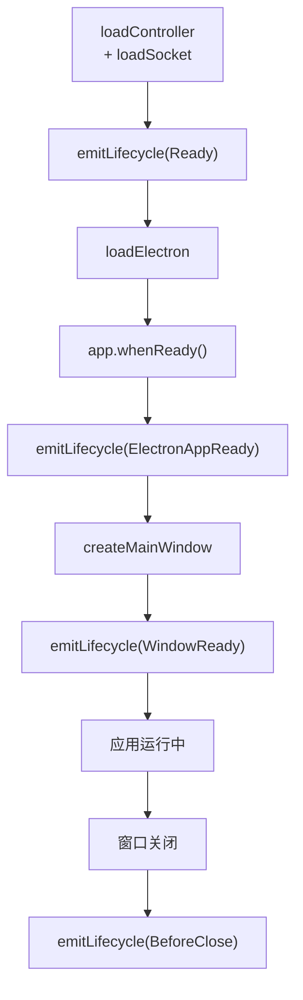

# 生命周期事件

electron-egg 通过 EventBus 管理框架生命周期事件和业务自定义事件。生命周期事件在启动和退出流程的关键节点触发，业务代码可以注册监听器来响应这些事件。

## 五大生命周期常量

框架定义了五个生命周期常量，对应应用运行的关键节点：

| 常量 | 触发时机 | 含义 |
|------|---------|------|
| `Ready` | `loadSocket()` 之后 | 框架核心模块全部加载完成，通信服务已启动 |
| `ElectronAppReady` | `app.whenReady()` 之后 | Electron 主进程就绪 |
| `WindowReady` | `createMainWindow()` 之后 | 主窗口已创建并加载完成 |
| `BeforeClose` | 窗口关闭前 | 应用即将关闭，适合执行清理操作 |
| `Preload` | preload 脚本加载时 | BrowserWindow preload 执行阶段 |

### 触发顺序



<Note>
`Ready` 事件在 Electron 进程启动之前触发，表示框架层面的初始化已完成。`ElectronAppReady` 和 `WindowReady` 在 Electron 进程启动后触发，表示应用已可交互。`BeforeClose` 是最后一个生命周期事件，用于资源清理。
</Note>

## EventBus 设计

EventBus 是 ee-core 内部的事件管理器，维护两个独立的事件集合：

### lifecycleEvents — 框架生命周期事件

存储五个内置生命周期常量，由框架内部触发，业务代码只能**监听**不能触发：

```js
// ee-core 内部定义
const lifecycleEvents = {
  Ready: 'ready',
  ElectronAppReady: 'electron-app-ready',
  WindowReady: 'window-ready',
  BeforeClose: 'before-close',
  Preload: 'preload',
};
```

### eventsMap — 业务自定义事件

业务代码可以在 `config.default.js` 中注册自定义事件，用于跨模块通信：

```js
// config.default.js — 注册业务事件
module.exports = (appInfo) => {
  const config = {};

  config.eventsMap = {
    'job-example:progress': 'job-example:progress',
    'job-example:complete': 'job-example:complete',
    'custom:sync-data': 'custom:sync-data',
  };

  return config;
};
```

<Note>
`eventsMap` 中的事件名称同时作为注册键和事件标识。建议使用 `{模块}:{动作}` 格式命名，避免冲突。
</Note>

## register() API

`register()` 用于注册事件监听器，支持生命周期事件和业务事件：

### 基本用法

```js
const { Controller } = require('ee-core');

class LifecycleController extends Controller {
  constructor() {
    super();
    // 注册生命周期事件监听器
    this.app.eventBus.register('Ready', this.onFrameworkReady.bind(this));
    this.app.eventBus.register('BeforeClose', this.onBeforeClose.bind(this));
  }

  onFrameworkReady() {
    this.logger.info('[LifecycleController] 框架已就绪');
    // 执行初始化逻辑，如启动定时任务
    this.startBackgroundJobs();
  }

  onBeforeClose() {
    this.logger.info('[LifecycleController] 应用即将关闭');
    // 执行清理逻辑
    this.stopBackgroundJobs();
  }
}
```

### 注册业务事件

```js
class JobController extends Controller {
  constructor() {
    super();
    // 注册业务事件
    this.app.eventBus.register('job-example:progress', this.onProgress.bind(this));
    this.app.eventBus.register('job-example:complete', this.onComplete.bind(this));
  }

  onProgress(data) {
    // 将进度推送到渲染进程
    this.app.socketServer.emit('job/progress', data);
  }

  onComplete(data) {
    this.logger.info('[JobController] 任务完成:', data);
  }
}
```

### 重复注册警告

对同一个事件重复注册监听器会产生警告：

```js
// 第一次注册 — 正常
app.eventBus.register('Ready', handlerA);

// 第二次注册 — 产生警告
app.eventBus.register('Ready', handlerB);
// 日志：[ee-core] Warning: Duplicate registration for lifecycle event "Ready"
```

<Warning>
重复注册不会覆盖之前的监听器，两个监听器都会执行。但重复注册通常是编码错误，说明某个模块的初始化逻辑被重复执行。请检查控制器是否在构造器中正确注册而非在方法中重复注册。
</Warning>

## emitLifecycle() API

`emitLifecycle()` 用于触发生命周期事件，**仅供框架内部使用**：

```js
// ee-core 内部调用
class Application {
  async run() {
    await this.loadController();
    await this.loadSocket();
    // 触发 Ready 事件
    this.emitLifecycle('Ready');

    await this.loadElectron();
    // Electron 就绪后触发
    this.app.whenReady().then(() => {
      this.emitLifecycle('ElectronAppReady');
      this.createMainWindow();
      this.emitLifecycle('WindowReady');
    });
  }

  emitLifecycle(eventName) {
    this.eventBus.emit(eventName);
  }
}
```

<Note>
业务代码不应调用 `emitLifecycle()`。生命周期事件的触发时机由框架严格控制，手动触发会破坏启动顺序。业务自定义事件使用 `eventBus.emit()` 触发。
</Note>

### 触发业务事件

```js
// 业务代码中触发自定义事件
this.app.eventBus.emit('job-example:progress', {
  percent: 75,
  message: '正在处理数据...',
});

this.app.eventBus.emit('job-example:complete', {
  result: 'success',
  duration: 5000,
});
```

## BeforeClose — 退出前处理

`BeforeClose` 是最常用的生命周期监听点，用于在应用关闭前执行清理操作：

### 基本清理模式

```js
class AppController extends Controller {
  constructor() {
    super();
    this.app.eventBus.register('BeforeClose', this.onBeforeClose.bind(this));
  }

  async onBeforeClose() {
    // 1. 关闭所有通信连接
    this.app.cross.killAll();

    // 2. 终止所有子进程任务
    this.app.jobPool.killAll();

    // 3. 关闭数据库连接
    if (this.app.coreDB) {
      this.app.coreDB.close();
    }

    // 4. 保存应用状态
    await this.saveAppState();
  }
}
```

### 阻止退出模式

在某些场景下，退出前需要用户确认：

```js
class AppController extends Controller {
  constructor() {
    super();
    this.app.eventBus.register('BeforeClose', this.onBeforeClose.bind(this));
  }

  onBeforeClose() {
    const hasUnsavedData = this.checkUnsavedData();
    if (hasUnsavedData) {
      // 通过 IPC 通知渲染进程弹窗确认
      this.app.ipcServer.send('controller/app/confirmClose', {
        message: '有未保存的数据，确定要退出吗？',
      });

      // 返回 false 可以阻止窗口关闭
      return false;
    }
  }
}
```

<Warning>
`BeforeClose` 中返回 `false` 可以阻止窗口关闭，但这依赖 Electron 的 `before-quit` 事件处理。确保只在必要时阻止退出，否则用户体验会受影响。
</Warning>

## Preload 生命周期

`Preload` 事件在 BrowserWindow 的 preload 脚本执行阶段触发：

```js
// electron/preload/bridge.js
const { ipcRenderer } = require('electron');

// Preload 脚本在窗口创建时执行
// 可以在这里注册 IPC 监听器
ipcRenderer.on('controller/app/init', (event, data) => {
  // 初始化渲染进程状态
  window.__EE_APP_DATA__ = data;
});
```

<Note>
`Preload` 脚本运行在渲染进程的独立上下文中，可以访问 Node.js API（如 `require`），但与页面 JS 是隔离的。这是 Electron 安全模型的一部分。
</Note>

## EventBus API 速览

```js
class EventBus {
  /**
   * 注册事件监听器
   * @param {string} eventName - 事件名称（生命周期常量或业务事件名）
   * @param {Function} handler - 回调函数
   */
  register(eventName, handler) {
    if (this._isRegistered(eventName)) {
      this.logger.warn(`Duplicate registration for event "${eventName}"`);
    }
    this._handlers[eventName] = handler;
  }

  /**
   * 触发事件
   * @param {string} eventName - 事件名称
   * @param {*} data - 事件数据（可选）
   */
  emit(eventName, data) {
    const handler = this._handlers[eventName];
    if (handler) {
      return handler(data);
    }
  }

  /**
   * 检查事件是否已注册
   * @param {string} eventName - 事件名称
   * @returns {boolean}
   */
  isRegistered(eventName) {
    return this._handlers[eventName] != null;
  }

  /**
   * 移除事件监听器
   * @param {string} eventName - 事件名称
   */
  unregister(eventName) {
    delete this._handlers[eventName];
  }
}
```

## 完整示例

```js
// electron/controller/lifecycle_controller.js
const { Controller } = require('ee-core');

class LifecycleController extends Controller {
  constructor() {
    super();

    // 注册所有生命周期监听器
    this.app.eventBus.register('Ready', this._onReady.bind(this));
    this.app.eventBus.register('ElectronAppReady', this._onElectronReady.bind(this));
    this.app.eventBus.register('WindowReady', this._onWindowReady.bind(this));
    this.app.eventBus.register('BeforeClose', this._onBeforeClose.bind(this));
  }

  _onReady() {
    this.logger.info('框架就绪 — 启动后台任务');
    this.app.service.job.startTimer();
  }

  _onElectronReady() {
    this.logger.info('Electron 就绪 — 初始化系统菜单');
    this.app.service.menu.createAppMenu();
  }

  _onWindowReady() {
    this.logger.info('窗口就绪 — 加载初始数据');
    this.app.ipcServer.send('controller/lifecycle/initData', {
      version: this.app.config.version,
      env: this.app.config.env,
    });
  }

  async _onBeforeClose() {
    this.logger.info('应用即将关闭 — 执行清理');
    this.app.cross.killAll();
    this.app.jobPool.killAll();
  }
}

module.exports = LifecycleController;
```