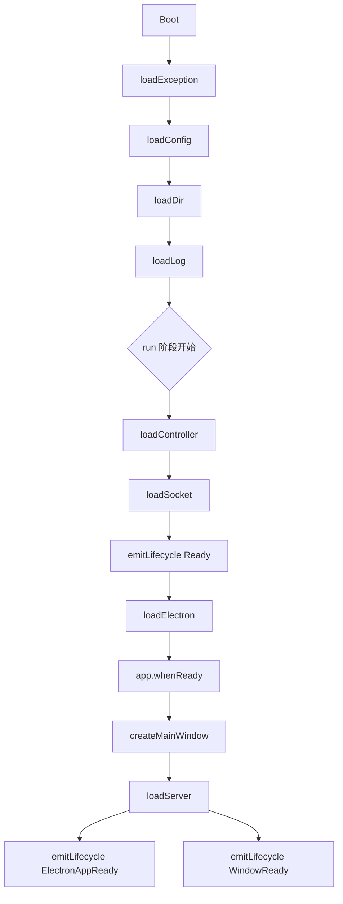

# 启动生命周期

electron-egg 的启动过程分为两个明确阶段：**初始化阶段（init）** 和 **运行阶段（run）**。初始化阶段完成所有核心模块的加载与配置，运行阶段启动 Electron 应用并创建窗口。

## 完整流程

启动生命周期按以下顺序执行：



<Note>
`emitLifecycle(Ready)` 在 `loadElectron` 之前触发，表示框架核心模块已全部就绪。`ElectronAppReady` 和 `WindowReady` 在窗口创建之后触发，表示应用已可交互。
</Note>

## init() 阶段

初始化阶段负责加载框架核心基础设施，不涉及 Electron 进程启动：

| 阶段 | 方法 | 职责 | 依赖 |
|------|------|------|------|
| Boot | `boot()` | 创建 Application 实例，初始化核心属性 | 无 |
| 异常处理 | `loadException()` | 注册全局未捕获异常处理器 | Application |
| 配置加载 | `loadConfig()` | 三层配置合并，存储到 `app.config` | Application |
| 目录加载 | `loadDir()` | 解析并存储项目目录结构（`appDir`、`homeDir` 等） | config |
| 日志加载 | `loadLog()` | 初始化 Pino 日志实例，存储到 `app.logger` | config、dir |

<Steps>
  <Step title="Boot">
    创建 `Application` 单例，挂载核心属性。这是整个框架的入口点：

    ```js
    const app = new Application();
    // app.coreDB = null
    // app.config = null
    // app.logger = null
    // app.controller = {}
    // app.service = {}
    ```
  </Step>

  <Step title="loadException — 全局异常兜底">
    注册 `uncaughtException` 和 `unhandledRejection` 处理器，防止进程因未处理错误而崩溃：

    ```js
    process.on('uncaughtException', (err) => {
      app.logger.error('[ee-core] Uncaught Exception:', err);
    });

    process.on('unhandledRejection', (reason, promise) => {
      app.logger.error('[ee-core] Unhandled Rejection at:', promise, 'reason:', reason);
    });
    ```
  </Step>

  <Step title="loadConfig — 配置合并">
    执行三层配置合并：框架默认配置 → 业务默认配置 → 环境配置。详见 [配置管线](/concepts/configuration-pipeline)。

    ```js
    // 合并后的配置存储在 app.config
    app.config = mergedConfig;
    ```
  </Step>

  <Step title="loadDir — 目录解析">
    解析项目目录结构并存储到 `app` 实例，后续模块依赖这些路径：

    ```js
    app.appDir = '/path/to/project';
    app.homeDir = os.homedir();
    app.electronDir = '/path/to/project/electron';
    // ...
    ```
  </Step>

  <Step title="loadLog — 日志初始化">
    根据 `config.logger` 创建 Pino 日志实例，支持 `pino-roll` 文件滚动和 `pino-pretty` 开发格式化：

    ```js
    app.logger = pino({
      level: config.logger.level || 'info',
      ...config.logger.options
    });
    ```
  </Step>
</Steps>

## run() 阶段

运行阶段启动业务逻辑和 Electron 窗口：

| 阶段 | 方法 | 职责 | 依赖 |
|------|------|------|------|
| 控制器加载 | `loadController()` | 加载并注册所有业务控制器 | config、logger |
| 服务加载 | `loadSocket()` | 启动 IPC/HTTP/SocketIO 通信服务 | config、controller |
| 生命周期 | `emitLifecycle(Ready)` | 触发 Ready 事件 | 以上所有 |
| Electron | `loadElectron()` | 启动 Electron 主进程 | config |
| 窗口创建 | `createMainWindow()` | 创建 BrowserWindow | config、electron |
| 服务启动 | `loadServer()` | 启动前端开发服务器或加载静态资源 | config |
| 生命周期 | `emitLifecycle(ElectronAppReady)` | 触发 ElectronAppReady 事件 | electron |
| 生命周期 | `emitLifecycle(WindowReady)` | 触发 WindowReady 事件 | window |

<Warning>
`loadController()` 必须在 `loadSocket()` 之前执行，因为通信服务需要控制器注册表来路由请求到对应的处理方法。
</Warning>

## 退出清理

应用退出时需要清理所有后台任务和通信连接，防止资源泄漏：

```js
app.on('before-quit', () => {
  // 清理所有 IPC/HTTP/SocketIO 连接
  cross.killAll();

  // 终止所有子进程任务
  killAllJobs();
});

app.on('will-quit', () => {
  // 释放 SQLite 数据库连接
  if (app.coreDB) {
    app.coreDB.close();
  }
});
```

<Note>
`before-quit` 事件在窗口关闭后触发，适合执行异步清理操作。`will-quit` 在进程即将退出时触发，适合释放同步资源。
</Note>

### 子进程任务清理

`killAllJobs()` 遍历所有子进程任务池并终止：

```js
function killAllJobs() {
  const jobPool = app.jobPool;
  if (jobPool) {
    jobPool.killAll();
  }
}
```

### 通信连接清理

`cross.killAll()` 关闭所有 IPC 监听器、HTTP 服务器和 SocketIO 连接：

```js
cross.killAll = function () {
  // ipcMain 移除所有监听器
  ipcMain.removeAllListeners();
  // HTTP Server 关闭
  if (httpServer) httpServer.close();
  // SocketIO 关闭
  if (socketServer) socketServer.close();
};
```

## init() 与 run() 的划分原则

两个阶段的划分遵循以下原则：

- **init()** — 不依赖 Electron 运行时，纯 Node.js 环境。可以在 Electron 进程启动前完成所有配置和模块初始化。
- **run()** — 需要 Electron 运行时支持，涉及 `BrowserWindow`、`app.whenReady()` 等 Electron API。

这种划分使得 init 阶段的逻辑可以在测试环境中独立运行，不需要启动完整的 Electron 进程。